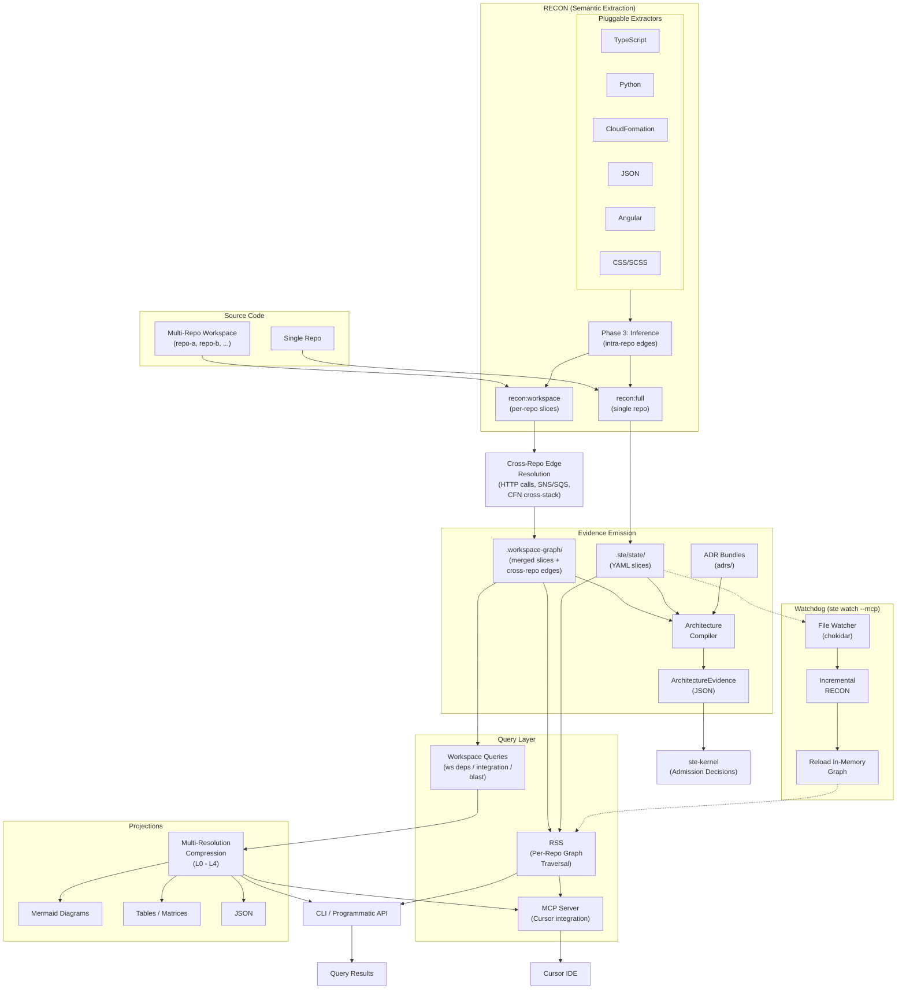

# ste-runtime

**Component implementation of the STE Specification** — A portable semantic extraction and graph traversal toolkit implementing RECON and RSS components for AI-assisted development.

**See:** [STE Specification](https://github.com/egallmann/ste-spec) for the complete architecture.

[](LICENSE)
[](https://nodejs.org/)
[](package.json)
[](MATURITY.md)

---

## Start Here

If you need fast repo orientation, start with [SYSTEM-OVERVIEW.md](SYSTEM-OVERVIEW.md).

`SYSTEM-OVERVIEW.md` is a generated artifact from ADR Kit. Refresh generated ADR docs with ADR Kit tooling, not by hand-editing generated outputs.

**Compiler authority:** [COMPILER-AUTHORITY.md](COMPILER-AUTHORITY.md) — ste-runtime is the **compiler of record** for machine-consumable architecture state (ADR YAML + code → graphs → registries/evidence). adr-architecture-kit is **authoring-only**; do not treat it as a parallel compiler authority for runtime/kernel artifacts.

---

> **PRODUCTION WORKSPACE TOOLING — HUMAN-IN-LOOP REQUIRED**
>
> ste-runtime is in **active production use** as workspace tooling within the ste-system and functional in non-STE contexts.
>
> - **Production-validated** — 15 repos, ~952K LOC, ~23s extraction, 70MB state
> - **NOT autonomous** — Requires human-in-loop oversight (CEM substrate exists, invariant validation not operationalized)
> - **NOT security-hardened** — No authentication, authorization, or access controls beyond boundary validation
>
> **See [MATURITY.md](MATURITY.md) for complete production readiness assessment and component maturity matrix.**
>
> **Appropriate for:** Production workspace tooling, STE system integration, non-STE code-to-graph extraction, MCP IDE integration, forking for custom implementations
> **Not appropriate for:** Autonomous agent execution, multi-user concurrent access, codebases >1M LOC without validation

---

## What is ste-runtime?

**ste-runtime** is a component implementation of the [System of Thought Engineering (STE) Specification](https://github.com/egallmann/ste-spec). This repository provides a subset of the components defined in the complete STE Runtime architecture.

### Components Implemented

This repository implements:

1. **RECON** (Reconciliation Protocol) — Extracts semantic state from source code into AI-DOC format
   - **Single-repo** (`recon:full`) — extracts one project into `.ste/state/`
   - **Multi-repo workspace** (`recon:workspace`) — extracts each repo in a `workspace.yaml` manifest, then runs cross-repo edge resolution (HTTP call matching, SNS/SQS channels, CFN cross-stack references). Output goes to `.workspace-graph/`.
2. **RSS** (Runtime State Slicing) — Graph traversal protocol for deterministic context assembly
   - Includes **MVC** (Minimally Viable Context) assembly via `assembleContext` function
   - Basic entry point discovery (`findEntryPoints`) for natural language queries
   - Bounded bidirectional traversal (maxDepth, maxNodes, visited-set convergence)
3. **MCP Server** — Model Context Protocol integration for Cursor IDE
4. **File Watching** — Incremental RECON triggering on file changes
5. **Workspace Graph Queries** — Multi-repo system-level traversal (deps, integration, blast radius) with multi-resolution projections (L0-L4)
6. **Runtime Evidence** — Architecture compiler combining ADR bundles with semantic graph state to emit factual `ArchitectureEvidence` JSON payloads consumed by `ste-kernel`

### Complete STE Runtime Architecture

The complete STE Runtime system (per [STE Architecture Specification](https://github.com/egallmann/ste-spec)) includes additional components not implemented in this repository:

- **AI-DOC Fabric** — Attestation authority and canonical state resolution
- **STE Gateway** — Enforcement service for eligibility verification
- **Trust Registry** — Public key distribution and signature verification
- **CEM** (Cognitive Execution Model) — 9-stage execution lifecycle (MVC/CEM substrate exists; invariant validation not operationalized. See [E-ADR-003](documentation/e-adr-archived/E-ADR-003-CEM-Deferral.md))
- **Task Analysis Protocol** — Full natural language to entry point resolution (basic implementation exists, full protocol not implemented)
- **Validation Stack** — CEM self-validation, static analysis, MCP validators

**See:** [STE Architecture Specification](https://github.com/egallmann/ste-spec/tree/main/ste-spec/architecture) for the complete system architecture.

### What This Repository Provides

ste-runtime transforms codebases into **queryable semantic graphs** that AI assistants can understand. Instead of grep-based text searches, get structured semantic queries with relationship traversal, impact analysis, and context assembly.

**Key insight:** AI assistants work better with structured semantic data than raw text. ste-runtime provides deterministic, queryable representations of your codebase through RECON and RSS components.

**Status:** Production workspace tooling with human-in-loop oversight. See [MATURITY.md](MATURITY.md) for complete readiness assessment.

---

## Authority Boundary

Current STE authority split:

| Concern | Owning repo |
| --- | --- |
| Public schemas and cross-repo contracts | `ste-spec` |
| ADR authoring and ADR -> IR compilation | `adr-architecture-kit` |
| Runtime evidence production | `ste-runtime` |
| Admission decisions and lifecycle enforcement | `ste-kernel` |
| Advisory governance rules | `ste-rules-library` |

For this repository, the key rule is simple:

- `ste-runtime` emits evidence only.
- `ste-runtime` does not emit admission decisions.
- `ste-runtime` does not own shared IR, evidence, or admission schemas.
- Public contract authority lives in `ste-spec/contracts/`.

---

## Quick Start

### Option 1: Add to an existing project or workspace (recommended)

Clone ste-runtime alongside your project, install, build, then run the
automated setup from your workspace root:

```bash
git clone https://github.com/egallmann/ste-runtime.git
cd ste-runtime && npm install && npm run build
cd ..
node ste-runtime/dist/cli/index.js setup
```

`ste setup` detects whether you have a single-repo project or a multi-repo
workspace, scaffolds the appropriate config files (`workspace.yaml` or
`ste.config.json`), creates `.cursor/mcp.json` with correct absolute paths,
updates `.gitignore`, and runs an initial RECON. Use `--dry-run` to preview
all changes before writing.

See [documentation/guides/setup.md](documentation/guides/setup.md) for the
full setup guide.

### Option 2: Clone and explore standalone

Use the automated bootstrap to install, build, run RECON on ste-runtime
itself, and validate the installation:

```bash
git clone https://github.com/egallmann/ste-runtime.git
cd ste-runtime
npm run init
```

After bootstrap completes, query the graph:

```bash
npm run rss:stats
npm run rss -- search "authentication"
```

### Generate Semantic Graph

```bash
npm run recon:full
```

This analyzes your codebase and generates a semantic graph in `.ste/state/`.

**Try self-documentation:**
```bash
npm run recon:self  # Documents ste-runtime itself
```

### Query the Graph

```bash
# Overview
npm run rss:stats

# Search
npm run rss -- search "authentication"

# Dependencies
node dist/cli/rss-cli.js dependencies graph/function/validateUser

# Impact analysis
node dist/cli/rss-cli.js blast-radius data/entity/UsersTable
```

---

## Why ste-runtime?

### How is this different from tree-sitter, LSP, or Kythe?

**Short answer:** ste-runtime is purpose-built for **AI context assembly**, not human code navigation.

| Tool | Purpose | ste-runtime Difference |
|------|---------|----------------------|
| **tree-sitter** | Fast syntax parsing | ste-runtime extracts **semantic relationships** (imports, dependencies, call graphs) |
| **LSP** | Real-time editor features | ste-runtime provides **persistent graphs** for bulk context assembly |
| **Kythe** | Enterprise code navigation | ste-runtime optimizes for **AI token efficiency**, not human point queries |
| **Sourcegraph** | Platform-scale search | ste-runtime is **portable** (drop into project, no infrastructure) |

**See:** [Alternatives Comparison](documentation/reference/alternatives-comparison.md) for detailed technical comparison and potential integrations.

### Traditional Approach (grep/text search)
```bash
$ grep -r "validateUser"
# Returns 47 text matches across files
# No context, no relationships, no semantics
```

### ste-runtime Approach (semantic graph)
```bash
# One-shot: Get complete subgraph for a concept
$ npm run rss -- context "validateUser"
# Returns full subgraph (45 nodes):
#   Entry points: 3 matching functions
#   Dependencies: 12 functions it imports
#   Dependents: 18 functions that call them
#   Related APIs: 7 endpoints
#   Data models: 5 tables/entities
#   Traversal depth: 2 (configurable)

# Or query specific relationships:
$ npm run rss -- search "validateUser"        # Find entry points
$ npm run rss -- dependencies graph/function/validateUser
$ npm run rss -- dependents graph/function/validateUser
$ npm run rss -- blast-radius graph/function/validateUser
```

**Advantage:** O(1) semantic lookups vs O(n) text scans. Complete subgraph assembly in one query.

---

## Features

### RECON — Semantic Extraction

- **Multi-language support**: TypeScript, Python, C#/.NET, Angular, CloudFormation, JSON, CSS/SCSS, ADR YAML
- **Auto-detection**: No config required — drop into any project and run
- **Incremental updates**: Fast reconciliation after code changes
- **Cross-repo edge resolution**: HTTP call matching, SNS/SQS channels, CFN cross-stack references
- **Self-documenting**: Can analyze itself (`npm run recon:self`)
- **Self-validating**: Schema-level validation and reconciliation (not operational fault tolerance)
- **Content-addressable**: Deterministic, reproducible state

### RSS — Graph Traversal

- **Natural language search**: Find components by description with fuzzy fallback (Levenshtein)
- **Lookup**: O(1) direct node retrieval by key (`Map.get()`)
- **By Tag**: Cross-domain queries (e.g., all Lambda handlers, all DynamoDB tables)
- **Dependency analysis**: Full import/export graph traversal
- **Blast radius**: Impact analysis before making changes
- **Context assembly**: Bundle relevant nodes for AI tasks with bounded traversal
- **Conversational queries**: AI-friendly query interface

### Traversal Model

All graph traversals are bounded by `maxDepth` and `maxNodes` to prevent
runaway expansion on large graphs. Every edge is bidirectional by construction
(inference emits both `references` and `referenced_by`), enabling four
traversal modes:

| Operation | Direction | Use Case |
|-----------|-----------|----------|
| `dependencies(key, depth)` | Forward only (`references`) | What does this depend on? |
| `dependents(key, depth)` | Backward only (`referenced_by`) | What depends on this? |
| `blastRadius(key, depth)` | Bidirectional (both edges simultaneously) | Full impact surface of a change |
| `assembleContext(entryPoints)` | Convergent sub-tree | Starts from multiple entry points, expands via bidirectional blast radius, deduplicates via visited set — produces the minimal viable context for a task |

Context assembly is the primary operation for AI-assisted workflows: given a
natural language task, `findEntryPoints` scores nodes by relevance, then
`assembleContext` expands from those entry points to produce a bounded,
deduplicated sub-graph that an agent can consume.

### Adaptive Depth Tuning

The graph topology analyzer runs at MCP server startup and after graph
reloads. It inspects the actual graph structure — average/P95/max dependency
depths, fan-out per component, and architectural shape — to detect the
architecture pattern and recommend an optimal traversal depth:

| Detected Pattern | Base Depth | Characteristics |
|------------------|------------|-----------------|
| `component-tree` | 4 | Deep component hierarchies (React, Vue) |
| `microservices` | 3 | Wide peer services with shared dependencies |
| `layered` | 2 | Clean layer boundaries |
| `flat` | 2 | Minimal dependencies (utility libraries) |
| `mixed` | 3 | No clear pattern (conservative default) |

The final recommended depth is the maximum of the pattern-based and
data-driven (P95-based) values, capped at 5.

### Workspace Graph Queries

For multi-repo workspaces, a separate query surface operates at the system level:
- `ws deps` — repo-to-repo dependency map
- `ws integration` — component integration map across repos
- `ws blast` — system-level blast radius

Results can be rendered through multi-resolution projections (L0 system through L4 full detail) as Mermaid diagrams, tables, adjacency matrices, or JSON.

### MCP Server and Watchdog

`ste watch --mcp` starts a persistent MCP server that integrates with Cursor:
- A file watcher monitors the project for changes
- Incremental RECON keeps the in-memory graph fresh without manual re-runs
- RSS and workspace query tools are exposed over the MCP protocol
- Cursor agents can search, traverse, and assemble context directly

### Runtime Evidence

The architecture compiler combines ADR bundles (`adrs/`) with semantic graph state to emit factual `ArchitectureEvidence` JSON payloads consumed by `ste-kernel` for admission decisions. ste-runtime reports bundle health, freshness, and subject linkage — it never makes admission judgments itself.

### Extractors

| Language | Elements Extracted |
|----------|-------------------|
| **TypeScript** | Functions, classes, imports, exports, types |
| **Python** | Functions, classes, Flask/FastAPI endpoints, Pydantic models |
| **C#/.NET** | Classes, methods, namespaces (regex-based shallow extraction) |
| **CloudFormation** | Resources, parameters, outputs, GSIs, tables |
| **JSON** | Schemas, configurations, reference data |
| **Angular** | Components, services, routes, templates, modules |
| **CSS/SCSS** | Design tokens, variables, animations, breakpoints |
| **ADR YAML** | Decisions, invariants, capabilities, components |

---

## Architecture



**State** is stored as content-addressable YAML slices in `.ste/state/`
(single repo) or `.workspace-graph/` (multi-repo workspace).

**Semantic graph structure:**
- `graph/modules/` — Source file metadata
- `graph/functions/` — Function signatures and relationships
- `graph/classes/` — Class definitions
- `api/endpoints/` — REST/GraphQL endpoints
- `data/entities/` — Database schemas and models
- `infrastructure/resources/` — CloudFormation/Terraform resources
- `frontend/component/` — UI components
- `validation/` — Self-validation reports

**Extractors** are pluggable, language-specific parsers that RECON invokes
during extraction. New languages can be added by implementing an extractor.

**Edge generators** produce the graph relationships that make traversal
possible. Phase 3 inference runs within each repo to resolve intra-repo edges
(import/export references, function calls, class inheritance). Cross-repo edge
resolution is a separate post-processing step in workspace mode that matches
outbound HTTP calls against API endpoint contracts, detects shared SNS/SQS
event channels, and resolves CloudFormation cross-stack references. Edges carry
a confidence level (HIGH for bilateral match, MEDIUM for unilateral claim).

**Watchdog** powers the live MCP experience. `ste watch --mcp` monitors the
filesystem, triggers incremental RECON on changes, reloads the in-memory
graph, and serves MCP tools — keeping the Cursor integration current without
manual re-runs.

**Query surfaces** are split by scope: RSS operates on the per-repo semantic
graph (functions, classes, endpoints), while workspace queries (`ws deps`,
`ws integration`, `ws blast`) operate on the cross-repo system graph
(repo-to-repo dependencies, integration maps, system-level blast radius).

**Projections** render workspace query results at configurable resolution
levels: L0 (system), L1 (domain), L2 (service), L3 (component), L4 (full
detail). Output formats include Mermaid diagrams, tables, adjacency matrices,
and JSON.

**Evidence emission** combines ADR bundles with semantic graph state to
produce factual `ArchitectureEvidence` JSON consumed by `ste-kernel` for
admission decisions. ste-runtime never makes admission judgments itself.

All state is **content-addressable** and **deterministic** — same source code always produces identical state.

**See:** [Architecture Documentation](documentation/architecture.md) and [instructions/README.md](instructions/README.md#architecture) for complete system architecture.

---

## Usage

### For Human Developers

```bash
# Full reconciliation (initial run)
npm run recon:full

# Incremental update (after changes)
npm run recon

# Multi-repo workspace extraction
npm run recon:workspace

# Self-documentation (scan ste-runtime itself)
npm run recon:self

# Query the graph - One-Shot Context Assembly (RECOMMENDED)
npm run rss -- context "user authentication"  # Full subgraph in one query

# Or use individual queries
npm run rss:stats                             # Graph statistics
npm run rss -- search "your query"            # Find entry points
node dist/cli/rss-cli.js dependencies graph/function/myFunction
node dist/cli/rss-cli.js dependents graph/function/myFunction
node dist/cli/rss-cli.js blast-radius data/entity/MyTable
```

### Self-Documentation with `recon:self`

ste-runtime can **document itself** using RECON. This is particularly useful when:

- Extending extractors or adding new language support
- Understanding the codebase architecture
- Validating that RECON works on TypeScript codebases (dogfooding)
- Generating AI-readable context about ste-runtime's implementation

```bash
npm run recon:self
```

This generates semantic state in `.ste-self/state/` containing:
- All TypeScript functions, classes, and modules in `src/`
- Import/export relationships within ste-runtime
- Complete dependency graph of the implementation

### For AI Assistants (Cursor, Copilot, etc.)

**Use the programmatic TypeScript API, not the CLI:**

```typescript
import { initRssContext, findEntryPoints, assembleContext } from 'ste-runtime';

// Initialize
const ctx = await initRssContext('.ste/state');

// ONE-SHOT: Get complete subgraph from natural language (RECOMMENDED)
const { entryPoints, searchTerms } = findEntryPoints(ctx, 'user authentication');
const context = assembleContext(ctx, entryPoints, {
  maxDepth: 2,
  maxNodes: 100
});

// context.nodes contains full subgraph (entry points + all connected nodes)
// context.summary has counts by domain, total nodes, etc.

// OR: Use individual operations for specific queries
import { search, dependencies, dependents, blastRadius } from 'ste-runtime';

const results = search(ctx, 'validateUser');
const deps = dependencies(ctx, results.nodes[0].key);
const callers = dependents(ctx, results.nodes[0].key);
const impact = blastRadius(ctx, 'data/entity/UsersTable');
```

**All outputs are advisory and must be reviewed by a human before use.**

**See [instructions/RSS-PROGRAMMATIC-API.md](instructions/RSS-PROGRAMMATIC-API.md) for full API documentation.**

---

## Example: AI-Assisted Development Workflow

```bash
# 1. Generate semantic state
npm run recon:full

# 2. AI retrieves complete subgraph for the task (ONE QUERY)
npm run rss -- context "add rate limiting to auth endpoints"
# Returns: All auth endpoints, their handlers, dependencies, data models, etc.

# 3. (Optional) AI digs deeper on specific nodes
npm run rss -- blast-radius api/endpoint/POST-login
npm run rss -- dependencies graph/function/validateToken

# 4. After implementation, update the graph
npm run recon

# 5. Verify the changes
npm run rss -- context "rate limiting middleware"
# See the new nodes and relationships
```

**Result:** AI gets complete context in one query instead of grep/text search or nested API calls.

---

## Common Commands

```bash
# Automated bootstrap (install, build, initial RECON, validate)
npm run init

# Build
npm run build

# Run tests
npm test

# Run contract-focused tests
npm run test:contract-guards

# Full reconciliation
npm run recon:full

# Incremental reconciliation
npm run recon

# Multi-repo workspace extraction
npm run recon:workspace

# Self-document this repo
npm run recon:self

# Graph stats
npm run rss:stats

# Scaffold workspace.yaml for a multi-repo workspace
node dist/cli/index.js init

# Automated setup (detects project type, scaffolds config, runs initial RECON)
node dist/cli/index.js setup

# Generate ste.config.json with auto-detected defaults
npm run recon:init
```

---

## Configuration

**RECON auto-detects everything by default** — no configuration required.

If customization is needed, create `ste.config.json`:

```bash
npm run recon:init
```

Example configuration:

```json
{
  "languages": ["typescript", "python"],
  "sourceDirs": ["src", "lib"],
  "ignorePatterns": ["**/generated/**", "**/migrations/**"],
  "stateDir": ".ste/state"
}
```

**See [instructions/RECON-README.md](instructions/RECON-README.md) for full configuration options.**

---

## Portability

ste-runtime is **designed to be dropped into any project** for local development and experimentation:

1. Copy `ste-runtime/` into your project
2. Run `npm install && npm run build`
3. Run `npm run recon`

RECON will:
- Auto-detect the parent project root
- Auto-detect languages and source directories
- Scan and extract semantic state
- Generate `.ste/state/` inside `ste-runtime/`

**To remove:** Delete the `ste-runtime/` directory. That's it.

---

## Testing

```bash
# Run all tests
npm test

# Run tests in watch mode
npm run test:watch

# Run with coverage
npm run test:coverage
```

**Test coverage:** 915 tests across 76 files, 60.45% overall statement coverage. See [MATURITY.md](MATURITY.md) for per-component breakdown.

---

## Project Structure

```
ste-runtime/
├── src/
│   ├── extractors/         # Language-specific extractors (8 languages)
│   ├── recon/              # RECON reconciliation engine
│   ├── rss/                # RSS graph traversal
│   ├── cli/                # CLI entry points
│   ├── watch/              # File watcher & change detection
│   ├── mcp/                # MCP server for Cursor integration
│   ├── architecture/       # Architecture domain (ADR integration, evidence)
│   ├── workspace/          # Multi-repo workspace extraction
│   ├── discovery/          # Project discovery and configuration
│   ├── task/               # Task analysis protocol
│   └── config/             # Configuration loader
├── python-scripts/         # Python AST parser
├── instructions/           # Usage guides
├── documentation/          # Reference materials and archived E-ADRs
├── fixtures/               # Test fixtures
├── .ste/                   # Example: Semantic state for parent project
├── .ste-self/              # Self-documentation (npm run recon:self)
└── adrs/                   # ADR Kit decisions and migration metadata
```

**Note:** `.ste-self/` contains ste-runtime's own semantic graph, generated by running RECON on itself. This serves as both a reference implementation and a working example of AI-DOC structure.

---

## Repository Scope vs Full STE System

This repository is not the full STE system.

It implements a subset of the overall workspace responsibilities. In particular, the following are outside this repo's authority:
- shared contract definition
- admission decisions
- system-wide governance authority
- handbook-style normative documentation

If you want the full current authority model, read:
- [ste-spec/architecture/authority-map.md](../ste-spec/architecture/authority-map.md)
- [COMPILER-AUTHORITY.md](COMPILER-AUTHORITY.md)

For deeper explanatory background on STE and how the repositories fit together, see [ste-handbook](../ste-handbook/). `ste-handbook` is explanatory only; normative contracts and authority remain in `ste-spec`.

---

## Documentation

### Architecture Decision Records
- [System Overview](SYSTEM-OVERVIEW.md) - Generated AI-first orientation for this repo
- [ADR Directory](adrs/) - Machine-verifiable ADR source records
- [ADR Manifest](adrs/manifest.yaml) - Generated ADR discovery index
- [Rendered ADR Docs](adrs/rendered/) - Generated markdown views of ADR source
- [Migration History](adrs/MIGRATION.md) - E-ADR to ADR Kit migration details

### Architecture
- [System Architecture](documentation/architecture.md) - Complete technical architecture of ste-runtime
- [Architecture Diagrams](documentation/diagrams/) - Visual architecture documentation

### Guides
- [Setup Guide](documentation/guides/setup.md) - Setup and onboarding
- [Guides Index](documentation/guides/README.md) - Curated operational guide set
- [Configuration Reference](documentation/guides/configuration-reference.md) - Complete `ste.config.json` reference
- [MCP Setup Guide](documentation/guides/mcp-setup.md) - Set up ste-runtime with Cursor IDE
- [Troubleshooting Guide](documentation/guides/troubleshooting.md) - Common issues and solutions

### Instructions
| Document | Purpose | Audience |
|----------|---------|----------|
| [instructions/RECON-README.md](instructions/RECON-README.md) | RECON installation & configuration | Developers, AI agents |
| [instructions/RSS-USAGE-GUIDE.md](instructions/RSS-USAGE-GUIDE.md) | RSS CLI usage guide | Human developers |
| [instructions/RSS-PROGRAMMATIC-API.md](instructions/RSS-PROGRAMMATIC-API.md) | RSS TypeScript API | AI assistants, developers |
| [instructions/recon-incremental.md](instructions/recon-incremental.md) | Incremental mode internals | Contributors |

### Architecture & Design
- [System Overview](SYSTEM-OVERVIEW.md) - Fastest correct orientation path
- [Architecture Decision Records](adrs/) - ADR Kit source authority
- [Rendered ADR Docs](adrs/rendered/) - Generated markdown projections
- [Alternatives Comparison](documentation/reference/alternatives-comparison.md) - How ste-runtime compares to tree-sitter, LSP, Kythe, Sourcegraph
- [Architecture Diagrams](documentation/diagrams/) - Visual architecture documentation

### Status & Governance
- [MATURITY.md](MATURITY.md) - Complete production readiness assessment and component maturity matrix
- [COMPILER-AUTHORITY.md](COMPILER-AUTHORITY.md) - Authority boundary for this repo

### Contributing
- [Contributing Guide](CONTRIBUTING.md) - Development standards and future contribution process
- [PROJECT Metadata](PROJECT.yaml) - Repo metadata for ADR Kit tooling

---

## STE Specification

ste-runtime implements **components** of the [System of Thought Engineering (STE) Specification](https://github.com/egallmann/ste-spec), specifically the RECON and RSS components for semantic extraction and graph traversal.

The complete STE architecture includes additional runtime services not implemented in this repository:
- **AI-DOC Fabric** — Attestation authority and canonical state resolution
- **STE Gateway** — Enforcement service for eligibility verification
- **Trust Registry** — Public key distribution and signature verification
- **Task Analysis** — Natural language to entry point resolution

**See:** [STE Architecture Specification](https://github.com/egallmann/ste-spec/tree/main/ste-spec/architecture) for the complete system architecture.

**Key architectural concepts:**
- **AI-DOC**: 13-domain documentation structure
- **RECON**: Reconciliation engine for semantic extraction
- **Divergence Taxonomy**: Classification of documentation-state drift
- **Invariants**: Constraints that bound system behavior
- **Validation Protocols**: Multi-phase validation pipeline

**See the public [ste-spec repository](https://github.com/egallmann/ste-spec) for the full specification.**

---

## Related Repositories

- **[ste-spec](https://github.com/egallmann/ste-spec)** — Semantic Truth Engine specification (architectural documentation)
- **[ste-handbook](../ste-handbook/)** — Explanatory background on STE, subsystem roles, and end-to-end solution structure

---

## Roadmap

**Current (v0.10.x production workspace tooling):**
- ✅ Multi-language semantic extraction (TypeScript, Python, C#/.NET, Angular, CFN, JSON, CSS, ADR YAML)
- ✅ RSS graph traversal with natural language search
- ✅ RECON 6-phase pipeline with schema-level validation and reconciliation
- ✅ Content-addressable deterministic state
- ✅ CLI and programmatic TypeScript API
- ✅ One-shot context assembly (`context` command)
- ✅ Multi-repo workspace extraction with cross-repo edge resolution
- ✅ Workspace graph queries with multi-resolution projections (L0-L4)
- ✅ MCP server with file watching and incremental RECON
- ✅ Architecture evidence compilation (ADR + graph → evidence payloads)
- ✅ Automated setup wizard (`ste setup`)

**Known Limitations:**
- ⚠️ TypeScript extractor does not capture JSDoc comments (search by name works, search by purpose limited)
- ⚠️ RSS search works on function names and paths, not inline documentation text
- ⚠️ C#/.NET extractor is regex-based shallow extraction (no test coverage)

**In Progress:**
- JSDoc extraction for TypeScript (description, params, returns, examples)
- Enhanced semantic search with documentation matching
- Cross-language documentation standardization

**Planned:**
- Additional language extractors (Java, Go, Rust)
- GraphQL API surface extraction
- Terraform/Pulumi infrastructure analysis
- React/Vue component extraction
- LLM-powered semantic enrichment

---

## Extending & Contributing

### Forking & Customization Encouraged

ste-runtime is **designed to be forked and extended**. Expected use cases:

- **Add new language extractors** (Java, Go, Rust, etc.)
- **Enhance existing extractors** (deeper semantic analysis, additional patterns)
- **Custom RSS queries** (domain-specific graph traversals)
- **Project-specific workflows** (custom validation, reporting, integrations)

**The architecture is modular** — extractors, validators, and RSS operations can be added or modified independently.

### How to Extend

1. **Fork the repository**
2. **Add your extractor** in `src/extractors/your-language/`
3. **Implement the `BaseExtractor` interface**
4. **Add tests** in `src/extractors/your-language/*.test.ts`
5. **Run `npm run recon:self`** to document your changes
6. **Use RSS** to query and validate your implementation

Use [PROJECT.yaml](PROJECT.yaml), [SYSTEM-OVERVIEW.md](SYSTEM-OVERVIEW.md), and [CONTRIBUTING.md](CONTRIBUTING.md) as the current extension starting points.

### Contributions to Main Repository

**ste-runtime is currently in active development and not accepting external contributions at this time.**

This repository documents a stable implementation that converges with the [STE Specification](https://github.com/egallmann/ste-spec). The codebase is still evolving, and significant changes are planned.

**However:**
- **Issues welcome** — Bug reports, feature requests, and questions are appreciated
- **Forking encouraged** — Feel free to fork and extend for your own use cases
- **Discussions encouraged** — Share your fork, showcase extensions, discuss architectural ideas
- **Forks showcased** — If you build something interesting, open an issue to share it

### Why Fork vs PR?

ste-runtime is designed for **divergent evolution** — different projects have different needs. Rather than maintaining a monolithic "one size fits all" implementation:

- **Fork freely** — Customize for your specific use case
- **Share learnings** — Discuss approaches, patterns, architectural insights
- **Evolve independently** — Your fork can diverge significantly from upstream

If a feature becomes widely adopted across forks, it may be considered for inclusion in the main repository.

---

## License

Copyright 2026-present Erik Gallmann

Licensed under the Apache License, Version 2.0 (the "License");
you may not use this file except in compliance with the License.
You may obtain a copy of the License at

    http://www.apache.org/licenses/LICENSE-2.0

Unless required by applicable law or agreed to in writing, software
distributed under the License is distributed on an "AS IS" BASIS,
WITHOUT WARRANTIES OR CONDITIONS OF ANY KIND, either express or implied.
See the License for the specific language governing permissions and
limitations under the License.

See [LICENSE](LICENSE) file for full text.

---

## Acknowledgments

Built on the shoulders of:
- **TypeScript Compiler API** — AST parsing
- **Python AST** — Python semantic extraction
- **Chokidar** — File watching
- **js-yaml** — YAML serialization
- **Vitest** — Testing framework
- **Zod** — Schema validation

---

**Questions?** See [instructions/README.md](instructions/README.md) for detailed guides.
