<!--
integrity_schema_version: 1
generated: deterministic_projection_v1
artifact_kind: rendered_adr_markdown
generator_id: adr-projection-markdown
generator_version: 2
hash_algorithm: sha256
source_hash: eef4e79fafbadc6db6d0c0dee6999ef12769a90554e834163e9769d0ee81305b
rendered_hash: 5fcfd27216f8ccc40bb0753d07c76490547a3622e92c495b753ffd0d9d6b74cc
-->

# ADR-L-0001: RECON Provisional Execution for Project-Level Semantic State

**Status:** accepted  
**Created:** 2026-01-07  
**Authors:** erik.gallmann  
**Domains:** recon, architecture, governance  
**Tags:** recon, provisional-execution, semantic-state, ste-compliance  
**Alias name:** recon-provisional-execution-for-project-level-semantic-state  

## Context

The STE Architecture Specification defines RECON (Reconciliation Engine) as the mechanism for extracting semantic state from source code and populating AI-DOC. The question arose: How should RECON operate during the exploratory development phase when foundational components are still being built?

Key tensions:

1. **Canonical vs. Provisional State:** Should RECON produce canonical state that is authoritative for downstream systems?
2. **Automatic Resolution vs. Conflict Surfacing:** Should RECON automatically resolve conflicts or surface them for human judgment?
3. **Blocking vs. Non-Blocking:** Should RECON block development workflows when conflicts are detected?
4. **Single Repository vs. Multi-Repository:** What is the scope of RECON's reconciliation?

---

## Relationship graph

```mermaid
flowchart LR
  n_019ff84e_4ece_7186_b102_4c667f5ed9f0["INV-0008"]
  n_019ff84e_4ece_71a8_b83f_c85f830514e4["DEC-0001"]
  n_019ff84e_4ece_7378_b637_eaea5a1d3bc2["ADR-L-0002"]
  n_019ff84e_4ece_7387_b33f_3d203e3c968c["INV-0001"]
  n_019ff84e_4ece_75dd_9f0b_ccb51cedc4f5["ADR-L-0004"]
  n_019ff84e_4ece_7693_ab03_49271bde3535["ADR-L-0003"]
  n_019ff84e_4ece_76e4_a515_11c97a90032c["INV-0003"]
  n_019ff84e_4ece_772f_913f_d3603f83cb87["INV-0002"]
  n_019ff84e_4ece_791b_822f_21f537c95340["ADR-L-0001"]
  n_019ff84e_4ece_791d_a83d_68e2071db99e["INV-0004"]
  n_019ff84e_4ece_7967_8b28_130fe99ac9eb["INV-0007"]
  n_019ff84e_4ece_7970_9516_2240d15fa4c9["INV-0011"]
  n_019ff84e_4ece_79fe_b207_0c466d8b3f67["INV-0009"]
  n_019ff84e_4ece_7b24_b62f_b90772932ca9["INV-0012"]
  n_019ff84e_4ece_7b95_b32f_76586c521b10["INV-0014"]
  n_019ff84e_4ece_7d65_8505_a183d71666d5["INV-0005"]
  n_019ff84e_4ece_7e08_8a3f_d34bedde9b7e["INV-0010"]
  n_019ff84e_4ece_7e59_873d_dde658c46f42["INV-0006"]
  n_019ff84e_4ece_7fc5_803f_d0e6164bd4e7["INV-0013"]
  n_019ff84e_4ecf_7117_853b_c869ac6d7ba6["ADR-PC-0005"]
  n_019ff84e_4ecf_721a_b936_e1b98d068ec7["ADR-PC-0007"]
  n_019ff84e_4ecf_73e1_8c0f_19a06db3004b["ADR-PC-0006"]
  n_019ff84e_4ecf_7a82_ae3a_121886af1b51["ADR-PC-0011"]
  n_019ff84e_4ed0_73d5_aa3f_dfbfd18b339c["ADR-PS-0002"]
  n_019ff84e_4ed0_7ba6_a33f_812df2eef432["ADR-P-0002"]
  n_019ff84e_4ed0_7fa4_b739_80447b4e3085["ADR-P-0003"]
  n_019ff84e_4ece_7186_b102_4c667f5ed9f0 -->|"declared_in"| n_019ff84e_4ece_791b_822f_21f537c95340
  n_019ff84e_4ece_71a8_b83f_c85f830514e4 -->|"declared_in"| n_019ff84e_4ece_791b_822f_21f537c95340
  n_019ff84e_4ece_7387_b33f_3d203e3c968c -->|"declared_in"| n_019ff84e_4ece_791b_822f_21f537c95340
  n_019ff84e_4ece_76e4_a515_11c97a90032c -->|"declared_in"| n_019ff84e_4ece_791b_822f_21f537c95340
  n_019ff84e_4ece_772f_913f_d3603f83cb87 -->|"declared_in"| n_019ff84e_4ece_791b_822f_21f537c95340
  n_019ff84e_4ece_791d_a83d_68e2071db99e -->|"declared_in"| n_019ff84e_4ece_791b_822f_21f537c95340
  n_019ff84e_4ece_7967_8b28_130fe99ac9eb -->|"declared_in"| n_019ff84e_4ece_791b_822f_21f537c95340
  n_019ff84e_4ece_7970_9516_2240d15fa4c9 -->|"declared_in"| n_019ff84e_4ece_791b_822f_21f537c95340
  n_019ff84e_4ece_79fe_b207_0c466d8b3f67 -->|"declared_in"| n_019ff84e_4ece_791b_822f_21f537c95340
  n_019ff84e_4ece_7b24_b62f_b90772932ca9 -->|"declared_in"| n_019ff84e_4ece_791b_822f_21f537c95340
  n_019ff84e_4ece_7d65_8505_a183d71666d5 -->|"declared_in"| n_019ff84e_4ece_791b_822f_21f537c95340
  n_019ff84e_4ece_7e08_8a3f_d34bedde9b7e -->|"declared_in"| n_019ff84e_4ece_791b_822f_21f537c95340
  n_019ff84e_4ece_7e59_873d_dde658c46f42 -->|"declared_in"| n_019ff84e_4ece_791b_822f_21f537c95340
  n_019ff84e_4ece_7fc5_803f_d0e6164bd4e7 -->|"declared_in"| n_019ff84e_4ece_791b_822f_21f537c95340
  n_019ff84e_4ecf_7117_853b_c869ac6d7ba6 -->|"implements_logical"| n_019ff84e_4ece_791b_822f_21f537c95340
  n_019ff84e_4ecf_721a_b936_e1b98d068ec7 -->|"implements_logical"| n_019ff84e_4ece_791b_822f_21f537c95340
  n_019ff84e_4ecf_73e1_8c0f_19a06db3004b -->|"implements_logical"| n_019ff84e_4ece_791b_822f_21f537c95340
  n_019ff84e_4ecf_7a82_ae3a_121886af1b51 -->|"implements_logical"| n_019ff84e_4ece_791b_822f_21f537c95340
  n_019ff84e_4ed0_73d5_aa3f_dfbfd18b339c -->|"implements_logical"| n_019ff84e_4ece_791b_822f_21f537c95340
  n_019ff84e_4ed0_7ba6_a33f_812df2eef432 -->|"implements_logical"| n_019ff84e_4ece_791b_822f_21f537c95340
  n_019ff84e_4ed0_7fa4_b739_80447b4e3085 -->|"implements_logical"| n_019ff84e_4ece_791b_822f_21f537c95340
  n_019ff84e_4ece_7378_b637_eaea5a1d3bc2 -->|"references"| n_019ff84e_4ece_791b_822f_21f537c95340
  n_019ff84e_4ece_75dd_9f0b_ccb51cedc4f5 -->|"references"| n_019ff84e_4ece_791b_822f_21f537c95340
  n_019ff84e_4ece_7693_ab03_49271bde3535 -->|"references"| n_019ff84e_4ece_791b_822f_21f537c95340
  n_019ff84e_4ece_791b_822f_21f537c95340 -->|"references"| n_019ff84e_4ece_7378_b637_eaea5a1d3bc2
  n_019ff84e_4ece_791b_822f_21f537c95340 -->|"references"| n_019ff84e_4ece_7693_ab03_49271bde3535
  n_019ff84e_4ece_7387_b33f_3d203e3c968c -->|"superseded_by"| n_019ff84e_4ece_7b95_b32f_76586c521b10
  n_019ff84e_4ece_7b95_b32f_76586c521b10 -->|"supersedes"| n_019ff84e_4ece_7387_b33f_3d203e3c968c
```

## Related ADRs

### ADR-L-0002 — RECON Self-Validation Strategy

**Relationships:**
- 019ff84e-4ece-7378-b637-eaea5a1d3bc2 -[:references]-> this ADR
- this ADR -[:references]-> 019ff84e-4ece-7378-b637-eaea5a1d3bc2

**Context:** RECON generates AI-DOC state from source code extraction. The question arose: How should RECON validate its own output to ensure consistency and quality?

[Open projection](ADR-L-0002-recon-self-validation-strategy.md)
### ADR-L-0003 — CEM Implementation Deferral

**Relationships:**
- 019ff84e-4ece-7693-ab03-49271bde3535 -[:references]-> this ADR
- this ADR -[:references]-> 019ff84e-4ece-7693-ab03-49271bde3535

**Context:** The STE Architecture Specification (ste-spec) defines a 9-stage Cognitive Execution Model (CEM):

[Open projection](ADR-L-0003-cem-implementation-deferral.md)
### ADR-L-0004 — Watchdog Authoritative Mode for Workspace Boundary

**Relationships:**
- 019ff84e-4ece-75dd-9f0b-ccb51cedc4f5 -[:references]-> this ADR

**Context:** Per STE Architecture (Section 3.1), STE operates across two distinct governance boundaries:
1. **Workspace Development Boundary** - Provisional state, soft + hard enforcement, post-reasoning validation
2. **Runtime Execution Boundary** - Canonical state, cryptographic enforcement, pre-reasoning admission control

[Open projection](ADR-L-0004-watchdog-authoritative-mode-for-workspace-boundary.md)
### ADR-P-0002 — JSON Data Extraction for Compliance Controls and Schemas

**Relationships:**
- 019ff84e-4ed0-7ba6-a33f-812df2eef432 -[:implements_logical]-> this ADR

**Context:** Many enterprise codebases contain JSON files with semantic value beyond simple configuration:

[Open projection](../physical/ADR-P-0002-json-data-extraction-for-compliance-controls-and-schemas.md)
### ADR-P-0003 — Angular and CSS/SCSS Semantic Extraction

**Relationships:**
- 019ff84e-4ed0-7fa4-b739-80447b4e3085 -[:implements_logical]-> this ADR

**Context:** The TypeScript extractor currently processes Angular files as standard TypeScript, capturing:
- Functions and their signatures
- Classes and their methods
- Import/export relationships
- Module structure

[Open projection](../physical/ADR-P-0003-angular-and-css-scss-semantic-extraction.md)
### ADR-PC-0005 — JSON Semantic Extraction

**Relationships:**
- 019ff84e-4ecf-7117-853b-c869ac6d7ba6 -[:implements_logical]-> this ADR

**Context:** JSON semantic extraction captures controls, schemas, and configuration
semantics from JSON sources and feeds them into RECON normalization.

[Open projection](../physical-component/ADR-PC-0005-json-semantic-extraction.md)
### ADR-PC-0006 — Frontend Semantic Extraction

**Relationships:**
- 019ff84e-4ecf-73e1-8c0f-19a06db3004b -[:implements_logical]-> this ADR

**Context:** Frontend semantic extraction captures Angular and CSS/SCSS-specific semantics
beyond generic TypeScript structure and feeds them into RECON normalization.

[Open projection](../physical-component/ADR-PC-0006-frontend-semantic-extraction.md)
### ADR-PC-0007 — CloudFormation Semantic Extraction

**Relationships:**
- 019ff84e-4ecf-721a-b936-e1b98d068ec7 -[:implements_logical]-> this ADR

**Context:** CloudFormation semantic extraction captures templates, resources, outputs,
parameters, infrastructure relationships, and template-level implementation
intent from CloudFormation sources. This includes nested stack topology
detection: master templates that orchestrate child stacks via
AWS::Serverless::Application and AWS::CloudFormation::Stack resource types
are identified by resource type analysis, and cross-template resolution
structures (StackTopology, OutputIndex) are built for downstream…

[Open projection](../physical-component/ADR-PC-0007-cloudformation-semantic-extraction.md)
### ADR-PC-0011 — ADR YAML Semantic Extraction

**Relationships:**
- 019ff84e-4ecf-7a82-ae3a-121886af1b51 -[:implements_logical]-> this ADR

**Context:** ADR YAML semantic extraction converts Architecture Decision Records authored
in the ADR-kit YAML schema into first-class RECON graph slices. This enables
the MCP query tools (find, impact, usages, similar) to operate over the
architecture domain alongside code-derived domains (graph, behavior, data,
api, infrastructure).

[Open projection](../physical-component/ADR-PC-0011-adr-yaml-semantic-extraction.md)
### ADR-PS-0002 — Semantic Extraction Subsystem

**Relationships:**
- 019ff84e-4ed0-73d5-aa3f-dfbfd18b339c -[:implements_logical]-> this ADR

**Context:** ste-runtime extraction is now a subsystem containing multiple first-class
extractors and normalization flows rather than a pair of isolated physical
slices. This ADR groups the implemented extractor estate under a concrete
system boundary.

[Open projection](../physical-system/ADR-PS-0002-semantic-extraction-subsystem.md)

## Invariants

### INV-0001

**Statement:** Single repository only: RECON discovers files within the current repository. Cross-repository reconciliation is out of scope.  
**Scope:** global  
**Enforcement:** must (design)  
**Verification:** manual

**Rationale:**
Extracted from ADR-L-0001 specification

### INV-0002

**Statement:** Incremental reconciliation: Only files that have changed since the last run are re-extracted (when timestamp detection is available).  
**Scope:** global  
**Enforcement:** must (design)  
**Verification:** manual

**Rationale:**
Extracted from ADR-L-0001 specification

### INV-0003

**Statement:** Configurable source directories: Specified via `ste.config.json` or auto-detected.  
**Scope:** global  
**Enforcement:** must (design)  
**Verification:** manual

**Rationale:**
Extracted from ADR-L-0001 specification

### INV-0004

**Statement:** Shallow extraction: Extract structural elements (functions, classes, imports, exports) without deep semantic analysis.  
**Scope:** global  
**Enforcement:** must (design)  
**Verification:** manual

**Rationale:**
Extracted from ADR-L-0001 specification

### INV-0005

**Statement:** No deep semantic analysis: Do not attempt to understand function behavior, side effects, or complex type flows.  
**Scope:** global  
**Enforcement:** must (design)  
**Verification:** manual

**Rationale:**
Extracted from ADR-L-0001 specification

### INV-0006

**Statement:** Multi-language support: TypeScript, Python, CloudFormation, JSON (see E-ADR-005), Angular, CSS/SCSS (see E-ADR-006), ADR YAML (see ADR-PC-0011).  
**Scope:** global  
**Enforcement:** must (design)  
**Verification:** manual

**Rationale:**
Extracted from ADR-L-0001 specification

### INV-0007

**Statement:** Portable execution: RECON must work when dropped into any project.  
**Scope:** global  
**Enforcement:** must (design)  
**Verification:** manual

**Rationale:**
Extracted from ADR-L-0001 specification

### INV-0008

**Statement:** Provisional mapping: Normalization to AI-DOC schema is best-effort, not canonical.  
**Scope:** global  
**Enforcement:** must (design)  
**Verification:** manual

**Rationale:**
Extracted from ADR-L-0001 specification

### INV-0009

**Statement:** Schema evolution expected: The AI-DOC schema is still evolving; normalization will change.  
**Scope:** global  
**Enforcement:** must (design)  
**Verification:** manual

**Rationale:**
Extracted from ADR-L-0001 specification

### INV-0010

**Statement:** ID stability: Element IDs should be stable across runs for the same source element.  
**Scope:** global  
**Enforcement:** must (design)  
**Verification:** manual

**Rationale:**
Extracted from ADR-L-0001 specification

### INV-0011

**Statement:** State is authoritative, not historical: Each run produces the current truth, not a delta.  
**Scope:** global  
**Enforcement:** must (design)  
**Verification:** manual

**Rationale:**
Extracted from ADR-L-0001 specification

### INV-0012

**Statement:** Create/Update/Delete semantics: New slices are created, changed slices are updated, orphaned slices are deleted.  
**Scope:** global  
**Enforcement:** must (design)  
**Verification:** manual

**Rationale:**
Extracted from ADR-L-0001 specification

### INV-0013

**Statement:** Orphan detection: Slices from processed source files that no longer exist in code are removed.  
**Scope:** global  
**Enforcement:** must (design)  
**Verification:** manual

**Rationale:**
Extracted from ADR-L-0001 specification

## Decisions

### DEC-0001: RECON executes provisionally, generating semantic pressure without assuming correctness.

**Rationale:**
### 1. Semantic Pressure Over Semantic Truth

RECON exists to **observe how semantic truth breaks under change**, not to declare what truth is. During exploratory development, the extraction algorithms, normalization schemas, and conflict detection heuristics are all evolving. Declaring any output as "canonical" would be premature.

By generating pressure without claiming correctness, RECON:
- Forces execution of incomplete implementations
- Surfaces edge cases and extraction gaps
- Generates learning evidence for future refinement
- Avoids false confidence in evolving algorithms

### 2. Conflicts Require Human Judgment

Automatic conflict resolution assumes the system understands developer intent. During this phase, RECON cannot reliably determine:
- Was a function renamed or deleted?
- Is a signature change intentional or accidental?
- Which version of a conflicting definition is correct?

All conflicts are written to disk as YAML files in `.ste/state/conflicts/active/` for human review. RECON surfaces evidence; humans render judgment.

### 3. Development Must Not Be Blocked

RECON is a learning tool, not an enforcement mechanism. Blocking commits would:
- Create friction disproportionate to RECON's maturity
- Force developers to work around false positives
- Reduce willingness to run RECON frequently

By remaining non-blocking, RECON encourages frequent execution and generates more learning data.

---

**Consequences:**

**Positive:**
- RECON can execute immediately, generating learning pressure
- Conflicts surface early, before they become entrenched
- Developers maintain full control over semantic state acceptance
- Extraction algorithms can evolve without breaking workflows

**Negative:**
- No automated enforcement of semantic consistency
- Conflicts may accumulate if not reviewed
- Provisional state cannot be used for authoritative downstream systems
- Document all conflicts for periodic human review
- Track conflict patterns to improve extraction algorithms
- Plan transition to canonical execution once algorithms stabilize

---

*Generated from ADR-L-0001 by ADR Architecture Kit*