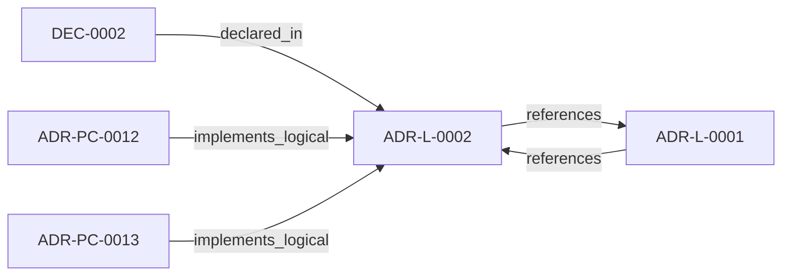

<!--
integrity_schema_version: 1
generated: deterministic_projection_v1
artifact_kind: rendered_adr_markdown
generator_id: adr-projection-markdown
generator_version: 2
hash_algorithm: sha256
source_hash: 986bda98497b3e1c4b358199c4fa837944c8955770a59afeba20179dda5bac85
rendered_hash: 78a673c358013687056fd462bf33844d614ee79afac12e5d3ced1a1b32bbfea4
-->

# ADR-L-0002: RECON Self-Validation Strategy

**Status:** accepted  
**Created:** 2026-01-07  
**Authors:** erik.gallmann  
**Domains:** recon, validation, governance  
**Tags:** recon, validation, self-validation, ste-compliance  
**Alias name:** recon-self-validation-strategy  

## Context

RECON generates AI-DOC state from source code extraction. The question arose: How should RECON validate its own output to ensure consistency and quality?

Key tensions:

1. **Blocking vs. Non-Blocking:** Should validation failures halt RECON execution?
2. **Verdict vs. Evidence:** Should validation declare correctness or surface observations?
3. **Scope:** What aspects of AI-DOC state should be validated?
4. **Integration:** When does validation run in the RECON pipeline?

---

## Relationship graph

## Related ADRs

### ADR-L-0001 — RECON Provisional Execution for Project-Level Semantic State

**Relationships:**
- 019ff84e-4ece-791b-822f-21f537c95340 -[:references]-> this ADR
- this ADR -[:references]-> 019ff84e-4ece-791b-822f-21f537c95340

**Context:** The STE Architecture Specification defines RECON (Reconciliation Engine) as the mechanism for extracting semantic state from source code and populating AI-DOC. The question arose: How should RECON operate during the exploratory development phase when foundational components are still being built?

[Open projection](ADR-L-0001-recon-provisional-execution-for-project-level-semantic-state.md)
### ADR-PC-0012 — RSS CLI and Runtime Graph Traversal

**Relationships:**
- 019ff876-6dad-7d95-ad68-e13d96ed23a9 -[:implements_logical]-> this ADR

**Context:** The runtime requires a developer-facing interface for deterministic traversal and context assembly over the RECON semantic graph. This component provides the RSS CLI and the underlying graph operations used by runtime and assistant-facing workflows.

[Open projection](../physical-component/ADR-PC-0012-rss-cli-and-runtime-graph-traversal.md)
### ADR-PC-0013 — Extractor Validation Framework

**Relationships:**
- 019ff876-6daf-773a-b017-7d967b7a7add -[:implements_logical]-> this ADR

**Context:** The semantic extraction subsystem needs a concrete validation component that checks extractor output quality, graph consistency, coverage, identity, schema conformance, and repeatability before derived state is accepted.

[Open projection](../physical-component/ADR-PC-0013-extractor-validation-framework.md)

## Decisions

### DEC-0002: RECON self-validation is non-blocking, report-only, and exploratory.

**Rationale:**
### 1. Non-Blocking Preserves Learning

If validation blocked execution on every finding, RECON would become unusable during exploratory development. Many validation findings are informational or represent known limitations in extraction algorithms.

By remaining non-blocking, validation:
- Captures all findings without losing work
- Allows developers to review findings at their discretion
- Generates historical data for pattern analysis
- Avoids false positive friction

### 2. Evidence Over Verdicts

During exploratory development, the validators themselves are evolving. A "verdict" implies confidence that is premature. Instead, validators generate:
- Observations about state structure
- Anomalies that may indicate issues
- Coverage gaps in extraction
- Repeatability concerns

Developers interpret findings; validators do not judge.

### 3. Categorization Enables Prioritization

All findings are categorized:

| Category | Meaning | Action |
|----------|---------|--------|
| ERROR | Structural issue that may indicate a bug | Investigate promptly |
| WARNING | Anomaly that may indicate a problem | Review when convenient |
| INFO | Observation for awareness | Log for future reference |

---

**Consequences:**

**Positive:**
- Continuous quality visibility without workflow disruption
- Historical trend data for extraction algorithm improvement
- Early detection of regression in extractors
- Developer confidence through transparency

**Negative:**
- Findings may be ignored if too numerous
- No enforcement of quality gates
- Report accumulation without review
- Periodic finding review as part of development process
- Track finding counts over time for trend analysis
- Prioritize ERROR findings for immediate investigation
- Use findings to guide extractor improvements

---

*Generated from ADR-L-0002 by ADR Architecture Kit*