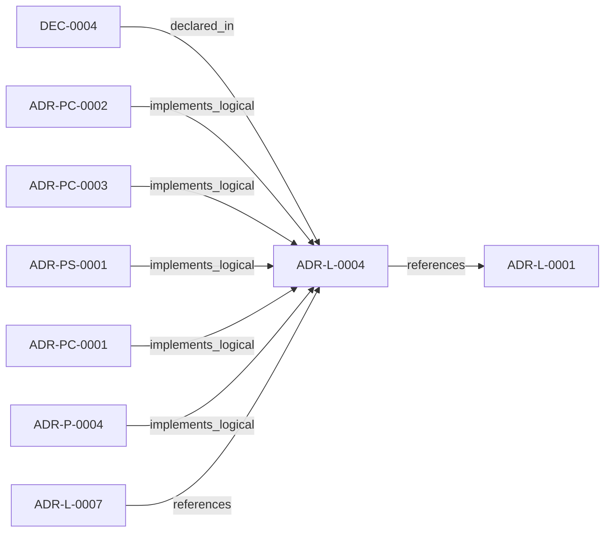

<!--
integrity_schema_version: 1
generated: deterministic_projection_v1
artifact_kind: rendered_adr_markdown
generator_id: adr-projection-markdown
generator_version: 2
hash_algorithm: sha256
source_hash: 7c4c433780a666b14b24dd0b8b440295b323e7ff4d02b0144062ed5ac5e1a780
rendered_hash: 7da9f80e303cd4150d20b42dc3af70c9a3e7845dfa8b8f15891fd5393a79c3fe
-->

# ADR-L-0004: Watchdog Authoritative Mode for Workspace Boundary

**Status:** accepted  
**Created:** 2026-03-08  
**Authors:** erik.gallmann  
**Domains:** watchdog, governance, workspace-boundary  
**Tags:** watchdog, file-watching, workspace-boundary, ste-compliance  
**Alias name:** watchdog-authoritative-mode-for-workspace-boundary  

## Context

Per STE Architecture (Section 3.1), STE operates across two distinct governance boundaries:
1. **Workspace Development Boundary** - Provisional state, soft + hard enforcement, post-reasoning validation
2. **Runtime Execution Boundary** - Canonical state, cryptographic enforcement, pre-reasoning admission control

This E-ADR defines ste-runtime's operation within the **Workspace Development Boundary**, where developers need a **live semantic graph** that stays fresh automatically during local development.

### Workspace Development Boundary (STE Architecture Section 3.1)

```
┌─────────────────────────────────────────────────────────────────┐
│              WORKSPACE DEVELOPMENT BOUNDARY                     │
│                                                                 │
│   ┌─────────────────────────────────────────────────────────┐   │
│   │                    CURSOR (Governed)                    │   │
│   │  • MCP client                                           │   │
│   │  • Context assembly via RSS (ste-runtime MCP)           │   │
│   └────────────────────┬────────────────────────────────────┘   │
│                        │ MCP Protocol (stdio)                   │
│                        ▼                                        │
│   ┌─────────────────────────────────────────────────────────┐   │
│   │              ste-runtime MCP Server                     │   │
│   │  • File Watcher → Incremental RECON                     │   │
│   │  • In-Memory RSS Context                                │   │
│   │  • MCP Tools (RSS operations)                           │   │
│   └─────────────────────────────────────────────────────────┘   │
│                        │                                        │
│                        ▼                                        │
│   ┌─────────────────────────────────────────────────────────┐   │
│   │              .ste/state/ (AI-DOC)                       │   │
│   │  • Provisional state (pre-merge)                        │   │
│   │  • Updated by incremental RECON                         │   │
│   └─────────────────────────────────────────────────────────┘   │
└─────────────────────────────────────────────────────────────────┘
```

**State Type:** Provisional, experimental (uncommitted, feature branches)  
**Authority:** Source code is truth → RECON extracts → AI-DOC (local, pre-merge)  
**Enforcement:** Soft (LLM) + Hard (validation tools + human approval)  
**Validation:** Post-reasoning (toolchain catches violations)

---

## Relationship graph



## Related ADRs

### ADR-L-0001 — RECON Provisional Execution for Project-Level Semantic State

**Relationships:**
- this ADR -[:references]-> 019ff84e-4ece-791b-822f-21f537c95340

**Context:** The STE Architecture Specification defines RECON (Reconciliation Engine) as the mechanism for extracting semantic state from source code and populating AI-DOC. The question arose: How should RECON operate during the exploratory development phase when foundational components are still being built?

[Open projection](ADR-L-0001-recon-provisional-execution-for-project-level-semantic-state.md)
### ADR-L-0007 — Graph Freshness and Obligation Projection Semantics

**Relationships:**
- 019ff84e-4ece-70ba-bf2e-a0fecd4a986e -[:references]-> this ADR

**Context:** ste-runtime now exposes graph freshness checks, invalidated validation
signals, change intent handling, and obligation projection behavior through
RSS and MCP tooling. These semantics are broader than implementation detail
and require an explicit logical authority.

[Open projection](ADR-L-0007-graph-freshness-and-obligation-projection-semantics.md)
### ADR-P-0004 — ste-runtime MCP Server Implementation

**Relationships:**
- 019ff84e-4ed0-78a0-9334-d520d3decf14 -[:implements_logical]-> this ADR

**Context:** Per STE Architecture Section 3.1, the Workspace Development Boundary requires:
- **Provisional state** maintenance (pre-merge, feature branches)
- **Soft + hard enforcement** (LLM instruction-following + validation tools)
- **Post-reasoning validation** (catch violations after generation)
- **Context assembly via RSS** (CEM Stage 2: State Loading)

[Open projection](../physical/ADR-P-0004-ste-runtime-mcp-server-implementation.md)
### ADR-PC-0001 — MCP Server and Tool Registry

**Relationships:**
- 019ff84e-4ecf-7d5e-a53c-bae8c74aca48 -[:implements_logical]-> this ADR

**Context:** This component exposes assistant-facing runtime tools over MCP and binds
structural, operational, context, optimized, obligation-oriented, and
workspace graph query tool surfaces into one discoverable server boundary.

[Open projection](../physical-component/ADR-PC-0001-mcp-server-and-tool-registry.md)
### ADR-PC-0002 — Watchdog and Update Coordination

**Relationships:**
- 019ff84e-4ecf-734c-9f3f-04d15f1079f5 -[:implements_logical]-> this ADR

**Context:** This component monitors changes, detects transactions, coordinates update
batches, and safeguards write-triggered reconciliation behavior for the
runtime boundary.

[Open projection](../physical-component/ADR-PC-0002-watchdog-and-update-coordination.md)
### ADR-PC-0003 — Preflight Freshness and Reconciliation Gating

**Relationships:**
- 019ff84e-4ecf-7776-bf27-ffc57bc598dd -[:implements_logical]-> this ADR

**Context:** This component evaluates file freshness, intent scope, and reconciliation
requirements before runtime actions rely on semantic graph state.

[Open projection](../physical-component/ADR-PC-0003-preflight-freshness-and-reconciliation-gating.md)
### ADR-PS-0001 — Runtime Orchestration and Assistant Integration

**Relationships:**
- 019ff84e-4ecf-78a6-bb1c-676e50a3d97a -[:implements_logical]-> this ADR

**Context:** ste-runtime now contains a runtime orchestration boundary that keeps semantic
state fresh, exposes assistant-facing MCP tools, performs reconciliation
gating and freshness checks, and assembles implementation context and
obligation projections for agents and operators.

[Open projection](../physical-system/ADR-PS-0001-runtime-orchestration-and-assistant-integration.md)


## Decisions

### DEC-0004: ste-runtime is a single process that combines:

**Rationale:**
### The Watchdog IS the Conflict Resolution Process

When a file moves:
1. Watchdog detects the move (authoritative: it observed the file system event)
2. Migration detection scores confidence (1.0 = certain same element)
3. High confidence → Watchdog resolves automatically (correct resolution)
4. Low confidence → Surfaces to human (ambiguous, needs judgment)

This is correct because:
-  Watchdog has ground truth (observed actual file system changes)
-  Migration detection is deterministic (same inputs → same decision)
-  Confidence thresholds ensure safety (humans review ambiguous cases)
-  Developer opts in (explicit choice to delegate authority)

### Slice Files Are Derived Artifacts

```
Source of Truth:
  user-panel.component.ts (source code)
  
Derived Artifact:
  .ste/state/frontend/component/component-abc123.yaml (slice)
  
Relationship:
  Source → RECON → Slice (one-way)
```

**Like:** `src/app.ts` → `dist/app.js` (compiled)

If you manually edit `dist/app.js`, the compiler overwrites it on next build.  
If you manually edit a slice file, watchdog overwrites it on next RECON (self-healing).

---


---

*Generated from ADR-L-0004 by ADR Architecture Kit*