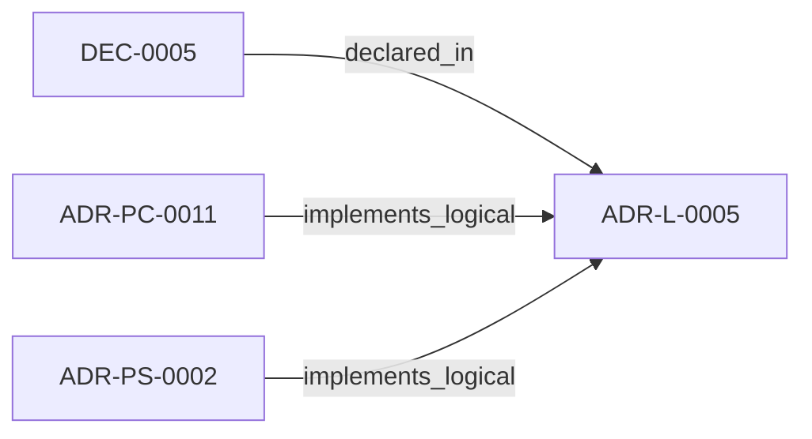

<!--
integrity_schema_version: 1
generated: deterministic_projection_v1
artifact_kind: rendered_adr_markdown
generator_id: adr-projection-markdown
generator_version: 2
hash_algorithm: sha256
source_hash: a374bcefebd776f30bb72c513abee47c97da99d133680aa6e2c21b7d7a464527
rendered_hash: 9de98ed23dc56ad6f8eea9b67ee335692a1a9c9029eba0a2bcdb3d86150c7e80
-->

# ADR-L-0005: Self-Configuring Domain Discovery

**Status:** proposed  
**Created:** 2026-01-07  
**Authors:** erik.gallmann  
**Domains:** recon, domain-discovery, architecture  
**Tags:** domain-discovery, self-configuring, ai-doc  
**Alias name:** self-configuring-domain-discovery  

## Context

## Relationship graph

## Related ADRs

### ADR-PC-0011 — ADR YAML Semantic Extraction

**Relationships:**
- 019ff84e-4ecf-7a82-ae3a-121886af1b51 -[:implements_logical]-> this ADR

**Context:** ADR YAML semantic extraction converts Architecture Decision Records authored
in the ADR-kit YAML schema into first-class RECON graph slices. This enables
the MCP query tools (find, impact, usages, similar) to operate over the
architecture domain alongside code-derived domains (graph, behavior, data,
api, infrastructure).

[Open projection](../physical-component/ADR-PC-0011-adr-yaml-semantic-extraction.md)
### ADR-PS-0002 — Semantic Extraction Subsystem

**Relationships:**
- 019ff84e-4ed0-73d5-aa3f-dfbfd18b339c -[:implements_logical]-> this ADR

**Context:** ste-runtime extraction is now a subsystem containing multiple first-class
extractors and normalization flows rather than a pair of isolated physical
slices. This ADR groups the implemented extractor estate under a concrete
system boundary.

[Open projection](../physical-system/ADR-PS-0002-semantic-extraction-subsystem.md)

## Decisions

### DEC-0005: 

**Rationale:**

**Consequences:**

**Positive:**
- Drop into any project and run immediately
- No setup time, no learning curve
- Immediate value delivery
- Works with any project structure
- Works with any naming convention
- Works with any framework combination
- Understands project context automatically
- Tags and relationships use actual project names
- Output reflects real architecture
- Reduces barrier to entry dramatically
- Eliminates configuration errors
- Enables rapid experimentation
- Discovery output shows what was found
- Users understand what runtime sees
- Transparent behavior

**Negative:**
- Discovery engine requires careful design
- Edge cases need handling
- More code to maintain
- 4 weeks vs 2 weeks for manual config
- Delays other features
- Higher upfront investment
- Heuristics may fail for unusual structures
- Need robust fallback mechanisms
- Requires extensive testing
- Clear abstractions and interfaces
- Comprehensive unit test coverage
- Well-documented heuristics
- Investment justified by adoption gains
- Phased implementation with validation gates
- Early user testing
- Confidence scoring system
- Graceful fallback to safe defaults
- Optional configuration override for edge cases
- Clear discovery debugging output

---

*Generated from ADR-L-0005 by ADR Architecture Kit*