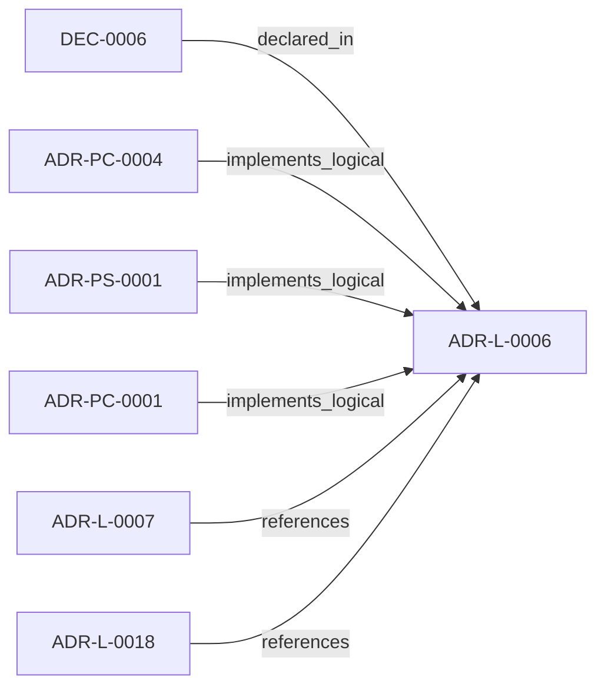

<!--
integrity_schema_version: 1
generated: deterministic_projection_v1
artifact_kind: rendered_adr_markdown
generator_id: adr-projection-markdown
generator_version: 2
hash_algorithm: sha256
source_hash: f94ddb8754bc669960941fd051438821a6315861e737a3c0b8b472c78ad65730
rendered_hash: 101d7bf55e0c88238320d8420cae5d30ebfde5b1f485a7cf13cdcbf2b528b5f8
-->

# ADR-L-0006: Conversational Query Interface for RSS

**Status:** proposed  
**Created:** 2026-01-09  
**Authors:** erik.gallmann  
**Domains:** rss, interface, architecture  
**Tags:** rss, conversational, query-interface, natural-language  
**Alias name:** conversational-query-interface-for-rss  

## Context

E-ADR-004 established the RSS CLI and TypeScript API as the foundation for graph traversal and context assembly. However, a gap exists between:

1. **Raw RSS operations** (search, dependencies, blast-radius) - require knowing the API
2. **Natural language queries** ("Tell me about X") - how humans and AI agents actually communicate

The challenge: **How do we make RSS consumption as seamless as natural conversation?**

Observations from usage patterns:

| Pattern | Example Query | Current RSS Approach |
|---------|---------------|---------------------|
| Describe | "Tell me about X" | `search X` → `blast-radius` → manual assembly |
| Explain | "How does X work?" | Same as above |
| Impact | "What would change affect?" | `blast-radius X --depth=3` |
| List | "Show all Lambda handlers" | `by-tag handler:lambda` |
| Locate | "Where is X?" | `search X` |

Each pattern requires the caller to:
1. Know which RSS operation to use
2. Compose operations correctly
3. Parse unstructured output
4. Generate follow-up queries

This friction degrades both human UX and AI agent efficiency.

---

## Relationship graph



## Related ADRs

### ADR-L-0007 — Graph Freshness and Obligation Projection Semantics

**Relationships:**
- 019ff84e-4ece-70ba-bf2e-a0fecd4a986e -[:references]-> this ADR

**Context:** ste-runtime now exposes graph freshness checks, invalidated validation
signals, change intent handling, and obligation projection behavior through
RSS and MCP tooling. These semantics are broader than implementation detail
and require an explicit logical authority.

[Open projection](ADR-L-0007-graph-freshness-and-obligation-projection-semantics.md)
### ADR-L-0018 — Deterministic Workspace Graph Queries

**Relationships:**
- 019ff84e-4ece-7c3b-833e-dbdb54ed76ec -[:references]-> this ADR

**Context:** The workspace semantic graph (verb-typed edges in slices/*.yaml, produced per
ADR-L-0016) already contains the relationships needed to answer standard
system-level questions such as "show me the repo dependency map," "show me the
component integration," and "what is the blast radius of node X." Today, those
questions require either manual MCP tool invocation by an LLM or reading raw
YAML.

[Open projection](ADR-L-0018-deterministic-workspace-graph-queries.md)
### ADR-PC-0001 — MCP Server and Tool Registry

**Relationships:**
- 019ff84e-4ecf-7d5e-a53c-bae8c74aca48 -[:implements_logical]-> this ADR

**Context:** This component exposes assistant-facing runtime tools over MCP and binds
structural, operational, context, optimized, obligation-oriented, and
workspace graph query tool surfaces into one discoverable server boundary.

[Open projection](../physical-component/ADR-PC-0001-mcp-server-and-tool-registry.md)
### ADR-PC-0004 — Obligation Projection and Context Assembly

**Relationships:**
- 019ff84e-4ecf-7156-a33b-bc8bba3fac60 -[:implements_logical]-> this ADR

**Context:** This component projects invalidated validations and change-driven obligations,
assembles implementation context, and loads source-backed evidence for
assistant-facing reasoning.

[Open projection](../physical-component/ADR-PC-0004-obligation-projection-and-context-assembly.md)
### ADR-PS-0001 — Runtime Orchestration and Assistant Integration

**Relationships:**
- 019ff84e-4ecf-78a6-bb1c-676e50a3d97a -[:implements_logical]-> this ADR

**Context:** ste-runtime now contains a runtime orchestration boundary that keeps semantic
state fresh, exposes assistant-facing MCP tools, performs reconciliation
gating and freshness checks, and assembles implementation context and
obligation projections for agents and operators.

[Open projection](../physical-system/ADR-PS-0001-runtime-orchestration-and-assistant-integration.md)


## Decisions

### DEC-0006: Implement a Conversational Query Interface (CQI) as a layer above RSS that:

**Rationale:**
### 1. Reduces Cognitive Load for Both Humans and AI

Without CQI:
```
Human: "What would be affected by changing the auth service?"
→ Human must know: use blast-radius, specify key format, parse output
→ AI must know: compose RSS calls, format results, generate follow-ups
```

With CQI:
```
Human: "What would be affected by changing the auth service?"
→ CQI: intent=impact, blastRadius(depth=3), structured response with files
```

### 2. Intent Classification Enables Optimization

Different intents have different optimal strategies:

| Intent | Optimization |
|--------|-------------|
| `list` | Use tag query if applicable (O(n) scan vs O(1) tag lookup) |
| `impact` | Increase depth, cap nodes |
| `relationship` | Traverse both, compute intersection |
| `describe` | Get context + suggested follow-ups |

### 3. Caching Amortizes Graph Load Cost

Benchmark results:

| Metric | Value |
|--------|-------|
| Graph load (cold) | ~300-400ms |
| Uncached query | ~2-4ms |
| Cached query | **~0.2-0.3ms** |

For interactive sessions, caching provides ~10x speedup on repeated patterns.

### 4. Suggested Queries Enable Exploration

CQI generates contextual follow-ups:

```
Query: "Tell me about the auth service"
Suggested:
  → What does AuthService depend on?
  → What depends on AuthService?
  → Impact of changing AuthService
```

This guides both humans and AI agents toward productive exploration.

---


**Consequences:**

**Positive:**
- **Seamless UX**: Both humans and AI agents use natural language
- **Performance**: Sub-5ms queries, <0.3ms cached
- **Discoverability**: Suggested queries guide exploration
- **Dual output**: Same engine serves terminal and programmatic use
- **Foundation for MCP**: CQI becomes the MCP tool interface

**Negative:**
- **Pattern maintenance**: New intent patterns require code changes
- **Cache staleness**: Risk of stale results if cache not invalidated
- **Abstraction cost**: Hides RSS complexity (may hinder advanced use)
- Expose raw RSS API for power users
- Document intent patterns explicitly
- Integrate with Watchdog for automatic cache invalidation


---

*Generated from ADR-L-0006 by ADR Architecture Kit*