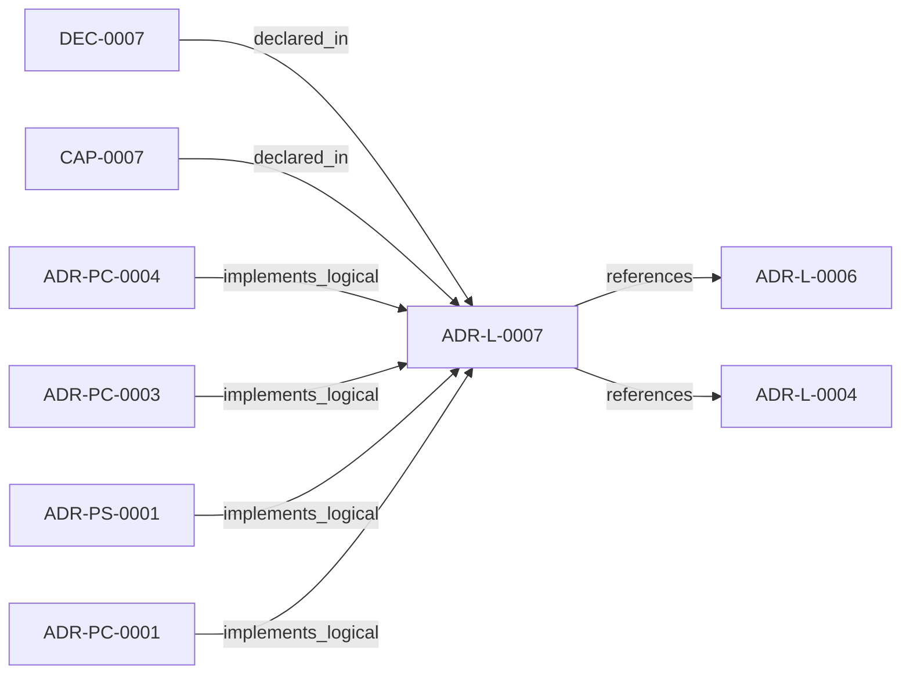

<!--
integrity_schema_version: 1
generated: deterministic_projection_v1
artifact_kind: rendered_adr_markdown
generator_id: adr-projection-markdown
generator_version: 2
hash_algorithm: sha256
source_hash: ad0d4e2a308f0fabd819576dc74d3c7a178c68ada59f2f83716f08e5ade1c490
rendered_hash: 6ead6f30aaa3725cfc254758f8077e394a862a76540ff4479ebad2c6ab48fe4b
-->

# ADR-L-0007: Graph Freshness and Obligation Projection Semantics

**Status:** proposed  
**Created:** 2026-03-15  
**Authors:** erik.gallmann  
**Domains:** rss, obligations, freshness  
**Tags:** freshness, obligations, preflight, validation  
**Alias name:** graph-freshness-and-obligation-projection-semantics  

## Context

ste-runtime now exposes graph freshness checks, invalidated validation
signals, change intent handling, and obligation projection behavior through
RSS and MCP tooling. These semantics are broader than implementation detail
and require an explicit logical authority.

## Relationship graph

## Related ADRs

### ADR-L-0004 — Watchdog Authoritative Mode for Workspace Boundary

**Relationships:**
- this ADR -[:references]-> 019ff84e-4ece-75dd-9f0b-ccb51cedc4f5

**Context:** Per STE Architecture (Section 3.1), STE operates across two distinct governance boundaries:
1. **Workspace Development Boundary** - Provisional state, soft + hard enforcement, post-reasoning validation
2. **Runtime Execution Boundary** - Canonical state, cryptographic enforcement, pre-reasoning admission control

[Open projection](ADR-L-0004-watchdog-authoritative-mode-for-workspace-boundary.md)
### ADR-L-0006 — Conversational Query Interface for RSS

**Relationships:**
- this ADR -[:references]-> 019ff84e-4ece-71c8-af1f-eb35c77b551a

**Context:** E-ADR-004 established the RSS CLI and TypeScript API as the foundation for graph traversal and context assembly. However, a gap exists between:

[Open projection](ADR-L-0006-conversational-query-interface-for-rss.md)
### ADR-PC-0001 — MCP Server and Tool Registry

**Relationships:**
- 019ff84e-4ecf-7d5e-a53c-bae8c74aca48 -[:implements_logical]-> this ADR

**Context:** This component exposes assistant-facing runtime tools over MCP and binds
structural, operational, context, optimized, obligation-oriented, and
workspace graph query tool surfaces into one discoverable server boundary.

[Open projection](../physical-component/ADR-PC-0001-mcp-server-and-tool-registry.md)
### ADR-PC-0003 — Preflight Freshness and Reconciliation Gating

**Relationships:**
- 019ff84e-4ecf-7776-bf27-ffc57bc598dd -[:implements_logical]-> this ADR

**Context:** This component evaluates file freshness, intent scope, and reconciliation
requirements before runtime actions rely on semantic graph state.

[Open projection](../physical-component/ADR-PC-0003-preflight-freshness-and-reconciliation-gating.md)
### ADR-PC-0004 — Obligation Projection and Context Assembly

**Relationships:**
- 019ff84e-4ecf-7156-a33b-bc8bba3fac60 -[:implements_logical]-> this ADR

**Context:** This component projects invalidated validations and change-driven obligations,
assembles implementation context, and loads source-backed evidence for
assistant-facing reasoning.

[Open projection](../physical-component/ADR-PC-0004-obligation-projection-and-context-assembly.md)
### ADR-PS-0001 — Runtime Orchestration and Assistant Integration

**Relationships:**
- 019ff84e-4ecf-78a6-bb1c-676e50a3d97a -[:implements_logical]-> this ADR

**Context:** ste-runtime now contains a runtime orchestration boundary that keeps semantic
state fresh, exposes assistant-facing MCP tools, performs reconciliation
gating and freshness checks, and assembles implementation context and
obligation projections for agents and operators.

[Open projection](../physical-system/ADR-PS-0001-runtime-orchestration-and-assistant-integration.md)

## Capabilities

### CAP-0007: Surface graph freshness and obligation projection semantics

Provide canonical freshness, invalidation, and obligation semantics for runtime consumers.

## Decisions

### DEC-0007: Freshness and obligation projection are logical runtime semantics

**Rationale:**
The current runtime models freshness and obligation data in public schemas
and assistant-facing responses, so these semantics require canonical
documentation above the component layer.

---

*Generated from ADR-L-0007 by ADR Architecture Kit*