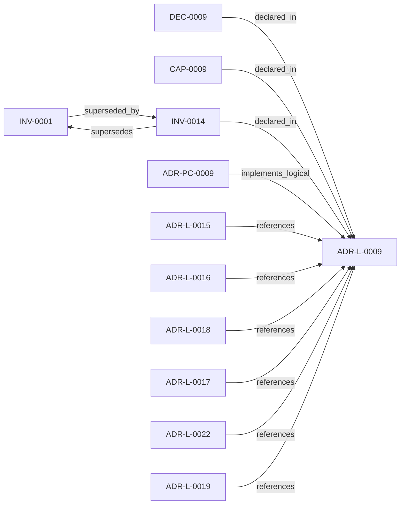

<!--
integrity_schema_version: 1
generated: deterministic_projection_v1
artifact_kind: rendered_adr_markdown
generator_id: adr-projection-markdown
generator_version: 2
hash_algorithm: sha256
source_hash: 3c9adeb674aece94071be799e57dba0fc196d78f0aff42f6a3591e9ba315bf65
rendered_hash: c3700b807c8caea77c6395f302648987e73d80fe68e31db944a1504305814916
-->

# ADR-L-0009: Unified Workspace Scope Model

**Status:** proposed  
**Created:** 2026-04-21  
**Authors:** erik.gallmann  
**Domains:** workspace, scope  
**Tags:** workspace, scope, multi-repo  
**Alias name:** unified-workspace-scope-model  

## Context

Reconnaissance tools traditionally assume a single repository as the unit
of analysis. Multi-repo systems require scope to expand to the workspace
level so that cross-repo relationships, shared configuration, and
aggregate evidence can be captured correctly.

## Relationship graph

## Related ADRs

### ADR-L-0015 — Workspace Agnosticism Invariant

**Relationships:**
- 019ff84e-4ece-76a3-a93f-463d9474ce28 -[:references]-> this ADR

**Context:** ste-runtime is an OSS tool that operates on arbitrary workspaces. Each
workspace declares its own repository list, output directory, and domain
vocabulary in workspace.yaml. The runtime must never contain references
to any specific workspace, repository name, or domain vocabulary in its
source code. Prior ADRs established workspace scope (ADR-L-0009) and
path portability (ADR-L-0013). This ADR strengthens those commitments
into a codified invariant with automated enforcement.

[Open projection](ADR-L-0015-workspace-agnosticism-invariant.md)
### ADR-L-0016 — Workspace Graph Slice Schema Contract

**Relationships:**
- 019ff84e-4ece-76ad-ae3e-f92bef05635a -[:references]-> this ADR

**Context:** ste-runtime produces per-repository graph slices during workspace RECON.
These slices are consumed by the runtime-owned workspace merger to produce
a unified workspace graph and multi-resolution projections. Without a
defined schema contract, producer and consumer drift can break merge
pipelines or cause downstream tools to treat partial graph material as
authoritative.

[Open projection](ADR-L-0016-workspace-graph-slice-schema-contract.md)
### ADR-L-0017 — RECON Workspace Execution Contract

**Relationships:**
- 019ff84e-4ece-7ddc-b31f-3a009abe14b3 -[:references]-> this ADR

**Context:** ADR-L-0009 fixes workspace as the universal scope unit. This ADR records
how workspace RECON execution behaves for observability, optional
incremental cross-run skips, and optional per-repository timeouts without
changing slice schemas or merge semantics. Persisted sentinel paths obey
ADR-L-0013 POSIX-relative projections from the workspace root. The semantic
extraction subsystem (ADR-PS-0002) remains the authoritative boundary for
phase-level extraction behavior; workspace orchestration…

[Open projection](ADR-L-0017-recon-workspace-execution-contract.md)
### ADR-L-0018 — Deterministic Workspace Graph Queries

**Relationships:**
- 019ff84e-4ece-7c3b-833e-dbdb54ed76ec -[:references]-> this ADR

**Context:** The workspace semantic graph (verb-typed edges in slices/*.yaml, produced per
ADR-L-0016) already contains the relationships needed to answer standard
system-level questions such as "show me the repo dependency map," "show me the
component integration," and "what is the blast radius of node X." Today, those
questions require either manual MCP tool invocation by an LLM or reading raw
YAML.

[Open projection](ADR-L-0018-deterministic-workspace-graph-queries.md)
### ADR-L-0019 — Multi-Resolution Architecture Projection

**Relationships:**
- 019ff84e-4ecf-74ba-b201-3b02412f39c8 -[:references]-> this ADR

**Context:** ADR-L-0018 established deterministic workspace graph querying with L4 (full
fidelity) projection rendering. The resulting projections prove the pipeline
works but produce cognitively unusable output for human readers. Evidence:
a typical multi-repo workspace architecture-overview.md contains 413 lines with 61 identical
has_contract edges rendering every API endpoint as a sibling node.

[Open projection](ADR-L-0019-multi-resolution-architecture-projection.md)
### ADR-L-0022 — Workspace Attribution Federation Consumption

**Relationships:**
- 019ff84e-4ecf-745f-9832-3155d323e40c -[:references]-> this ADR

**Context:** Per-repo RECON emits implementation-attribution-evidence.yaml with bare
ADR-L-XXXX ids scoped to each repository manifest. The same bare id string
may denote different decisions in different repos (for example ADR-L-0013 in
adr-architecture-kit vs ste-runtime).

[Open projection](ADR-L-0022-workspace-attribution-federation-consumption.md)
### ADR-PC-0009 — Workspace Graph Query Engine

**Relationships:**
- 019ff84e-4ecf-7a24-801d-7d1e708577ac -[:implements_logical]-> this ADR

**Context:** ADR-L-0018 established the capability for deterministic workspace graph
querying. This component implements the loader, three canned query functions,
and three projection renderers that realize that capability. It consumes
workspace slices (per ADR-L-0016 schema contract) and exposes results through
the MCP tool registry (ADR-PC-0001) and CLI (ADR-P-0001).

[Open projection](../physical-component/ADR-PC-0009-workspace-graph-query-engine.md)

## Capabilities

### CAP-0009: Workspace-scoped analysis

All reconnaissance and evidence emission operates on workspace scope.

## Invariants

### INV-0014

**Statement:** Scope is a workspace. Size(workspace) >= 1.  
**Scope:** global  
**Enforcement:** must (design)  
**Verification:** automated

**Rationale:**
All analysis operates on workspace scope; a workspace always contains at least one repository.

## Decisions

### DEC-0009: Workspace is the universal scope unit

**Rationale:**
Multi-repo analysis cannot be retrofitted onto single-repo scope
without pervasive special-casing. Defining workspace as the universal
scope from the start eliminates that debt. A workspace containing a
single repository (e.g. repo-a) behaves identically to a degenerate
case of workspace containing repo-a, repo-b, repo-c.

---

*Generated from ADR-L-0009 by ADR Architecture Kit*