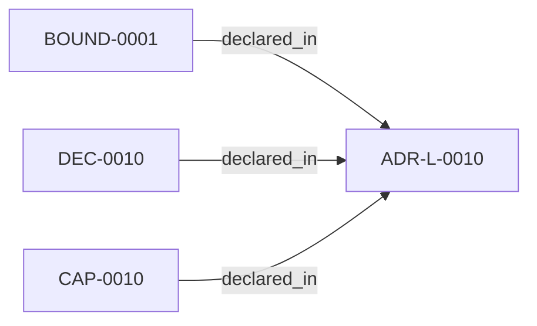

<!--
integrity_schema_version: 1
generated: deterministic_projection_v1
artifact_kind: rendered_adr_markdown
generator_id: adr-projection-markdown
generator_version: 2
hash_algorithm: sha256
source_hash: 65daae867d2f842ac364b2ef856771dcfca5175ef61007b6b94b94b09a068f22
rendered_hash: 679f460591dcfd212bc97caa3f1e80b1338b3fe90ec52f96cf474926f0545929
-->

# ADR-L-0010: Bootstrap and Init Capability

**Status:** proposed  
**Created:** 2026-04-21  
**Authors:** erik.gallmann  
**Domains:** workspace, init  
**Tags:** init, bootstrap, onboarding  
**Alias name:** bootstrap-and-init-capability  

## Context

Without a first-class init command, onboarding requires manual file
creation and sequencing knowledge. Users must know which files to create,
in which order, and which values to populate. This friction slows
adoption and increases configuration errors.

## Relationship graph

## Capabilities

### CAP-0010: One-command workspace initialization

ste setup creates a fully configured workspace (config, MCP, gitignore,
initial RECON). ste init remains as the sub-capability for scaffolding
workspace.yaml specifically.

## Architectural Boundaries

### BOUND-0001: Init publication surface

**Description:**
Creates .workspace-graph/config.yaml and
.workspace-graph/registry.local.yaml.example at the target path.

**Rationale:**
Defines the exact files produced by init, bounding its write surface.

## Constraints

### CONST-0001 (technical)

**Description:**
Defaults to public registries only (registry.npmjs.org, pypi.org).

**Rationale:**
Ensures the init command works without corporate network access.

### CONST-0002 (security)

**Description:**
Reads but never persists work-context environment variables.

**Rationale:**
Prevents accidental leakage of environment-specific values into version-controlled files.

### CONST-0003 (technical)

**Description:**
Generates a gitignored local-override pattern for private mirror opt-in.

**Rationale:**
Users who need private registries can opt in locally without affecting the shared configuration.

### CONST-0004 (technical)

**Description:**
Fails with a clear actionable error when offline; never silently retries against a hard-coded private host.

**Rationale:**
Prevents silent network requests to unreachable hosts and provides actionable diagnostics.

### CONST-0005 (technical)

**Description:**
Is idempotent -- running twice produces the same result as running once.

**Rationale:**
Idempotency ensures safe re-runs and reduces operator anxiety during onboarding.

## Decisions

### DEC-0010: ste setup is the canonical one-command install experience

**Rationale:**
Manual onboarding is error-prone and slow. A first-class setup command
with binding constraints ensures consistent, portable, and safe
workspace initialization. ste setup supersedes the narrower ste init
by also handling MCP configuration, .gitignore, and initial RECON.

---

*Generated from ADR-L-0010 by ADR Architecture Kit*