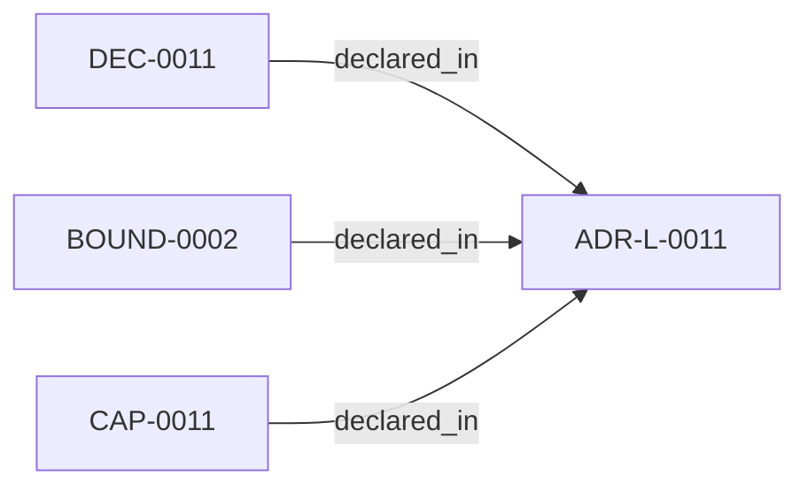

<!--
integrity_schema_version: 1
generated: deterministic_projection_v1
artifact_kind: rendered_adr_markdown
generator_id: adr-projection-markdown
generator_version: 2
hash_algorithm: sha256
source_hash: 6bd84bd4ca48d7827509147e9ff5f7d3ff985ed42d3bb97f4e72a1c094eb4169
rendered_hash: 1a84796174271649566dacf931d10f28fd94c9e033af9c3aae588b19fb358d24
-->

# ADR-L-0011: Adapter Role Conformance

**Status:** proposed  
**Created:** 2026-04-21  
**Authors:** erik.gallmann  
**Domains:** architecture, integration  
**Tags:** adapter, role, evidence  
**Alias name:** adapter-role-conformance  

## Context

STE defines five subsystems. ste-runtime is the RuntimeAdapter. Its role
and publication surface must be declared, not assumed. Without explicit
conformance, the runtime risks emitting artifacts outside its authority
or failing to emit required ones.

## Relationship graph

## Capabilities

### CAP-0011: ArchitectureEvidence emission

Emit ArchitectureEvidence v2 at .workspace-graph/evidence/architecture-evidence.json.

## Architectural Boundaries

### BOUND-0002: RuntimeAdapter publication surface

**Description:**
Publication surface (stable):
.workspace-graph/evidence/architecture-evidence.json

**Rationale:**
Declares the single stable output path for runtime evidence emission.

## Decisions

### DEC-0011: ste-runtime conforms to RuntimeAdapter role

**Rationale:**
Explicit role conformance prevents scope leakage across subsystem
boundaries and ensures evidence artifacts are schema-compliant.

---

*Generated from ADR-L-0011 by ADR Architecture Kit*