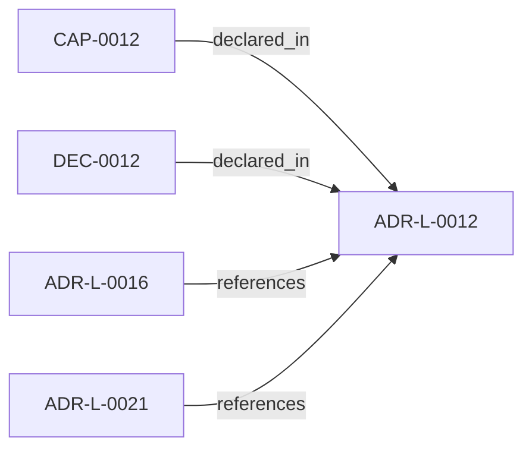

<!--
integrity_schema_version: 1
generated: deterministic_projection_v1
artifact_kind: rendered_adr_markdown
generator_id: adr-projection-markdown
generator_version: 2
hash_algorithm: sha256
source_hash: f191875d28aa4a5bd8d1684baa1b8b631d7afef8c5370e6f8b397f73e56e547c
rendered_hash: 5a116944e3924c37b14f64b85f2f96e41cadd81f4963e4d8ffce4c505e509c57
-->

# ADR-L-0012: Polyglot Interop Contract

**Status:** proposed  
**Created:** 2026-04-21  
**Authors:** erik.gallmann  
**Domains:** architecture, interop  
**Tags:** polyglot, schema, interop  
**Alias name:** polyglot-interop-contract  

## Context

STE subsystems are written in different languages. On-disk artifacts are
the only interop boundary. Neither runtime invents schema. Without a
single schema authority, subsystems risk copying, re-deriving, or
hand-maintaining sibling schemas, leading to drift and contract
violations.

## Relationship graph

## Related ADRs

### ADR-L-0016 — Workspace Graph Slice Schema Contract

**Relationships:**
- 019ff84e-4ece-76ad-ae3e-f92bef05635a -[:references]-> this ADR

**Context:** ste-runtime produces per-repository graph slices during workspace RECON.
These slices are consumed by the runtime-owned workspace merger to produce
a unified workspace graph and multi-resolution projections. Without a
defined schema contract, producer and consumer drift can break merge
pipelines or cause downstream tools to treat partial graph material as
authoritative.

[Open projection](ADR-L-0016-workspace-graph-slice-schema-contract.md)
### ADR-L-0021 — Experimental MVC-D to MVC-S Contract Consumption

**Relationships:**
- 019ff84e-4ecf-74b8-8b3b-d33e1ad21f6a -[:references]-> this ADR

**Context:** ste-spec now defines draft MVC-D and MVC-S schemas as part of the MVC evolution
contract surface. ste-runtime needs an experimental contract-consumption slice
that proves it can validate MVC-D fixtures and emit factual MVC-S candidate
snapshots without becoming a second schema authority and without crossing into
kernel-owned admission.

[Open projection](ADR-L-0021-experimental-mvc-d-to-mvc-s-contract-consumption.md)

## Capabilities

### CAP-0012: Schema fixture synchronization

ste-runtime consumes architecture-evidence.schema.json via fixture
sync in test/fixtures/. Drift is detected by
spec-schema-fixture-sync.test.ts.

## Decisions

### DEC-0012: ste-spec is the single schema authority

**Rationale:**
Polyglot subsystems cannot safely maintain independent copies of
shared schemas. Centralizing authority in ste-spec eliminates drift
and ensures all subsystems validate against the same contract.

---

*Generated from ADR-L-0012 by ADR Architecture Kit*