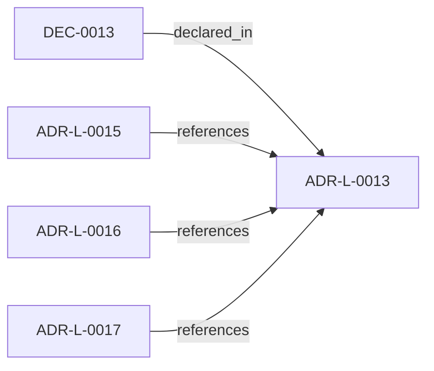

<!--
integrity_schema_version: 1
generated: deterministic_projection_v1
artifact_kind: rendered_adr_markdown
generator_id: adr-projection-markdown
generator_version: 2
hash_algorithm: sha256
source_hash: 89be1e7bcd68f90c2896ffa18045c140efc38d36c61fdb84071a887048df551a
rendered_hash: 9994b4383211a7d4f2ed9004e571f926565931e0a4c91e0c50e3916198384c96
-->

# ADR-L-0013: Path Portability Contract

**Status:** proposed  
**Created:** 2026-04-21  
**Authors:** erik.gallmann  
**Domains:** portability, paths  
**Tags:** paths, portability, cross-platform  
**Alias name:** path-portability-contract  

## Context

Windows, macOS, and Linux represent paths differently. Any path
persisted to a file, logged, or used as an identifier must be portable.
src/utils/paths.ts already implements the correct helpers
(toPosixPath, getRelativePosixPath).

## Relationship graph

## Related ADRs

### ADR-L-0015 — Workspace Agnosticism Invariant

**Relationships:**
- 019ff84e-4ece-76a3-a93f-463d9474ce28 -[:references]-> this ADR

**Context:** ste-runtime is an OSS tool that operates on arbitrary workspaces. Each
workspace declares its own repository list, output directory, and domain
vocabulary in workspace.yaml. The runtime must never contain references
to any specific workspace, repository name, or domain vocabulary in its
source code. Prior ADRs established workspace scope (ADR-L-0009) and
path portability (ADR-L-0013). This ADR strengthens those commitments
into a codified invariant with automated enforcement.

[Open projection](ADR-L-0015-workspace-agnosticism-invariant.md)
### ADR-L-0016 — Workspace Graph Slice Schema Contract

**Relationships:**
- 019ff84e-4ece-76ad-ae3e-f92bef05635a -[:references]-> this ADR

**Context:** ste-runtime produces per-repository graph slices during workspace RECON.
These slices are consumed by the runtime-owned workspace merger to produce
a unified workspace graph and multi-resolution projections. Without a
defined schema contract, producer and consumer drift can break merge
pipelines or cause downstream tools to treat partial graph material as
authoritative.

[Open projection](ADR-L-0016-workspace-graph-slice-schema-contract.md)
### ADR-L-0017 — RECON Workspace Execution Contract

**Relationships:**
- 019ff84e-4ece-7ddc-b31f-3a009abe14b3 -[:references]-> this ADR

**Context:** ADR-L-0009 fixes workspace as the universal scope unit. This ADR records
how workspace RECON execution behaves for observability, optional
incremental cross-run skips, and optional per-repository timeouts without
changing slice schemas or merge semantics. Persisted sentinel paths obey
ADR-L-0013 POSIX-relative projections from the workspace root. The semantic
extraction subsystem (ADR-PS-0002) remains the authoritative boundary for
phase-level extraction behavior; workspace orchestration…

[Open projection](ADR-L-0017-recon-workspace-execution-contract.md)

## Constraints

### CONST-0006 (technical)

**Description:**
ste init may not write drive-letter or home-directory paths into any generated file.

**Rationale:**
Generated files must be portable across platforms; absolute or drive-letter paths break this contract.

## Decisions

### DEC-0013: Persisted paths are POSIX-relative to workspace root

**Rationale:**
Platform-specific paths in persisted artifacts break cross-platform
workflows. Enforcing POSIX-relative paths at the serialization
boundary ensures portability without constraining internal disk-IO.

---

*Generated from ADR-L-0013 by ADR Architecture Kit*