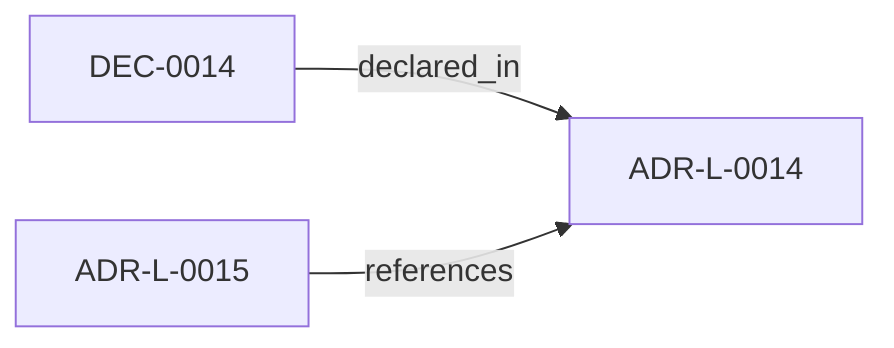

<!--
integrity_schema_version: 1
generated: deterministic_projection_v1
artifact_kind: rendered_adr_markdown
generator_id: adr-projection-markdown
generator_version: 2
hash_algorithm: sha256
source_hash: ccb74cc394a2d38a555c66b282ad3310fcce7a1083550d3bdf90ad257aed621b
rendered_hash: a1e990f59f5009c5c88ebbdec039fde55560c089e07157e5720f5760f07c1e01
-->

# ADR-L-0014: Private Registry Isolation

**Status:** proposed  
**Created:** 2026-04-21  
**Authors:** erik.gallmann  
**Domains:** security, registry  
**Tags:** registry, isolation, ip-protection  
**Alias name:** private-registry-isolation  

## Context

Enterprise environments route package installs through private registry
instances. These hosts are unreachable outside the corporate network and
their URLs are work-context IP. Source code, configuration, generated
artifacts, and lockfiles must not leak private registry references.

## Relationship graph

## Related ADRs

### ADR-L-0015 — Workspace Agnosticism Invariant

**Relationships:**
- 019ff84e-4ece-76a3-a93f-463d9474ce28 -[:references]-> this ADR

**Context:** ste-runtime is an OSS tool that operates on arbitrary workspaces. Each
workspace declares its own repository list, output directory, and domain
vocabulary in workspace.yaml. The runtime must never contain references
to any specific workspace, repository name, or domain vocabulary in its
source code. Prior ADRs established workspace scope (ADR-L-0009) and
path portability (ADR-L-0013). This ADR strengthens those commitments
into a codified invariant with automated enforcement.

[Open projection](ADR-L-0015-workspace-agnosticism-invariant.md)

## Constraints

### CONST-0007 (security)

**Description:**
ste init honors NPM_CONFIG_REGISTRY at runtime but never writes
that value into a generated file.

**Rationale:**
Runtime registry configuration must not leak into persisted artifacts.

## Decisions

### DEC-0014: No private registry references in source or artifacts

**Rationale:**
Private registry URLs are work-context IP that must not appear in
version-controlled files. Mechanical enforcement via the scanner
prevents accidental leakage.

---

*Generated from ADR-L-0014 by ADR Architecture Kit*