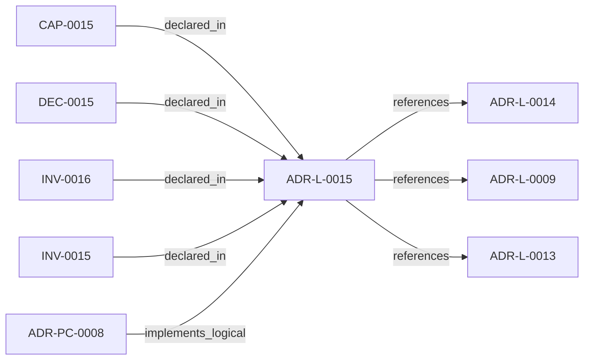

<!--
integrity_schema_version: 1
generated: deterministic_projection_v1
artifact_kind: rendered_adr_markdown
generator_id: adr-projection-markdown
generator_version: 2
hash_algorithm: sha256
source_hash: 5e2dba890ae51a06037829c9c032bdaafe7029a239367bd1f5ccc76072dc2fba
rendered_hash: 2e495ad0021d6728312328910ac9e78f3ce5c148ff8c412d7894494861ddd48a
-->

# ADR-L-0015: Workspace Agnosticism Invariant

**Status:** proposed  
**Created:** 2026-04-24  
**Authors:** erik.gallmann  
**Domains:** workspace, portability, architecture  
**Tags:** workspace-agnosticism, invariant, oss, manifest-driven  
**Alias name:** workspace-agnosticism-invariant  

## Context

ste-runtime is an OSS tool that operates on arbitrary workspaces. Each
workspace declares its own repository list, output directory, and domain
vocabulary in workspace.yaml. The runtime must never contain references
to any specific workspace, repository name, or domain vocabulary in its
source code. Prior ADRs established workspace scope (ADR-L-0009) and
path portability (ADR-L-0013). This ADR strengthens those commitments
into a codified invariant with automated enforcement.

## Relationship graph

## Related ADRs

### ADR-L-0009 — Unified Workspace Scope Model

**Relationships:**
- this ADR -[:references]-> 019ff84e-4ece-7ce3-aa17-67193bab337e

**Context:** Reconnaissance tools traditionally assume a single repository as the unit
of analysis. Multi-repo systems require scope to expand to the workspace
level so that cross-repo relationships, shared configuration, and
aggregate evidence can be captured correctly.

[Open projection](ADR-L-0009-unified-workspace-scope-model.md)
### ADR-L-0013 — Path Portability Contract

**Relationships:**
- this ADR -[:references]-> 019ff84e-4ece-7f44-8e26-a71c17ab45d9

**Context:** Windows, macOS, and Linux represent paths differently. Any path
persisted to a file, logged, or used as an identifier must be portable.
src/utils/paths.ts already implements the correct helpers
(toPosixPath, getRelativePosixPath).

[Open projection](ADR-L-0013-path-portability-contract.md)
### ADR-L-0014 — Private Registry Isolation

**Relationships:**
- this ADR -[:references]-> 019ff84e-4ece-721e-b93f-3d5659b95dca

**Context:** Enterprise environments route package installs through private registry
instances. These hosts are unreachable outside the corporate network and
their URLs are work-context IP. Source code, configuration, generated
artifacts, and lockfiles must not leak private registry references.

[Open projection](ADR-L-0014-private-registry-isolation.md)
### ADR-PC-0008 — Service Wiring Post-Processing

**Relationships:**
- 019ff84e-4ecf-7e82-bb1f-8a42fe4d7e4d -[:implements_logical]-> this ADR

**Context:** RECON produces rich per-repository state (call graphs, SDK usage, env
vars, CFN resources, triggers) but the workspace slice emitter collapsed
this to a skeleton with only has_contract edges. Cross-domain joins
(SDK usage to CFN resources via env var bridging) can produce reads,
writes, publishes, consumes, invokes, and deploys_to edges without any
new AST parsing. This wiring must be post-processing on existing RECON
state, never modifying extraction output.

[Open projection](../physical-component/ADR-PC-0008-service-wiring-post-processing.md)

## Capabilities

### CAP-0015: Workspace-agnostic operation

ste-runtime operates identically in any workspace without source code changes. All workspace-specific values (repo names, output directories, domain vocabulary) are derived from workspace.yaml at runtime.

## Constraints

### CONST-0008 (technical)

**Description:**
The output directory name is manifest-driven. workspace.yaml declares output_dir (default: .workspace-graph/). No domain-specific directory name appears in ste-runtime source code.

**Rationale:**
Domain-specific output directory names (e.g. .my-workspace/) belong in workspace.yaml, not in the tool source.

### CONST-0009 (technical)

**Description:**
Edge wiring logic uses structural matching only (AWS resource types, SDK service names, CFN ref/getatt patterns). Zero repo-name awareness.

**Rationale:**
Nominal matching (by repo name) would couple the wiring logic to a specific workspace layout and break portability.

## Invariants

### INV-0015

**Statement:** ste-runtime source code contains zero references to any specific workspace, repository name, output directory name, or domain vocabulary. All such values are derived from workspace.yaml at runtime.
  
**Scope:** global  
**Enforcement:** must (design)  
**Verification:** automated

**Rationale:**
ste-runtime is OSS and must work in any workspace. Hardcoded references to specific workspaces, repositories, or domains would couple the tool to a single consumer and violate its portability contract.

### INV-0016

**Statement:** Unit tests use synthetic repository names (e.g. repo-alpha, repo-beta) and never reference real workspace repository names.
  
**Scope:** global  
**Enforcement:** must (design)  
**Verification:** automated

**Rationale:**
Test fixtures containing real workspace names leak domain-specific vocabulary into the OSS codebase and create false coupling.

## Decisions

### DEC-0015: ste-runtime is workspace-agnostic by invariant

**Rationale:**
Workspace-specific references in source code create coupling to a single
consumer. By codifying workspace agnosticism as an invariant with
automated enforcement (grep-based CI check), the tool remains portable
across all workspaces without manual auditing.

---

*Generated from ADR-L-0015 by ADR Architecture Kit*