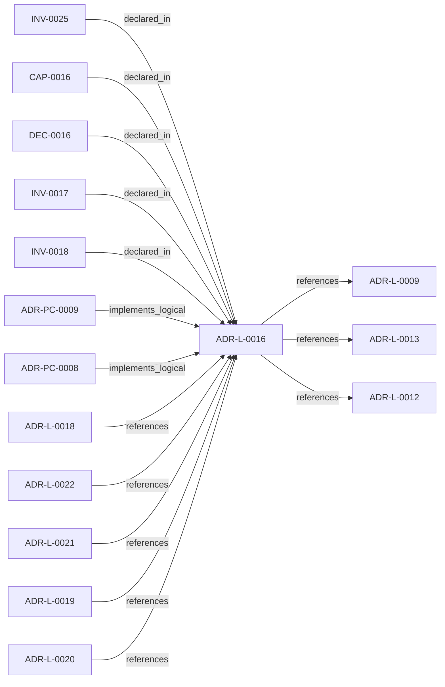

<!--
integrity_schema_version: 1
generated: deterministic_projection_v1
artifact_kind: rendered_adr_markdown
generator_id: adr-projection-markdown
generator_version: 2
hash_algorithm: sha256
source_hash: 8a47db8d9a34ae2702564bd8a7172c02c089be4ed6e9533104dc3ca2e7022d4d
rendered_hash: 7951d8eafe81cbc69590eca8bce0ddcb3e8bfca900bcec01dc81cdb4e83fcfaf
-->

# ADR-L-0016: Workspace Graph Slice Schema Contract

**Status:** proposed  
**Created:** 2026-04-24  
**Authors:** erik.gallmann  
**Domains:** workspace, interop, graph  
**Tags:** slice-schema, graph, interop, contract  
**Alias name:** workspace-graph-slice-schema-contract  

## Context

ste-runtime produces per-repository graph slices during workspace RECON.
These slices are consumed by the runtime-owned workspace merger to produce
a unified workspace graph and multi-resolution projections. Without a
defined schema contract, producer and consumer drift can break merge
pipelines or cause downstream tools to treat partial graph material as
authoritative.

ADR-L-0012 established ste-spec as public cross-repo schema authority.
This ADR defines the runtime-owned slice output contract used by
ste-runtime's workspace graph pipeline. The slice and merged workspace graph
remain derived runtime artifacts, not Architecture IR and not canonical
architecture authority.

## Relationship graph

## Related ADRs

### ADR-L-0009 — Unified Workspace Scope Model

**Relationships:**
- this ADR -[:references]-> 019ff84e-4ece-7ce3-aa17-67193bab337e

**Context:** Reconnaissance tools traditionally assume a single repository as the unit
of analysis. Multi-repo systems require scope to expand to the workspace
level so that cross-repo relationships, shared configuration, and
aggregate evidence can be captured correctly.

[Open projection](ADR-L-0009-unified-workspace-scope-model.md)
### ADR-L-0012 — Polyglot Interop Contract

**Relationships:**
- this ADR -[:references]-> 019ff84e-4ece-7fcd-a62e-c8a7982632b0

**Context:** STE subsystems are written in different languages. On-disk artifacts are
the only interop boundary. Neither runtime invents schema. Without a
single schema authority, subsystems risk copying, re-deriving, or
hand-maintaining sibling schemas, leading to drift and contract
violations.

[Open projection](ADR-L-0012-polyglot-interop-contract.md)
### ADR-L-0013 — Path Portability Contract

**Relationships:**
- this ADR -[:references]-> 019ff84e-4ece-7f44-8e26-a71c17ab45d9

**Context:** Windows, macOS, and Linux represent paths differently. Any path
persisted to a file, logged, or used as an identifier must be portable.
src/utils/paths.ts already implements the correct helpers
(toPosixPath, getRelativePosixPath).

[Open projection](ADR-L-0013-path-portability-contract.md)
### ADR-L-0018 — Deterministic Workspace Graph Queries

**Relationships:**
- 019ff84e-4ece-7c3b-833e-dbdb54ed76ec -[:references]-> this ADR

**Context:** The workspace semantic graph (verb-typed edges in slices/*.yaml, produced per
ADR-L-0016) already contains the relationships needed to answer standard
system-level questions such as "show me the repo dependency map," "show me the
component integration," and "what is the blast radius of node X." Today, those
questions require either manual MCP tool invocation by an LLM or reading raw
YAML.

[Open projection](ADR-L-0018-deterministic-workspace-graph-queries.md)
### ADR-L-0019 — Multi-Resolution Architecture Projection

**Relationships:**
- 019ff84e-4ecf-74ba-b201-3b02412f39c8 -[:references]-> this ADR

**Context:** ADR-L-0018 established deterministic workspace graph querying with L4 (full
fidelity) projection rendering. The resulting projections prove the pipeline
works but produce cognitively unusable output for human readers. Evidence:
a typical multi-repo workspace architecture-overview.md contains 413 lines with 61 identical
has_contract edges rendering every API endpoint as a sibling node.

[Open projection](ADR-L-0019-multi-resolution-architecture-projection.md)
### ADR-L-0020 — Source Locators as Cognitive Execution Model Infrastructure

**Relationships:**
- 019ff84e-4ecf-7f4e-8b17-1f35008e8877 -[:references]-> this ADR

**Context:** The workspace graph currently supports deterministic traversal and projection,
but graph entities need stable, portable links back to authoritative source
artifacts before the graph can safely support IDE-native reasoning,
conversation-engine context assembly, and future kernel handoff.

[Open projection](ADR-L-0020-source-locators-as-cognitive-execution-model-infrastructure.md)
### ADR-L-0021 — Experimental MVC-D to MVC-S Contract Consumption

**Relationships:**
- 019ff84e-4ecf-74b8-8b3b-d33e1ad21f6a -[:references]-> this ADR

**Context:** ste-spec now defines draft MVC-D and MVC-S schemas as part of the MVC evolution
contract surface. ste-runtime needs an experimental contract-consumption slice
that proves it can validate MVC-D fixtures and emit factual MVC-S candidate
snapshots without becoming a second schema authority and without crossing into
kernel-owned admission.

[Open projection](ADR-L-0021-experimental-mvc-d-to-mvc-s-contract-consumption.md)
### ADR-L-0022 — Workspace Attribution Federation Consumption

**Relationships:**
- 019ff84e-4ecf-745f-9832-3155d323e40c -[:references]-> this ADR

**Context:** Per-repo RECON emits implementation-attribution-evidence.yaml with bare
ADR-L-XXXX ids scoped to each repository manifest. The same bare id string
may denote different decisions in different repos (for example ADR-L-0013 in
adr-architecture-kit vs ste-runtime).

[Open projection](ADR-L-0022-workspace-attribution-federation-consumption.md)
### ADR-PC-0008 — Service Wiring Post-Processing

**Relationships:**
- 019ff84e-4ecf-7e82-bb1f-8a42fe4d7e4d -[:implements_logical]-> this ADR

**Context:** RECON produces rich per-repository state (call graphs, SDK usage, env
vars, CFN resources, triggers) but the workspace slice emitter collapsed
this to a skeleton with only has_contract edges. Cross-domain joins
(SDK usage to CFN resources via env var bridging) can produce reads,
writes, publishes, consumes, invokes, and deploys_to edges without any
new AST parsing. This wiring must be post-processing on existing RECON
state, never modifying extraction output.

[Open projection](../physical-component/ADR-PC-0008-service-wiring-post-processing.md)
### ADR-PC-0009 — Workspace Graph Query Engine

**Relationships:**
- 019ff84e-4ecf-7a24-801d-7d1e708577ac -[:implements_logical]-> this ADR

**Context:** ADR-L-0018 established the capability for deterministic workspace graph
querying. This component implements the loader, three canned query functions,
and three projection renderers that realize that capability. It consumes
workspace slices (per ADR-L-0016 schema contract) and exposes results through
the MCP tool registry (ADR-PC-0001) and RSS CLI (ADR-PC-0012).

[Open projection](../physical-component/ADR-PC-0009-workspace-graph-query-engine.md)

## Capabilities

### CAP-0016: Schema-compliant slice emission

ste-runtime emits workspace graph slices that conform to a defined schema contract, enabling any compliant merger to consume them without validation errors.

## Constraints

### CONST-0010 (technical)

**Description:**
Node shape: { id: string, type: string, name: string, provenance: { source_path: string, source_ref: string, repo?: string }, attributes?: object }. Ratified node types are Service, Lambda, StateMachine, Queue, Topic, Bucket, Database, Schema, Endpoint, ExternalSystem, Stack, Distribution, WebACL, Certificate, DNSRecord, APIGateway, SecurityGroup, Secret, DBCluster, DBProxy, LogGroup, Alarm, DeliveryStream, EventRule, Role, and InfraResource. InfraResource is a catch-all fallback type for any extracted CFN resource type not covered by an explicit mapping; it preserves cfn_type in attributes for downstream classification. Role nodes carry auxiliary: true and are compressed at L0-L2 projections. Node IDs follow the Graph Identity Contract (Type:normalized-name).

**Rationale:**
Consistent node shape enables merger join logic and identity stability across runs. Comprehensive type coverage ensures all RECON-extracted infrastructure resources flow through to the workspace graph regardless of repository pattern (backend service, frontend SPA, MFE monorepo).

### CONST-0011 (technical)

**Description:**
Edge shape: { from: string, to: string, verb: string, confidence?: string, provenance?: { source_path: string, source_ref: string, repo?: string }, attributes?: object }. Ratified verbs are invokes, publishes, consumes, reads, writes, validates_against, implements, deploys_to, has_contract, calls, triggers, publishes_to, and contains. The contains verb represents structural containment (e.g., a Stack node contains its child resources or nested stacks). The projection compression layer also recognizes references as a low-tier reference edge when present in merged graph input.

**Rationale:**
Consistent edge shape and ratified verb set prevent schema drift and enable reliable graph queries. The contains verb surfaces monorepo app-level grouping and nested stack topology in the graph.

### CONST-0012 (technical)

**Description:**
generated_by is read from package.json (ste-runtime@<version>), never hardcoded or workspace-specific. generated_at is ISO-8601 UTC. source_commit is git rev-parse HEAD of the scanned repository, or null.

**Rationale:**
Provenance fields must be accurate and reproducible for audit trails.

### CONST-0013 (technical)

**Description:**
Slice validation supports warn and reject modes. Warn mode accepts unknown node types and edge verbs while surfacing diagnostics; reject mode treats them as validation errors.

**Rationale:**
Workspace adoption needs a staged compatibility mode, but strict validation must remain available for contract gates.

## Invariants

### INV-0017

**Statement:** Every workspace graph slice emitted by ste-runtime contains the required core fields defined in the slice schema contract: schema_version, repo, generated_by, generated_at, nodes, and edges. source_commit and diagnostics are supported standard fields. Consumers may preserve unknown extension fields but must not treat them as portable contract authority.
  
**Scope:** global  
**Enforcement:** must (design)  
**Verification:** automated

**Rationale:**
Required core fields keep the merge path deterministic. Extension tolerance allows polyglot producers to evolve without breaking older consumers, while keeping public authority in documented contract fields.

### INV-0018

**Statement:** Runtime-emitted workspace graph edges that assert a resolved relationship use confidence 'high'. Ambiguous resolutions produce diagnostics rather than asserted edges. Consumers must drop non-high edges when they appear in permissive input mode.
  
**Scope:** global  
**Enforcement:** must (design)  
**Verification:** automated

**Rationale:**
The graph must not lie. Emitting uncertain edges degrades trust in the entire graph. Diagnostics preserve the signal without asserting false relationships.

### INV-0025

**Statement:** All infrastructure resources extracted by RECON are emitted as workspace graph nodes. No extracted resource is silently dropped by the slice emitter. Resources not covered by an explicit CFN-to-graph-type mapping are emitted as InfraResource nodes with the original cfn_type preserved in attributes. The logicalId is the last-resort display name; a null name never causes a node to be dropped.
  
**Scope:** global  
**Enforcement:** must (design)  
**Verification:** automated

**Rationale:**
The workspace graph is the Architecture IR substrate. Silently dropping extracted resources creates blind spots that downstream context domains cannot compensate for. Pattern-agnostic emission ensures backend services, frontend SPAs, and MFE monorepos are treated equally.

## Decisions

### DEC-0016: Workspace graph slices follow a defined schema contract

**Rationale:**
Producer-consumer drift between ste-runtime and workspace graph consumers
caused validation failures. A defined contract with required core fields,
ratified vocabularies, and explicit extension behavior eliminates this
class of integration failure without pretending derived graph slices are
public Architecture IR authority.

---

*Generated from ADR-L-0016 by ADR Architecture Kit*