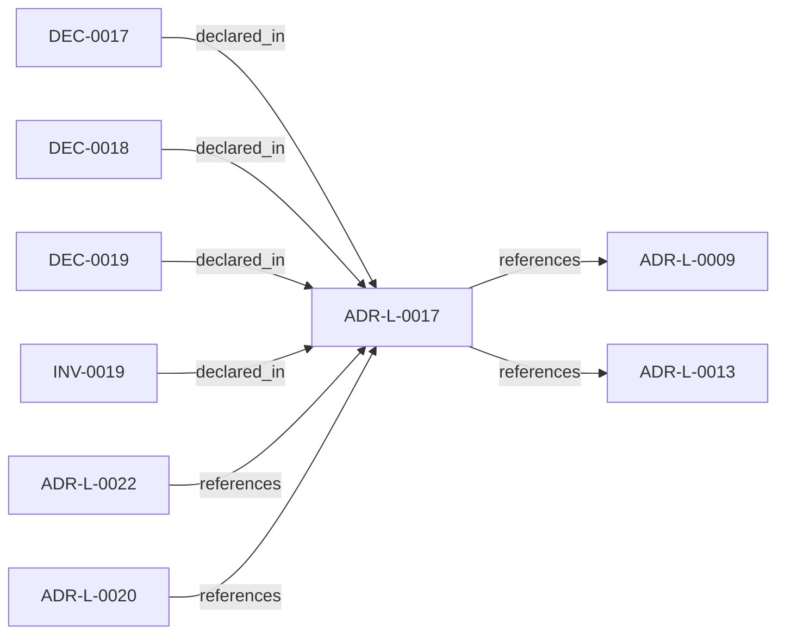

<!--
integrity_schema_version: 1
generated: deterministic_projection_v1
artifact_kind: rendered_adr_markdown
generator_id: adr-projection-markdown
generator_version: 2
hash_algorithm: sha256
source_hash: c376cef26d6a01581b389fbe65836612fb72ac17d06b72cd68b5713e1e51553e
rendered_hash: ca2ec5df64991d4bd6509b7b0ee534ce111cdda58561240b0655316dd1e3b6a6
-->

# ADR-L-0017: RECON Workspace Execution Contract

**Status:** proposed  
**Created:** 2026-04-30  
**Authors:** erik.gallmann  
**Domains:** workspace, recon  
**Tags:** workspace, recon, reliability  
**Alias name:** recon-workspace-execution-contract  

## Context

ADR-L-0009 fixes workspace as the universal scope unit. This ADR records
how workspace RECON execution behaves for observability, optional
incremental cross-run skips, and optional per-repository timeouts without
changing slice schemas or merge semantics. Persisted sentinel paths obey
ADR-L-0013 POSIX-relative projections from the workspace root. The semantic
extraction subsystem (ADR-PS-0002) remains the authoritative boundary for
phase-level extraction behavior; workspace orchestration layered here only
coordinates repos and aggregates outcomes.

## Relationship graph

## Related ADRs

### ADR-L-0009 — Unified Workspace Scope Model

**Relationships:**
- this ADR -[:references]-> 019ff84e-4ece-7ce3-aa17-67193bab337e

**Context:** Reconnaissance tools traditionally assume a single repository as the unit
of analysis. Multi-repo systems require scope to expand to the workspace
level so that cross-repo relationships, shared configuration, and
aggregate evidence can be captured correctly.

[Open projection](ADR-L-0009-unified-workspace-scope-model.md)
### ADR-L-0013 — Path Portability Contract

**Relationships:**
- this ADR -[:references]-> 019ff84e-4ece-7f44-8e26-a71c17ab45d9

**Context:** Windows, macOS, and Linux represent paths differently. Any path
persisted to a file, logged, or used as an identifier must be portable.
src/utils/paths.ts already implements the correct helpers
(toPosixPath, getRelativePosixPath).

[Open projection](ADR-L-0013-path-portability-contract.md)
### ADR-L-0020 — Source Locators as Cognitive Execution Model Infrastructure

**Relationships:**
- 019ff84e-4ecf-7f4e-8b17-1f35008e8877 -[:references]-> this ADR

**Context:** The workspace graph currently supports deterministic traversal and projection,
but graph entities need stable, portable links back to authoritative source
artifacts before the graph can safely support IDE-native reasoning,
conversation-engine context assembly, and future kernel handoff.

[Open projection](ADR-L-0020-source-locators-as-cognitive-execution-model-infrastructure.md)
### ADR-L-0022 — Workspace Attribution Federation Consumption

**Relationships:**
- 019ff84e-4ecf-745f-9832-3155d323e40c -[:references]-> this ADR

**Context:** Per-repo RECON emits implementation-attribution-evidence.yaml with bare
ADR-L-XXXX ids scoped to each repository manifest. The same bare id string
may denote different decisions in different repos (for example ADR-L-0013 in
adr-architecture-kit vs ste-runtime).

[Open projection](ADR-L-0022-workspace-attribution-federation-consumption.md)

## Constraints

### CONST-0015 (technical)

**Description:**
Cross-run sentinel file path under workspace output directory is OUTPUT/state/REPO/recon-run-sentinel.json relative to workspace root for persistence (POSIX-relative), where REPO is the manifest repo name key used elsewhere for slice paths.

**Rationale:**
Matches existing per-repository state layout and avoids scattering ad hoc paths.

### CONST-0016 (technical)

**Description:**
Incremental skip is allowed only when both source fingerprint hash and bundled ste-runtime version in the sentinel match the current computation.

**Rationale:**
Algorithm or tooling changes invalidate stale skip decisions safely.

### CONST-0017 (technical)

**Description:**
Optional per-repository timeout yields timed_out repo status without aborting sibling repos. timed_out participates in aggregate workspace failures the same way standard failed repos do under existing CLI success rules.

**Rationale:**
Stall isolation without killing the workspace process outright.

## Invariants

### INV-0019

**Statement:** Workspace RECON emits exactly one progress line per repository before that repository begins processing.  
**Scope:** global  
**Enforcement:** must (design)  
**Verification:** manual

**Rationale:**
Silence during long workspace runs cannot be distinguished from a hang without per-repo heartbeat output.

## Decisions

### DEC-0017: Mandatory per-repo heartbeat (stdout)

**Rationale:**
Operators need deterministic progress granularity per repository.

### DEC-0018: Opt-in cross-run incremental skip via --skip-unchanged and sentinel CONST-0015/CONST-0016.

**Rationale:**
Default runs remain untouched; caches are explicitly requested.

### DEC-0019: Opt-in per-repo Promise timeout (--timeout-per-repo)

**Rationale:**
Bounded wait per repo frees concurrency slots; subprocess kill is intentionally out of scope.

---

*Generated from ADR-L-0017 by ADR Architecture Kit*