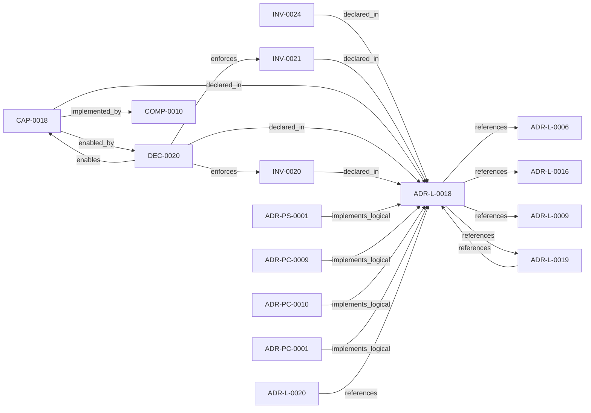

<!--
integrity_schema_version: 1
generated: deterministic_projection_v1
artifact_kind: rendered_adr_markdown
generator_id: adr-projection-markdown
generator_version: 2
hash_algorithm: sha256
source_hash: b5db57d70da3162fdb936c54029ced2b91c582634e275eaf24fb0585b70661ab
rendered_hash: c1ed7b89dc93c0b9348c8093f5fac79d93a8dbcb37a5d859c4dee943f8f60ddf
-->

# ADR-L-0018: Deterministic Workspace Graph Queries

**Status:** proposed  
**Created:** 2026-05-22  
**Authors:** erik.gallmann  
**Domains:** workspace, graph, rss  
**Tags:** workspace, graph-traversal, canned-queries, deterministic, non-llm  
**Alias name:** deterministic-workspace-graph-queries  

## Context

The workspace semantic graph (verb-typed edges in slices/*.yaml, produced per
ADR-L-0016) already contains the relationships needed to answer standard
system-level questions such as "show me the repo dependency map," "show me the
component integration," and "what is the blast radius of node X." Today, those
questions require either manual MCP tool invocation by an LLM or reading raw
YAML.

ADR-L-0006 established the Conversational Query Interface (CQI) for
intent-classified, session-cached queries over the per-repo RECON graph. CQI
is LLM-assisted (intent classification) and operates on untyped bidirectional
edges. A distinct capability is needed for deterministic, LLM-free queries
that operate on the workspace infra graph's typed verb edges and produce
structured results projectable as diagrams and tables.

The key gap: the workspace infra graph (slices/*.yaml) had no loader or query
API. loadAidocGraph() only consumes per-repo RECON YAML with _slice blocks. A
new loader and query layer was required.

## Relationship graph

## Related ADRs

### ADR-L-0006 — Conversational Query Interface for RSS

**Relationships:**
- this ADR -[:references]-> 019ff84e-4ece-71c8-af1f-eb35c77b551a

**Context:** E-ADR-004 established the RSS CLI and TypeScript API as the foundation for graph traversal and context assembly. However, a gap exists between:

[Open projection](ADR-L-0006-conversational-query-interface-for-rss.md)
### ADR-L-0009 — Unified Workspace Scope Model

**Relationships:**
- this ADR -[:references]-> 019ff84e-4ece-7ce3-aa17-67193bab337e

**Context:** Reconnaissance tools traditionally assume a single repository as the unit
of analysis. Multi-repo systems require scope to expand to the workspace
level so that cross-repo relationships, shared configuration, and
aggregate evidence can be captured correctly.

[Open projection](ADR-L-0009-unified-workspace-scope-model.md)
### ADR-L-0016 — Workspace Graph Slice Schema Contract

**Relationships:**
- this ADR -[:references]-> 019ff84e-4ece-76ad-ae3e-f92bef05635a

**Context:** ste-runtime produces per-repository graph slices during workspace RECON.
These slices are consumed by the runtime-owned workspace merger to produce
a unified workspace graph and multi-resolution projections. Without a
defined schema contract, producer and consumer drift can break merge
pipelines or cause downstream tools to treat partial graph material as
authoritative.

[Open projection](ADR-L-0016-workspace-graph-slice-schema-contract.md)
### ADR-L-0019 — Multi-Resolution Architecture Projection

**Relationships:**
- 019ff84e-4ecf-74ba-b201-3b02412f39c8 -[:references]-> this ADR
- this ADR -[:references]-> 019ff84e-4ecf-74ba-b201-3b02412f39c8

**Context:** ADR-L-0018 established deterministic workspace graph querying with L4 (full
fidelity) projection rendering. The resulting projections prove the pipeline
works but produce cognitively unusable output for human readers. Evidence:
a typical multi-repo workspace architecture-overview.md contains 413 lines with 61 identical
has_contract edges rendering every API endpoint as a sibling node.

[Open projection](ADR-L-0019-multi-resolution-architecture-projection.md)
### ADR-L-0020 — Source Locators as Cognitive Execution Model Infrastructure

**Relationships:**
- 019ff84e-4ecf-7f4e-8b17-1f35008e8877 -[:references]-> this ADR

**Context:** The workspace graph currently supports deterministic traversal and projection,
but graph entities need stable, portable links back to authoritative source
artifacts before the graph can safely support IDE-native reasoning,
conversation-engine context assembly, and future kernel handoff.

[Open projection](ADR-L-0020-source-locators-as-cognitive-execution-model-infrastructure.md)
### ADR-PC-0001 — MCP Server and Tool Registry

**Relationships:**
- 019ff84e-4ecf-7d5e-a53c-bae8c74aca48 -[:implements_logical]-> this ADR

**Context:** This component exposes assistant-facing runtime tools over MCP and binds
structural, operational, context, optimized, obligation-oriented, and
workspace graph query tool surfaces into one discoverable server boundary.

[Open projection](../physical-component/ADR-PC-0001-mcp-server-and-tool-registry.md)
### ADR-PC-0009 — Workspace Graph Query Engine

**Relationships:**
- 019ff84e-4ecf-7a24-801d-7d1e708577ac -[:implements_logical]-> this ADR

**Context:** ADR-L-0018 established the capability for deterministic workspace graph
querying. This component implements the loader, three canned query functions,
and three projection renderers that realize that capability. It consumes
workspace slices (per ADR-L-0016 schema contract) and exposes results through
the MCP tool registry (ADR-PC-0001) and CLI (ADR-P-0001).

[Open projection](../physical-component/ADR-PC-0009-workspace-graph-query-engine.md)
### ADR-PC-0010 — Semantic Compression Engine

**Relationships:**
- 019ff84e-4ecf-7d09-802f-c14b1802b27c -[:implements_logical]-> this ADR

**Context:** ADR-L-0019 established the capability for multi-resolution architecture
projection using deterministic semantic compression. This component implements
the compression engine, resolution-aware renderers, multi-resolution emission
pipeline, and projection family registry that realize that capability. It
consumes CannedQueryResult from the existing workspace graph query engine
(COMP-0010) and produces CompressedProjection at configurable resolution levels.

[Open projection](../physical-component/ADR-PC-0010-semantic-compression-engine.md)
### ADR-PS-0001 — Runtime Orchestration and Assistant Integration

**Relationships:**
- 019ff84e-4ecf-78a6-bb1c-676e50a3d97a -[:implements_logical]-> this ADR

**Context:** ste-runtime now contains a runtime orchestration boundary that keeps semantic
state fresh, exposes assistant-facing MCP tools, performs reconciliation
gating and freshness checks, and assembles implementation context and
obligation projections for agents and operators.

[Open projection](../physical-system/ADR-PS-0001-runtime-orchestration-and-assistant-integration.md)

## Capabilities

### CAP-0018: Deterministic workspace graph querying

Load workspace infra graph slices into a typed in-memory graph and execute deterministic, non-LLM traversal queries that answer standard workspace-level questions (system dependencies, component integration, blast radius), returning structured results projectable as Mermaid diagrams, tables, and adjacency matrices.

## Constraints

### CONST-0018 (technical)

**Description:**
Canned query functions accept only a WorkspaceGraph (loaded from slices/*.yaml) as their data source. They do not access the per-repo RECON graph (AidocGraph), the file system, or any external service.

**Rationale:**
Keeps queries deterministic and testable with in-memory fixtures. Cross-layer enrichment from the RECON graph is deferred to a follow-up slice.

## Invariants

### INV-0020

**Statement:** Canned query functions (systemDependencies, componentIntegration, blastRadiusWorkspace) are pure graph traversal. They do not invoke LLM inference, network calls, or non-deterministic operations.
  
**Scope:** global  
**Enforcement:** must (design)  
**Verification:** automated

**Rationale:**
Determinism is the defining property of canned queries. If an LLM were involved, the output would be non-reproducible and untestable with fixture-based assertions.

### INV-0021

**Statement:** Projection is separated from query. Query functions return structured data objects. Rendering to Mermaid, table, or matrix is performed by distinct projection functions.
  
**Scope:** global  
**Enforcement:** must (design)  
**Verification:** automated

**Rationale:**
Separation enables adding new output formats (PlantUML, D2, CSV) in follow-up slices without modifying query logic.

### INV-0024

**Statement:** Every emitted projection file includes projection_level metadata in its YAML frontmatter, identifying the resolution level (L0-L4) at which the projection was generated.
  
**Scope:** global  
**Enforcement:** must (design)  
**Verification:** automated

**Rationale:**
Projection level metadata enables downstream consumers to identify the abstraction level of a projection file, determine whether drill-down or drill-up navigation is available, and detect staleness via the accompanying generation hash.

## Decisions

### DEC-0020: Workspace graph queries are deterministic graph traversal with no LLM inference

**Rationale:**
Three standard questions (system dependencies, component integration, blast
radius) are answerable purely from the typed verb edges in workspace slices.
Making them deterministic:

1. Guarantees reproducibility (same graph -> same result).
2. Enables fixture-based unit testing without mocking LLM responses.
3. Runs in <10ms even for large workspaces (pure BFS/DFS on adjacency maps).
4. Complements rather than replaces CQI (ADR-L-0006), which handles
   intent-classified natural language queries.

**Alternatives Considered:**

- **Extend CQI with workspace-level intents**: CQI is session-cached and intent-classified, designed for interactive exploration. Canned queries need to be stateless, reproducible, and callable from CLI and programmatic API without LLM overhead.

- **Build queries on top of existing AidocGraph loader**: AidocGraph uses untyped bidirectional edges (references/referenced_by) and cannot load workspace slice YAML (different schema). A new typed loader was required.

**Consequences:**

**Positive:**
- Three standard questions answered without LLM cost or latency.
- Results are reproducible and testable with in-memory fixtures.
- Multiple output projections (Mermaid, table, matrix) from one query.
- Serves CLI, MCP, and programmatic API surfaces from the same engine.

**Negative:**
- New loader required (workspace slices were previously unloadable).
- No natural language flexibility; exact node IDs required for blast radius target.

**Related Invariants:** 019ff84e-4ece-7ffd-8202-831399ecb2a0, 019ff84e-4ece-7329-8c34-bbee9f5aea8f

---

*Generated from ADR-L-0018 by ADR Architecture Kit*