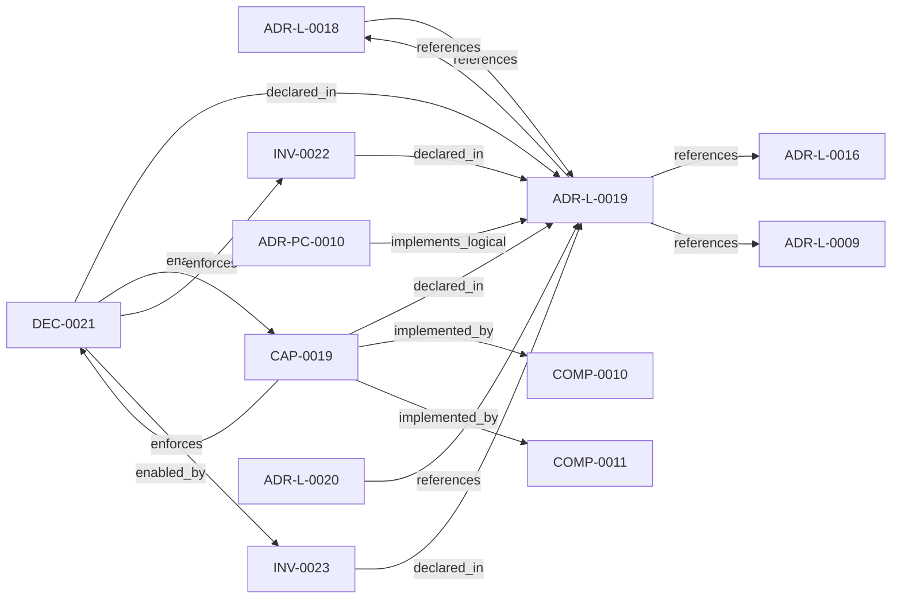

<!--
integrity_schema_version: 1
generated: deterministic_projection_v1
artifact_kind: rendered_adr_markdown
generator_id: adr-projection-markdown
generator_version: 2
hash_algorithm: sha256
source_hash: 3e03eec9a258c2bfc0f4a6640105e9a471bd03319802f0a937b46cfcd7699033
rendered_hash: c94d3d5edb0bb8be15b6507ae2f7416f601ab0141183a9ec9e62293378490824
-->

# ADR-L-0019: Multi-Resolution Architecture Projection

**Status:** proposed  
**Created:** 2026-05-22  
**Authors:** erik.gallmann  
**Domains:** workspace, graph, projection  
**Tags:** workspace, multi-resolution, projection, semantic-compression, deterministic  
**Alias name:** adr-l-0019-multi-resolution-architecture-projection  

## Context

ADR-L-0018 established deterministic workspace graph querying with L4 (full
fidelity) projection rendering. The resulting projections prove the pipeline
works but produce cognitively unusable output for human readers. Evidence:
a typical multi-repo workspace architecture-overview.md contains 413 lines with 61 identical
has_contract edges rendering every API endpoint as a sibling node.

The root cause: the pipeline has no aggregation layer between canned-query
results and Mermaid rendering. toMermaid() maps every node and edge 1:1 into
Mermaid syntax. There is no grouping, no compression, no resolution selection.

This capability introduces a deterministic semantic compression layer that
produces multi-resolution architecture views (L0-L4) optimized for different
audiences while preserving the graph substrate, existing L4 projections, and
non-LLM deterministic behavior.

## Relationship graph

## Related ADRs

### ADR-L-0009 — Unified Workspace Scope Model

**Relationships:**
- this ADR -[:references]-> 019ff84e-4ece-7ce3-aa17-67193bab337e

**Context:** Reconnaissance tools traditionally assume a single repository as the unit
of analysis. Multi-repo systems require scope to expand to the workspace
level so that cross-repo relationships, shared configuration, and
aggregate evidence can be captured correctly.

[Open projection](ADR-L-0009-unified-workspace-scope-model.md)
### ADR-L-0016 — Workspace Graph Slice Schema Contract

**Relationships:**
- this ADR -[:references]-> 019ff84e-4ece-76ad-ae3e-f92bef05635a

**Context:** ste-runtime produces per-repository graph slices during workspace RECON.
These slices are consumed by the runtime-owned workspace merger to produce
a unified workspace graph and multi-resolution projections. Without a
defined schema contract, producer and consumer drift can break merge
pipelines or cause downstream tools to treat partial graph material as
authoritative.

[Open projection](ADR-L-0016-workspace-graph-slice-schema-contract.md)
### ADR-L-0018 — Deterministic Workspace Graph Queries

**Relationships:**
- 019ff84e-4ece-7c3b-833e-dbdb54ed76ec -[:references]-> this ADR
- this ADR -[:references]-> 019ff84e-4ece-7c3b-833e-dbdb54ed76ec

**Context:** The workspace semantic graph (verb-typed edges in slices/*.yaml, produced per
ADR-L-0016) already contains the relationships needed to answer standard
system-level questions such as "show me the repo dependency map," "show me the
component integration," and "what is the blast radius of node X." Today, those
questions require either manual MCP tool invocation by an LLM or reading raw
YAML.

[Open projection](ADR-L-0018-deterministic-workspace-graph-queries.md)
### ADR-L-0020 — Source Locators as Cognitive Execution Model Infrastructure

**Relationships:**
- 019ff84e-4ecf-7f4e-8b17-1f35008e8877 -[:references]-> this ADR

**Context:** The workspace graph currently supports deterministic traversal and projection,
but graph entities need stable, portable links back to authoritative source
artifacts before the graph can safely support IDE-native reasoning,
conversation-engine context assembly, and future kernel handoff.

[Open projection](ADR-L-0020-source-locators-as-cognitive-execution-model-infrastructure.md)
### ADR-PC-0010 — Semantic Compression Engine

**Relationships:**
- 019ff84e-4ecf-7d09-802f-c14b1802b27c -[:implements_logical]-> this ADR

**Context:** ADR-L-0019 established the capability for multi-resolution architecture
projection using deterministic semantic compression. This component implements
the compression engine, resolution-aware renderers, multi-resolution emission
pipeline, and projection family registry that realize that capability. It
consumes CannedQueryResult from the existing workspace graph query engine
(COMP-0010) and produces CompressedProjection at configurable resolution levels.

[Open projection](../physical-component/ADR-PC-0010-semantic-compression-engine.md)

## Capabilities

### CAP-0019: Multi-resolution architecture projection

Produce architecture projections at five deterministic resolution levels (L0-L4)
from the same workspace graph substrate, using semantic compression (endpoint
grouping, same-type aggregation, edge tier filtering) to optimize for human
cognition at L0-L2 while preserving full fidelity at L4 for machine consumption.

## Constraints

### CONST-0019 (technical)

**Description:**
All compression algorithms are deterministic: same graph + same config produces
identical output. No LLM inference, sampling, or probabilistic summarization is
involved at any resolution level.

**Rationale:**
Determinism enables fixture-based testing, CI diffing, and reproducible
architecture documentation generation.

## Invariants

### INV-0022

**Statement:** Resolution level is a first-class parameter of the projection pipeline.
Every MCP tool and CLI command that produces projections accepts an optional
resolution parameter (L0|L1|L2|L3|L4) with L4 as the default.
  
**Scope:** global  
**Enforcement:** must (design)  
**Verification:** automated

**Rationale:**
Making resolution explicit prevents it from being a hidden rendering hack and
enables programmatic selection of appropriate abstraction levels.

### INV-0023

**Statement:** Compressed projections preserve traceability to source graph nodes. Every
aggregate node carries memberIds linking back to the original workspace nodes.
Every compressed edge carries sourceEdgeIds when multiplicity > 1.
  
**Scope:** global  
**Enforcement:** must (design)  
**Verification:** automated

**Rationale:**
Traceability ensures that human-facing compressed views can always be expanded
to full fidelity for debugging, audit, or detailed analysis.

## Decisions

### DEC-0021: Deterministic semantic compression for multi-resolution architecture projections

**Rationale:**
The current L4-only projection pipeline produces cognitively unusable output for
human readers. Rather than introducing LLM-based summarization, the compression
layer uses deterministic algorithms:

1. Endpoint path-prefix grouping (capability domain extraction)
2. Same-type node aggregation (threshold-based)
3. Edge tier filtering (5-tier verb taxonomy with per-level suppression rules)
4. Edge multiplicity compression (N edges of same verb collapsed to 1 with count)
5. Infrastructure condensation (alarm/monitoring resource suppression at L0-L1)

These algorithms produce consistent output from identical input, enabling
fixture-based testing and CI-diffable architecture documentation.

**Alternatives Considered:**

- **LLM-based architecture summarization**: Non-deterministic output prevents fixture-based testing and CI diffing.
Different runs would produce different summaries, making regression testing
impossible and eroding trust in the documentation.

- **Manual curation of architecture views**: Does not scale with workspace growth. Manual views drift from the graph
substrate and require continuous maintenance effort.

- **Single configurable threshold without resolution levels**: Different audiences need fundamentally different views (executives vs API
developers vs machine consumers). A single threshold cannot serve all audiences.

**Consequences:**

**Positive:**
- Five resolution levels serve distinct audiences (executive, platform, domain, integration, machine)
- All views derive from the same graph substrate ensuring consistency
- Deterministic output enables CI diffing and fixture-based testing
- Existing L4 projections are fully preserved for backward compatibility

**Negative:**
- Additional code surface (compression engine, resolution-aware renderers)
- Capability domain heuristic (path-prefix grouping) may not perfectly match business domains

**Related Invariants:** 019ff84e-4ecf-73d0-981f-c33049a28eba, 019ff84e-4ecf-79b2-863d-d595307d7c90

---

*Generated from ADR-L-0019 by ADR Architecture Kit*