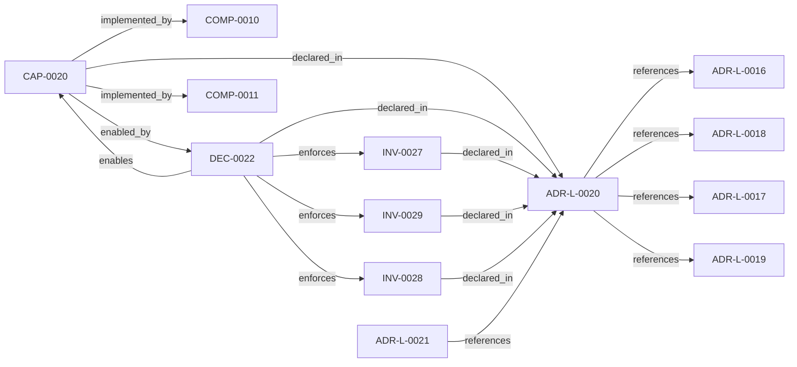

<!--
integrity_schema_version: 1
generated: deterministic_projection_v1
artifact_kind: rendered_adr_markdown
generator_id: adr-projection-markdown
generator_version: 2
hash_algorithm: sha256
source_hash: 0b5a647c57351512d8e0dead6fee2304980ac6f85a6f60dd6ff9841f9af3662d
rendered_hash: 6dcf9147045b876ceed3d36f08f817c074f7b3dd619b75cb979babf9af3ad68c
-->

# ADR-L-0020: Source Locators as Cognitive Execution Model Infrastructure

**Status:** proposed  
**Created:** 2026-05-27  
**Authors:** erik.gallmann  
**Domains:** workspace, graph, cem, mvc, provenance  
**Tags:** source-locators, entity-uri, cognitive-execution-model, mvc, provenance, deterministic  
**Alias name:** source-locators-as-cognitive-execution-model-infrastructure  

## Context

The workspace graph currently supports deterministic traversal and projection,
but graph entities need stable, portable links back to authoritative source
artifacts before the graph can safely support IDE-native reasoning,
conversation-engine context assembly, and future kernel handoff.

This capability frames source locators as infrastructure for ste-runtime's
Cognitive Execution Model (CEM). The graph remains derived cognitive routing
state. Canonical ADRs, decisions, invariants, source files, contracts, and
rule artifacts remain authoritative in their owning repositories.

CEM bundles are correctness-oriented evidence packages assembled by
ste-runtime from graph state, source locators, embodiment evidence, validation
state, traversal context, and negative-space constraints. MVC bundles are
minimized context projections derived from CEM bundles for bounded AI or IDE
reasoning. MVC validation checks whether the minimized bundle remains current,
faithful, scoped, and non-misleading relative to the CEM bundle.

## Relationship graph

## Related ADRs

### ADR-L-0016 — Workspace Graph Slice Schema Contract

**Relationships:**
- this ADR -[:references]-> 019ff84e-4ece-76ad-ae3e-f92bef05635a

**Context:** ste-runtime produces per-repository graph slices during workspace RECON.
These slices are consumed by the runtime-owned workspace merger to produce
a unified workspace graph and multi-resolution projections. Without a
defined schema contract, producer and consumer drift can break merge
pipelines or cause downstream tools to treat partial graph material as
authoritative.

[Open projection](ADR-L-0016-workspace-graph-slice-schema-contract.md)
### ADR-L-0017 — RECON Workspace Execution Contract

**Relationships:**
- this ADR -[:references]-> 019ff84e-4ece-7ddc-b31f-3a009abe14b3

**Context:** ADR-L-0009 fixes workspace as the universal scope unit. This ADR records
how workspace RECON execution behaves for observability, optional
incremental cross-run skips, and optional per-repository timeouts without
changing slice schemas or merge semantics. Persisted sentinel paths obey
ADR-L-0013 POSIX-relative projections from the workspace root. The semantic
extraction subsystem (ADR-PS-0002) remains the authoritative boundary for
phase-level extraction behavior; workspace orchestration…

[Open projection](ADR-L-0017-recon-workspace-execution-contract.md)
### ADR-L-0018 — Deterministic Workspace Graph Queries

**Relationships:**
- this ADR -[:references]-> 019ff84e-4ece-7c3b-833e-dbdb54ed76ec

**Context:** The workspace semantic graph (verb-typed edges in slices/*.yaml, produced per
ADR-L-0016) already contains the relationships needed to answer standard
system-level questions such as "show me the repo dependency map," "show me the
component integration," and "what is the blast radius of node X." Today, those
questions require either manual MCP tool invocation by an LLM or reading raw
YAML.

[Open projection](ADR-L-0018-deterministic-workspace-graph-queries.md)
### ADR-L-0019 — Multi-Resolution Architecture Projection

**Relationships:**
- this ADR -[:references]-> 019ff84e-4ecf-74ba-b201-3b02412f39c8

**Context:** ADR-L-0018 established deterministic workspace graph querying with L4 (full
fidelity) projection rendering. The resulting projections prove the pipeline
works but produce cognitively unusable output for human readers. Evidence:
a typical multi-repo workspace architecture-overview.md contains 413 lines with 61 identical
has_contract edges rendering every API endpoint as a sibling node.

[Open projection](ADR-L-0019-multi-resolution-architecture-projection.md)
### ADR-L-0021 — Experimental MVC-D to MVC-S Contract Consumption

**Relationships:**
- 019ff84e-4ecf-74b8-8b3b-d33e1ad21f6a -[:references]-> this ADR

**Context:** ste-spec now defines draft MVC-D and MVC-S schemas as part of the MVC evolution
contract surface. ste-runtime needs an experimental contract-consumption slice
that proves it can validate MVC-D fixtures and emit factual MVC-S candidate
snapshots without becoming a second schema authority and without crossing into
kernel-owned admission.

[Open projection](ADR-L-0021-experimental-mvc-d-to-mvc-s-contract-consumption.md)

## Capabilities

### CAP-0020: Source-aware CEM and MVC assembly

Resolve workspace graph entities to authoritative source artifacts through
stable URI locators, assemble CEM bundles with provenance and validation
state, derive bounded MVC bundles, and validate MVC bundles against their
parent CEM bundle.

## Constraints

### CONST-0020 (technical)

**Description:**
Source locator, CEM, and MVC artifacts are runtime-owned derived state. They
must not become canonical ADR, decision, invariant, rule, contract, or source
authority.

**Rationale:**
Authority boundaries keep graph cognition separate from source ownership and
preserve future ste-kernel admission semantics.

## Invariants

### INV-0027

**Statement:** Workspace graph entities may carry source locator metadata, but graph
artifacts must not embed full canonical ADR, DEC, invariant, contract, or
source documents by default.
  
**Scope:** global  
**Enforcement:** must (design)  
**Verification:** automated

**Rationale:**
The graph is a semantic cognition and routing substrate, not a document
database or competing authority surface.

### INV-0028

**Statement:** Every MVC bundle must retain provenance back to its parent CEM bundle,
graph snapshot, traversal operation, selected source artifacts, embodiment
evidence, and validation state.
  
**Scope:** global  
**Enforcement:** must (design)  
**Verification:** automated

**Rationale:**
MVC is optimized for cognitive efficiency and may be lossy; provenance and
validation protect against misleading context reduction.

### INV-0029

**Statement:** Source locator generation, graph traversal, CEM assembly, MVC derivation,
and MVC validation are deterministic for identical workspace graph, source,
locator registry, and traversal inputs.
  
**Scope:** global  
**Enforcement:** must (design)  
**Verification:** automated

**Rationale:**
Determinism enables replay, fixture testing, stale-state detection, and
future kernel consumption.

## Decisions

### DEC-0022: Use source locators as foundational infrastructure for CEM and MVC

**Rationale:**
Entity URI resolution is necessary but not sufficient for IDE and
conversation-engine reasoning. ste-runtime must assemble a correctness-first
CEM bundle, derive a bounded MVC projection, and validate the MVC against
the CEM before agents reason from minimized context.

Source locators use stable workspace/entity/ADR/decision URI forms and
source hashes. They allow graph traversal results to route back to canonical
source artifacts without copying full source content into graph artifacts.

**Alternatives Considered:**

- **Embed source documents in graph nodes**: This would turn derived graph state into a shadow document database and
create authority drift from canonical source artifacts.

- **Resolve source directly from paths without URI normalization**: Raw paths are not portable across platforms, repo layouts, or future
conversation-engine handoff surfaces.

- **Produce MVC directly from graph traversal**: MVC is intentionally minimized and may omit important negative-space or
provenance context. A parent CEM bundle is required as the correctness
baseline for derivation and validation.

**Consequences:**

**Positive:**
- IDE agents can traverse the graph and retrieve authoritative source artifacts
- MVC bundles remain small while preserving provenance to CEM and source
- Source freshness and graph freshness can be validated before reasoning
- Future ste-kernel can consume runtime-produced CEM/MVC validation state

**Negative:**
- Additional runtime artifact surface and tests
- More explicit stale and partial-state diagnostics for consumers to handle

**Related Invariants:** 019ff84e-4ecf-771d-9a3c-ef75ea44643f, 019ff84e-4ecf-7912-af16-46a17ff8fc57, 019ff84e-4ecf-7766-a829-6425e5ad305e

---

*Generated from ADR-L-0020 by ADR Architecture Kit*