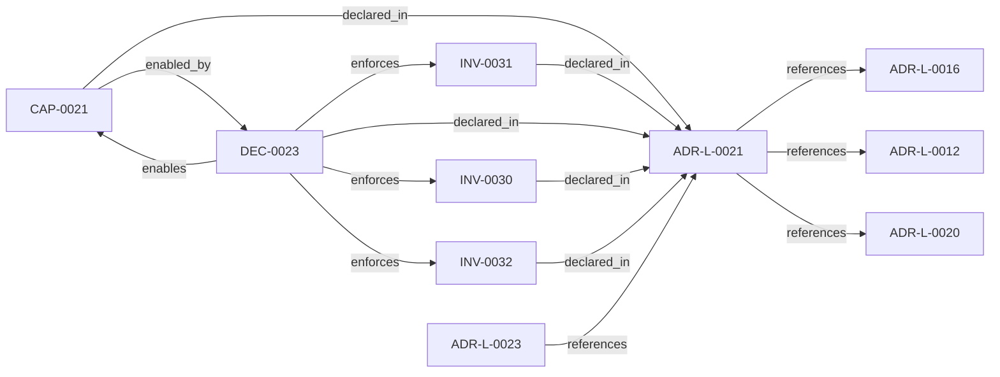

<!--
integrity_schema_version: 1
generated: deterministic_projection_v1
artifact_kind: rendered_adr_markdown
generator_id: adr-projection-markdown
generator_version: 2
hash_algorithm: sha256
source_hash: b451a46ab12beda96c3b8cd6bc78533240d6e7b14c8843b92a3a49367514fbcc
rendered_hash: 7d01bbc44847fae1e867b99e5fb42c022c492edf4b79e727cd806ec8dd9d8d6e
-->

# ADR-L-0021: Experimental MVC-D to MVC-S Contract Consumption

**Status:** proposed  
**Created:** 2026-05-30  
**Authors:** erik.gallmann  
**Domains:** mvc, contracts, runtime, provenance  
**Tags:** mvc-d, mvc-s, contract-consumption, candidate-surface, provenance  
**Alias name:** experimental-mvc-d-to-mvc-s-contract-consumption  

## Context

ste-spec now defines draft MVC-D and MVC-S schemas as part of the MVC evolution
contract surface. ste-runtime needs an experimental contract-consumption slice
that proves it can validate MVC-D fixtures and emit factual MVC-S candidate
snapshots without becoming a second schema authority and without crossing into
kernel-owned admission.

This ADR is intentionally narrow. It does not authorize RSS traversal, graph
database support, Context Domain execution, Graph Domain execution, Linkage
Surface materialization, runtime query planning, or MVC-M admission.

## Relationship graph

## Related ADRs

### ADR-L-0012 — Polyglot Interop Contract

**Relationships:**
- this ADR -[:references]-> 019ff84e-4ece-7fcd-a62e-c8a7982632b0

**Context:** STE subsystems are written in different languages. On-disk artifacts are
the only interop boundary. Neither runtime invents schema. Without a
single schema authority, subsystems risk copying, re-deriving, or
hand-maintaining sibling schemas, leading to drift and contract
violations.

[Open projection](ADR-L-0012-polyglot-interop-contract.md)
### ADR-L-0016 — Workspace Graph Slice Schema Contract

**Relationships:**
- this ADR -[:references]-> 019ff84e-4ece-76ad-ae3e-f92bef05635a

**Context:** ste-runtime produces per-repository graph slices during workspace RECON.
These slices are consumed by the runtime-owned workspace merger to produce
a unified workspace graph and multi-resolution projections. Without a
defined schema contract, producer and consumer drift can break merge
pipelines or cause downstream tools to treat partial graph material as
authoritative.

[Open projection](ADR-L-0016-workspace-graph-slice-schema-contract.md)
### ADR-L-0020 — Source Locators as Cognitive Execution Model Infrastructure

**Relationships:**
- this ADR -[:references]-> 019ff84e-4ecf-7f4e-8b17-1f35008e8877

**Context:** The workspace graph currently supports deterministic traversal and projection,
but graph entities need stable, portable links back to authoritative source
artifacts before the graph can safely support IDE-native reasoning,
conversation-engine context assembly, and future kernel handoff.

[Open projection](ADR-L-0020-source-locators-as-cognitive-execution-model-infrastructure.md)
### ADR-L-0023 — Experimental MVC-S Candidate Traversal Boundary

**Relationships:**
- 019ff84e-4ecf-7eed-a03b-5ae24f705e4d -[:references]-> this ADR

**Context:** ADR-L-0021 established experimental MVC-D to MVC-S contract consumption and
deterministic candidate emission from fully supplied fixture inputs. It
explicitly did not authorize RSS traversal, Graph Domain execution, Linkage
Surface materialization, runtime query planning, or MVC-M admission.

[Open projection](ADR-L-0023-experimental-mvc-s-candidate-traversal-boundary.md)

## Capabilities

### CAP-0021: Experimental MVC-D to MVC-S candidate emission

Consume ste-spec-owned MVC-D and MVC-S contracts in tests and emit deterministic
factual MVC-S candidate snapshots from fully supplied fixture inputs.

## Invariants

### INV-0030

**Statement:** ste-runtime MUST treat MVC-D and MVC-S schemas as external ste-spec contracts.
Runtime tests may mirror schema fixtures for local validation, but runtime
code MUST NOT redefine the public schema authority.
  
**Scope:** global  
**Enforcement:** must (design)  
**Verification:** automated

**Rationale:**
Prevents runtime from becoming a secondary schema authority for MVC contracts.

### INV-0031

**Statement:** Experimental MVC-S candidate emission MUST NOT include admission decisions,
caller-facing eligibility, enforcement outcomes, kernel verdicts, governance
state, or admitted payloads.
  
**Scope:** global  
**Enforcement:** must (design)  
**Verification:** automated

**Rationale:**
Preserves the MVC-S to MVC-M boundary and the ste-kernel admission authority.

### INV-0032

**Statement:** Experimental MVC-S candidate emission MUST be deterministic for identical
MVC-D, candidate refs, selector refs, topology metrics, rationale, and
negative-space inputs. Fingerprints MUST be computed over canonicalized input.
  
**Scope:** global  
**Enforcement:** must (design)  
**Verification:** automated

**Rationale:**
Deterministic candidate identity is required before RSS assembly or kernel
admission work can safely build on MVC-S.

## Decisions

### DEC-0023: Add an experimental contract-consumption builder for MVC-D to MVC-S fixtures

**Rationale:**
A narrow fixture validator gives ste-runtime a contract-safe baseline before
implementing RSS traversal or kernel handoff. All candidate material is fully
supplied to the builder; runtime does not reconstruct architecture or discover
topology in this slice.

**Alternatives Considered:**

- **Implement RSS traversal first**: Traversal would mix contract consumption with reality assembly and make it
harder to prove the MVC-S candidate boundary.

- **Emit MVC-M directly**: MVC-M requires kernel-owned admission and is outside runtime authority.

**Consequences:**

**Positive:**
- Runtime can validate ste-spec MVC contracts locally
- Candidate-only semantics are executable and testable
- Code provenance can link implementation to this ADR

**Negative:**
- Additional experimental surface must remain clearly separated from legacy CEM/MVC

**Related Invariants:** 019ff84e-4ecf-7cb6-8f2e-9ea0bafe9052, 019ff84e-4ecf-7381-953f-a53af77032aa, 019ff84e-4ecf-7f16-843f-242411e53189

---

*Generated from ADR-L-0021 by ADR Architecture Kit*