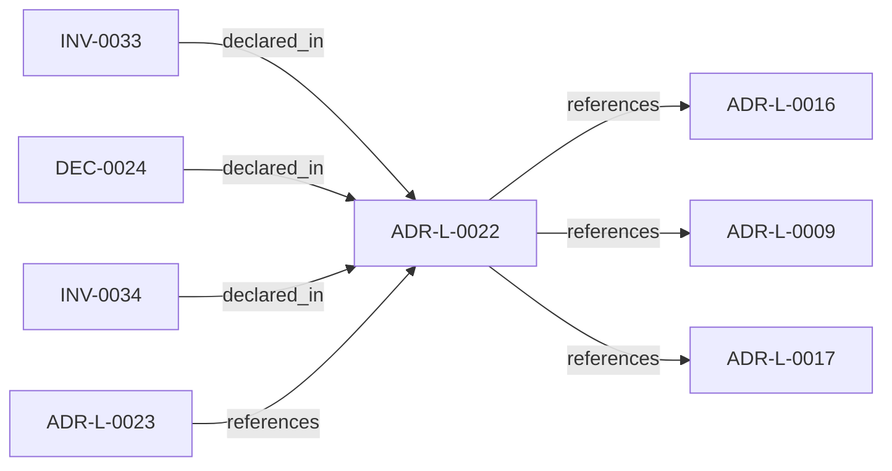

<!--
integrity_schema_version: 1
generated: deterministic_projection_v1
artifact_kind: rendered_adr_markdown
generator_id: adr-projection-markdown
generator_version: 2
hash_algorithm: sha256
source_hash: 5d2aa79559df9cc709ac25b89bd7a06c3b7706c0d918590a6fa6f3b32296517d
rendered_hash: 8f079418421f91a43b599f7b90e8faf50f976eee61a932b64df57050e8737d14
-->

# ADR-L-0022: Workspace Attribution Federation Consumption

**Status:** accepted  
**Created:** 2026-06-02  
**Authors:** erik.gallmann  
**Domains:** workspace, federation, attribution  
**Tags:** workspace, federation, qualified-id, attribution  
**Alias name:** workspace-attribution-federation-consumption  

## Context

Per-repo RECON emits implementation-attribution-evidence.yaml with bare
ADR-L-XXXX ids scoped to each repository manifest. The same bare id string
may denote different decisions in different repos (for example ADR-L-0013 in
adr-architecture-kit vs ste-runtime).

Federation authority and qualified identity are defined in
adr-architecture-kit ADR-L-0012 (accepted). ste-runtime consumes that model
at the workspace boundary: after workspace RECON completes for all manifest
repos, it invokes adr-architecture-kit `adr attribution workspace-report` to
write a derived `.ste-workspace/workspace-attribution-federation.yaml` keyed
by `{workspaceRepoKey}:{bareAdrId}`.

This artifact is derived state, not canonical architecture authority. Per-repo
attribution validation (`adr attribution check --scope <repo>`) is unchanged.

## Relationship graph

## Related ADRs

### ADR-L-0009 — Unified Workspace Scope Model

**Relationships:**
- this ADR -[:references]-> 019ff84e-4ece-7ce3-aa17-67193bab337e

**Context:** Reconnaissance tools traditionally assume a single repository as the unit
of analysis. Multi-repo systems require scope to expand to the workspace
level so that cross-repo relationships, shared configuration, and
aggregate evidence can be captured correctly.

[Open projection](ADR-L-0009-unified-workspace-scope-model.md)
### ADR-L-0016 — Workspace Graph Slice Schema Contract

**Relationships:**
- this ADR -[:references]-> 019ff84e-4ece-76ad-ae3e-f92bef05635a

**Context:** ste-runtime produces per-repository graph slices during workspace RECON.
These slices are consumed by the runtime-owned workspace merger to produce
a unified workspace graph and multi-resolution projections. Without a
defined schema contract, producer and consumer drift can break merge
pipelines or cause downstream tools to treat partial graph material as
authoritative.

[Open projection](ADR-L-0016-workspace-graph-slice-schema-contract.md)
### ADR-L-0017 — RECON Workspace Execution Contract

**Relationships:**
- this ADR -[:references]-> 019ff84e-4ece-7ddc-b31f-3a009abe14b3

**Context:** ADR-L-0009 fixes workspace as the universal scope unit. This ADR records
how workspace RECON execution behaves for observability, optional
incremental cross-run skips, and optional per-repository timeouts without
changing slice schemas or merge semantics. Persisted sentinel paths obey
ADR-L-0013 POSIX-relative projections from the workspace root. The semantic
extraction subsystem (ADR-PS-0002) remains the authoritative boundary for
phase-level extraction behavior; workspace orchestration…

[Open projection](ADR-L-0017-recon-workspace-execution-contract.md)
### ADR-L-0023 — Experimental MVC-S Candidate Traversal Boundary

**Relationships:**
- 019ff84e-4ecf-7eed-a03b-5ae24f705e4d -[:references]-> this ADR

**Context:** ADR-L-0021 established experimental MVC-D to MVC-S contract consumption and
deterministic candidate emission from fully supplied fixture inputs. It
explicitly did not authorize RSS traversal, Graph Domain execution, Linkage
Surface materialization, runtime query planning, or MVC-M admission.

[Open projection](ADR-L-0023-experimental-mvc-s-candidate-traversal-boundary.md)

## Invariants

### INV-0033

**Statement:** Workspace attribution federation MUST NOT mutate per-repo attribution evidence
or ADR corpora; it only reads state and manifests to emit a derived index.
  
**Scope:** global  
**Enforcement:** must (design)  
**Verification:** automated

**Rationale:**
Aligns with federation read-only aggregation (adr-architecture-kit ADR-L-0012).

### INV-0034

**Statement:** Federation embodiment counts MUST be computed per qualified_id only; bare ADR
ids shared across repos MUST NOT have embodiment counts summed across corpora.
  
**Scope:** global  
**Enforcement:** must (test)  
**Verification:** automated

**Rationale:**
Prevents homonym collapse at workspace reasoning time.

## Decisions

### DEC-0024: ste-runtime orchestrates workspace federation via adr-kit CLI after workspace RECON

**Rationale:**
Federation merge logic lives in adr-architecture-kit as single authority;
ste-runtime must not duplicate merge in TypeScript.

---

*Generated from ADR-L-0022 by ADR Architecture Kit*