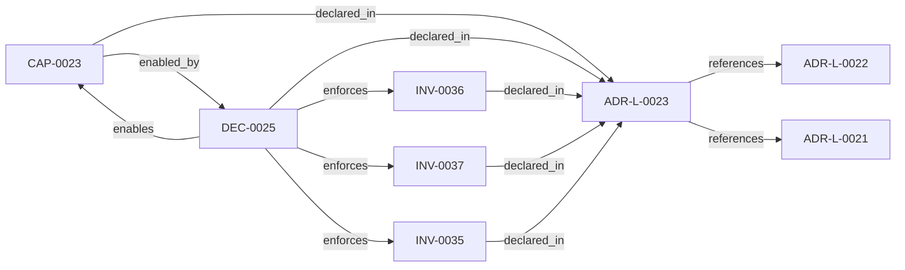

<!--
integrity_schema_version: 1
generated: deterministic_projection_v1
artifact_kind: rendered_adr_markdown
generator_id: adr-projection-markdown
generator_version: 2
hash_algorithm: sha256
source_hash: 3952ab043372cd062fec84a6371ba6e0e8c718f5f6cf12f735ab8b050619c108
rendered_hash: 823f7bf14b7821483f2f6ad1e44b764a2c5719f6613cc40713ba27fb66d8dee0
-->

# ADR-L-0023: Experimental MVC-S Candidate Traversal Boundary

**Status:** proposed  
**Created:** 2026-06-04  
**Authors:** erik.gallmann  
**Domains:** mvc, rss, runtime, traversal, provenance  
**Tags:** mvc-s, traversal, candidate-surface, supplied-relationships, provenance  
**Alias name:** experimental-mvc-s-candidate-traversal-boundary  

## Context

ADR-L-0021 established experimental MVC-D to MVC-S contract consumption and
deterministic candidate emission from fully supplied fixture inputs. It
explicitly did not authorize RSS traversal, Graph Domain execution, Linkage
Surface materialization, runtime query planning, or MVC-M admission.

Gate 6 introduces a narrower traversal boundary before production RSS
traversal. The runtime may expand MVC-S candidate refs by following supplied
relationship records only. This is a candidate-surface operation, not Graph
Domain materialization, topology discovery, Linkage Surface materialization,
context assembly, governance evaluation, or admission.

Supplied relationship records may be provided directly or inside a
ste-spec Linkage Surface-shaped object. In both cases ste-runtime remains a
consumer of supplied contract input. Runtime may read relationship_records
from a caller-supplied object, but it MUST NOT create, refresh, infer, enrich,
or materialize Linkage Surfaces.

Authorized:

- candidate expansion
- deterministic relationship following
- depth-bounded traversal
- inclusion rationale generation
- exclusion rationale generation
- candidate-only MVC-S output
- read-only consumption of supplied Linkage Surface-shaped relationship_records

Not Authorized:

- Graph Domain materialization
- topology computation
- relationship inference or derivation
- depth recommendation derivation
- Linkage Surface materialization
- MVC-M generation
- eligibility determination
- governance evaluation
- kernel admission
- workspace graph loading
- repository state access
- Linkage Surface generation, refresh, enrichment, or validation authority

## Relationship graph

## Related ADRs

### ADR-L-0021 — Experimental MVC-D to MVC-S Contract Consumption

**Relationships:**
- this ADR -[:references]-> 019ff84e-4ecf-74b8-8b3b-d33e1ad21f6a

**Context:** ste-spec now defines draft MVC-D and MVC-S schemas as part of the MVC evolution
contract surface. ste-runtime needs an experimental contract-consumption slice
that proves it can validate MVC-D fixtures and emit factual MVC-S candidate
snapshots without becoming a second schema authority and without crossing into
kernel-owned admission.

[Open projection](ADR-L-0021-experimental-mvc-d-to-mvc-s-contract-consumption.md)
### ADR-L-0022 — Workspace Attribution Federation Consumption

**Relationships:**
- this ADR -[:references]-> 019ff84e-4ecf-745f-9832-3155d323e40c

**Context:** Per-repo RECON emits implementation-attribution-evidence.yaml with bare
ADR-L-XXXX ids scoped to each repository manifest. The same bare id string
may denote different decisions in different repos (for example ADR-L-0013 in
adr-architecture-kit vs ste-runtime).

[Open projection](ADR-L-0022-workspace-attribution-federation-consumption.md)

## Capabilities

### CAP-0023: Experimental MVC-S candidate traversal

Expand MVC-S candidate refs by breadth-first traversal over supplied
relationship records only, including relationship_records supplied inside a
Linkage Surface-shaped contract object, producing deterministic
candidate-only MVC-S snapshots.

## Invariants

### INV-0035

**Statement:** Experimental MVC-S candidate traversal MUST operate directly against supplied
relationship records only. It MUST NOT construct Graph Domains, adjacency
maps, topology caches, reusable traversal structures, or materialized graph
artifacts.
  
**Scope:** global  
**Enforcement:** must (design)  
**Verification:** automated

**Rationale:**
Preserves the boundary between candidate traversal and graph materialization.

### INV-0036

**Statement:** Experimental MVC-S candidate traversal MUST be breadth-first and bounded by
caller-supplied relationship-hop depth from supplied seed candidates. Runtime
MUST NOT compute, derive, adjust, optimize, or override traversal depth.
  
**Scope:** global  
**Enforcement:** must (design)  
**Verification:** automated

**Rationale:**
Keeps depth authority with the caller and stabilizes rationale generation.

### INV-0037

**Statement:** Experimental MVC-S candidate traversal MUST preserve exact candidate identity.
Runtime MUST NOT collapse, merge, alias, or heuristically equate candidate
refs based on bare identifiers, titles, names, or other non-authoritative
identity surfaces.
  
**Scope:** global  
**Enforcement:** must (design)  
**Verification:** automated

**Rationale:**
Prevents workspace homonym collapse and preserves federation-aware identity.

## Decisions

### DEC-0025: Add a supplied-relationship MVC-S candidate traversal boundary

**Rationale:**
A deterministic traversal helper lets runtime test candidate expansion before
production RSS traversal. The helper consumes only caller-supplied
relationship records and emits MVC-S candidate output through the existing
candidate builder.

**Alternatives Considered:**

- **Build Graph Domains first**: Graph Domain materialization would expand this gate beyond candidate-only
traversal and blur authority boundaries.

- **Reuse workspace graph traversal**: Workspace graph loading and production RSS traversal are outside this
experimental MVC-S boundary.

- **Emit MVC-M from traversal output**: MVC-M requires kernel-owned admission and is outside runtime authority.

**Consequences:**

**Positive:**
- Candidate traversal can be tested before production RSS assembly
- Rationale and negative space can be generated from deterministic paths
- Runtime authority remains factual and candidate-only

**Negative:**
- Traversal is intentionally limited and does not discover missing graph state

**Related Invariants:** 019ff84e-4ecf-75ff-950f-d592721d0236, 019ff84e-4ecf-70ef-9b2b-d34696170f1b, 019ff84e-4ecf-7548-9e1c-3b7ed8868019

---

*Generated from ADR-L-0023 by ADR Architecture Kit*