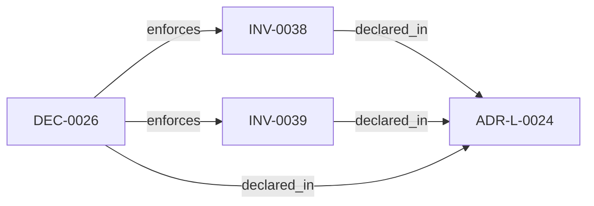

<!--
integrity_schema_version: 1
generated: deterministic_projection_v1
artifact_kind: rendered_adr_markdown
generator_id: adr-projection-markdown
generator_version: 2
hash_algorithm: sha256
source_hash: 5ff113a47643e1fb0687b6990aaa4c525f1d9d574cf9275cc5635d8da04c6f69
rendered_hash: b5c0634687f15ee5ee65fdff22be2c708f83665a047105b47009161c81424070
-->

# ADR-L-0024: Public Source Release and Production Publication Boundary

**Status:** accepted  
**Created:** 2026-08-12  
**Authors:** erik.gallmann  
**Domains:** release, governance, runtime, public-repository  
**Tags:** branch-promotion, public-source, production-overhaul, npm-publication, release-evidence  
**Alias name:** public-source-release-and-production-publication-boundary  

## Context

ste-runtime is maintained in a public repository, but its package remains intentionally private and unpublished because the runtime is an experimental reference implementation rather than a production-supported npm distribution.

The repository therefore has two distinct publication surfaces:

- public source and canonical architecture artifacts, reviewed and promoted through GitHub;
- a future installable package, which requires a separate production-overhaul decision and a compatibility-supported public API.

Without an explicit boundary, a public repository can be mistaken for a public package commitment, and feature branches can be promoted directly to the production/reference branch without the integration evidence collected on develop. 

## Relationship graph

## Constraints

### CONST-0021 (technical)

**Description:**
The package MUST remain private and unpublished while the production overhaul is incomplete.

**Rationale:**
Separates public source availability from an unsupported package compatibility promise.

### CONST-0022 (technical)

**Description:**
The repository MUST preserve canonical ADR authority and regenerate derived projections and registries through their owning tools.

**Rationale:**
Prevents release evidence from being based on manually edited derived artifacts.

## Invariants

### INV-0038

**Statement:** Runtime changes MUST promote through a reviewed pull request from a feature branch to develop, followed by a reviewed develop-to-main promotion. Feature branches MUST NOT bypass develop when updating main.  
**Scope:** global  
**Enforcement:** must (policy)  
**Verification:** automated

**Rationale:**
Preserves an integration boundary and makes the evidence for promoted source reviewable.

### INV-0039

**Statement:** The ste-runtime package MUST remain marked private and MUST NOT be published to npm until an accepted production-overhaul decision establishes a supported public API, package compatibility policy, release evidence, and publication provenance.  
**Scope:** global  
**Enforcement:** must (policy)  
**Verification:** automated

**Rationale:**
Separates public source availability from an unsupported package compatibility promise.

## Decisions

### DEC-0026: Keep source public, defer package publication to the production overhaul

**Rationale:**
The current runtime is experimental and its package metadata already declares a private, unpublished distribution. The repository can still provide transparent source, canonical ADRs, generated architecture artifacts, and reproducible validation evidence without making an npm compatibility promise.

**Alternatives Considered:**

- **Publish every main promotion to npm**: Main currently represents promoted public source, not a production-supported package contract.
- **Keep branch and package policy implicit**: Implicit policy makes public source, integration, and package compatibility boundaries easy to confuse.

**Consequences:**

**Positive:**
- Public source remains reviewable and reusable.
- develop provides an explicit integration boundary before main promotion.
- npm publication remains blocked until production readiness is deliberate and evidenced.

**Negative:**
- Consumers must use source checkout or local linking until publication is approved.
- A future production-overhaul decision and release implementation remain necessary.

**Related Invariants:** 019ff88c-4cbd-7725-892a-3762052360df, 019ff88c-4cbd-7725-892a-3762052360e0

---

*Generated from ADR-L-0024 by ADR Architecture Kit*