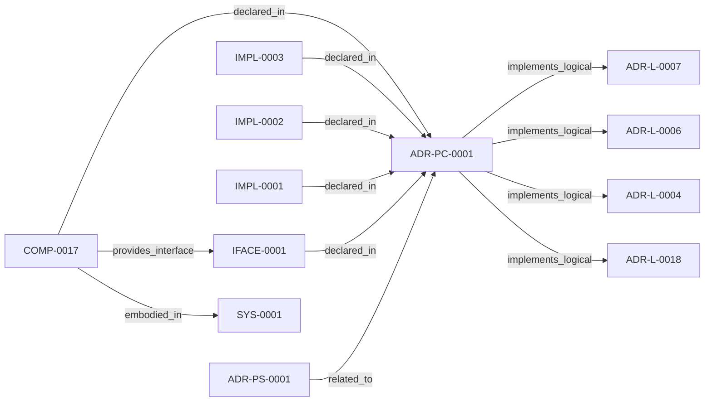

<!--
integrity_schema_version: 1
generated: deterministic_projection_v1
artifact_kind: rendered_adr_markdown
generator_id: adr-projection-markdown
generator_version: 2
hash_algorithm: sha256
source_hash: b2fe064ef467fa4fe9fe17436e0f11ebd4a0b38622803086fe20d37523b31048
rendered_hash: 121d53ebff3f4a850137e0260058f13084217f467a6b9bdae95c383471076347
-->

# ADR-PC-0001: MCP Server and Tool Registry

**Status:** proposed  
**Created:** 2026-03-15  
**Modified:** 2026-05-22  
**Authors:** erik.gallmann  
**Domains:** mcp, integration, runtime  
**Alias name:** adr-pc-0001-mcp-server-and-tool-registry  

**Implements Logical:** [ADR-L-0004](../logical/ADR-L-0004-watchdog-authoritative-mode-for-workspace-boundary.md), [ADR-L-0006](../logical/ADR-L-0006-conversational-query-interface-for-rss.md), [ADR-L-0007](../logical/ADR-L-0007-graph-freshness-and-obligation-projection-semantics.md), [ADR-L-0018](../logical/ADR-L-0018-deterministic-workspace-graph-queries.md)  
**Technologies:** typescript, node.js, mcp, zod  

**Implements System:** [ADR-PS-0001](../physical-system/ADR-PS-0001-runtime-orchestration-and-assistant-integration.md)  

## Context

This component exposes assistant-facing runtime tools over MCP and binds
structural, operational, context, optimized, obligation-oriented, and
workspace graph query tool surfaces into one discoverable server boundary.

## Technology Stack

### TypeScript (language)

**Version:** 5.3+

**Rationale:**
Existing implementation language.

### @modelcontextprotocol/sdk (library)

**Version:** 1.x

**Rationale:**
MCP protocol implementation.

## Relationship graph

## Related ADRs

### ADR-L-0004 — Watchdog Authoritative Mode for Workspace Boundary

**Relationships:**
- this ADR -[:implements_logical]-> 019ff84e-4ece-75dd-9f0b-ccb51cedc4f5

**Context:** Per STE Architecture (Section 3.1), STE operates across two distinct governance boundaries:
1. **Workspace Development Boundary** - Provisional state, soft + hard enforcement, post-reasoning validation
2. **Runtime Execution Boundary** - Canonical state, cryptographic enforcement, pre-reasoning admission control

[Open projection](../logical/ADR-L-0004-watchdog-authoritative-mode-for-workspace-boundary.md)
### ADR-L-0006 — Conversational Query Interface for RSS

**Relationships:**
- this ADR -[:implements_logical]-> 019ff84e-4ece-71c8-af1f-eb35c77b551a

**Context:** E-ADR-004 established the RSS CLI and TypeScript API as the foundation for graph traversal and context assembly. However, a gap exists between:

[Open projection](../logical/ADR-L-0006-conversational-query-interface-for-rss.md)
### ADR-L-0007 — Graph Freshness and Obligation Projection Semantics

**Relationships:**
- this ADR -[:implements_logical]-> 019ff84e-4ece-70ba-bf2e-a0fecd4a986e

**Context:** ste-runtime now exposes graph freshness checks, invalidated validation
signals, change intent handling, and obligation projection behavior through
RSS and MCP tooling. These semantics are broader than implementation detail
and require an explicit logical authority.

[Open projection](../logical/ADR-L-0007-graph-freshness-and-obligation-projection-semantics.md)
### ADR-L-0018 — Deterministic Workspace Graph Queries

**Relationships:**
- this ADR -[:implements_logical]-> 019ff84e-4ece-7c3b-833e-dbdb54ed76ec

**Context:** The workspace semantic graph (verb-typed edges in slices/*.yaml, produced per
ADR-L-0016) already contains the relationships needed to answer standard
system-level questions such as "show me the repo dependency map," "show me the
component integration," and "what is the blast radius of node X." Today, those
questions require either manual MCP tool invocation by an LLM or reading raw
YAML.

[Open projection](../logical/ADR-L-0018-deterministic-workspace-graph-queries.md)
### ADR-PS-0001 — Runtime Orchestration and Assistant Integration

**Relationships:**
- 019ff84e-4ecf-78a6-bb1c-676e50a3d97a -[:related_to]-> this ADR

**Context:** ste-runtime now contains a runtime orchestration boundary that keeps semantic
state fresh, exposes assistant-facing MCP tools, performs reconciliation
gating and freshness checks, and assembles implementation context and
obligation projections for agents and operators.

[Open projection](../physical-system/ADR-PS-0001-runtime-orchestration-and-assistant-integration.md)

## Component Specifications

### COMP-0017: MCP Server and Tool Registry (service)

**Responsibilities:**
- Serve MCP stdio runtime for assistant integration
- Register structural, operational, context, optimized, obligation, and workspace graph query tools
- Route tool requests onto runtime graph, context, and workspace query services

**Interfaces:**
- **IFACE-0001** (CLI): Entry surfaces:
- src/mcp/mcp-server.ts
- MCP stdio tool registration for structural, operational, c...

**Implementation Identifiers:**
- Module Path: `src/mcp/mcp-server.ts`

## Implementation Decisions

### IMPL-0001: Graph topology analysis uses single-pass BFS layering (Kahn's algorithm) computing forward dependency depths in O(N+E). The original per-node recursive DFS (O(N x (N+E))) caused the MCP server to hang at startup when the graph exceeded ~500 nodes. Backward depth metrics are dead (never consumed by detectPattern() or calculateOptimalDepth()); fields retained at zero for cache compatibility. Alternatives rejected: (1) increase sampling threshold -- constant factor improvement only, (2) skip topology analysis -- loses pattern detection and recommended depth.

**Rationale:**
Infrastructure domain expansion (ADR-L-0016 INV-0025) grew the graph from ~200 to ~1200 nodes, triggering the O(N*DFS) hang. Linear-time analysis is required for the IR substrate to grow to 5K-10K+ nodes.

### IMPL-0002: MCP startup loads the RECON graph exactly once per initialization or reload cycle. rssContext.graph (already in memory from initRssContext) is passed directly to analyzeGraphTopology(). The redundant second call to loadAidocGraph on cache miss and on every reloadContext() is eliminated.

**Rationale:**
At N=5000 with sequential YAML I/O, each redundant loadAidocGraph call added ~50 seconds. Eliminating the double load halves cold-start I/O.

### IMPL-0003: Graph metrics cache (graph-metrics.json) is validated by node-count delta: recompute when |cached.totalComponents - graph.size| exceeds 10% of graph.size. The check is O(1); recomputation is O(N+E) per IMPL-0001.

**Rationale:**
Previously graph-metrics.json was accepted without staleness validation. A stale cache could silently produce incorrect topology metadata after graph growth, leading to suboptimal traversal parameter tuning.

## Gaps

### GAP-0001: The O(N*DFS) topology analysis caused MCP server startup to hang when graph size exceeded ~500 nodes. Was there a performance bound for startup graph analysis?

**Impact:**   
**Blocking:** No

---

*Generated from ADR-PC-0001 by ADR Architecture Kit*