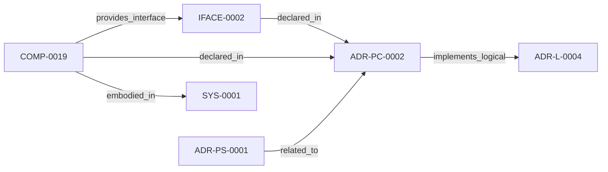

<!--
integrity_schema_version: 1
generated: deterministic_projection_v1
artifact_kind: rendered_adr_markdown
generator_id: adr-projection-markdown
generator_version: 2
hash_algorithm: sha256
source_hash: 3271bd9162c39b0459b83ade459de58644e6b05f8ec8ebf083c7b24a72369f56
rendered_hash: 14eb97aac510b08caa1487f2ad26324217041d11d634cdcc992e791b7880ed78
-->

# ADR-PC-0002: Watchdog and Update Coordination

**Status:** proposed  
**Created:** 2026-03-15  
**Authors:** erik.gallmann  
**Domains:** watch, runtime, reconciliation  
**Alias name:** adr-pc-0002-watchdog-and-update-coordination  

**Implements Logical:** [ADR-L-0004](../logical/ADR-L-0004-watchdog-authoritative-mode-for-workspace-boundary.md)  
**Technologies:** typescript, node.js, chokidar  

**Implements System:** [ADR-PS-0001](../physical-system/ADR-PS-0001-runtime-orchestration-and-assistant-integration.md)  

## Context

This component monitors changes, detects transactions, coordinates update
batches, and safeguards write-triggered reconciliation behavior for the
runtime boundary.

## Technology Stack

### TypeScript (language)

**Version:** 5.3+

**Rationale:**
Existing implementation language.

### chokidar (library)

**Version:** 3.x

**Rationale:**
File watching implementation.

## Relationship graph

## Related ADRs

### ADR-L-0004 — Watchdog Authoritative Mode for Workspace Boundary

**Relationships:**
- this ADR -[:implements_logical]-> 019ff84e-4ece-75dd-9f0b-ccb51cedc4f5

**Context:** Per STE Architecture (Section 3.1), STE operates across two distinct governance boundaries:
1. **Workspace Development Boundary** - Provisional state, soft + hard enforcement, post-reasoning validation
2. **Runtime Execution Boundary** - Canonical state, cryptographic enforcement, pre-reasoning admission control

[Open projection](../logical/ADR-L-0004-watchdog-authoritative-mode-for-workspace-boundary.md)
### ADR-PS-0001 — Runtime Orchestration and Assistant Integration

**Relationships:**
- 019ff84e-4ecf-78a6-bb1c-676e50a3d97a -[:related_to]-> this ADR

**Context:** ste-runtime now contains a runtime orchestration boundary that keeps semantic
state fresh, exposes assistant-facing MCP tools, performs reconciliation
gating and freshness checks, and assembles implementation context and
obligation projections for agents and operators.

[Open projection](../physical-system/ADR-PS-0001-runtime-orchestration-and-assistant-integration.md)

## Component Specifications

### COMP-0019: Watchdog and Update Coordination (worker)

**Responsibilities:**
- Watch source and state changes
- Detect coherent edit transactions
- Coordinate update batches and reconciliation triggers
- Protect runtime behavior from unsafe write loops

**Interfaces:**
- **IFACE-0002** (library_api): Public surfaces:
- Watchdog
- UpdateCoordinator
- TransactionDetector
- WriteTracker
...

**Implementation Identifiers:**
- Module Path: `src/watch/watchdog.ts`

---

*Generated from ADR-PC-0002 by ADR Architecture Kit*