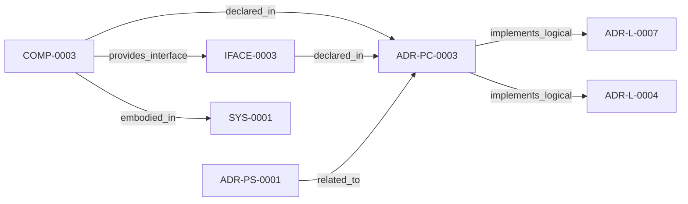

<!--
integrity_schema_version: 1
generated: deterministic_projection_v1
artifact_kind: rendered_adr_markdown
generator_id: adr-projection-markdown
generator_version: 2
hash_algorithm: sha256
source_hash: 6725a99b4324b56fc7de644390cab0870999c9ee34754c38ececf6859c8fdae4
rendered_hash: d3d0d67039c760659b6843beddbe491922a569a8b5fe7f638831e9835f6e83d4
-->

# ADR-PC-0003: Preflight Freshness and Reconciliation Gating

**Status:** proposed  
**Created:** 2026-03-15  
**Authors:** erik.gallmann  
**Domains:** preflight, freshness, reconciliation  
**Alias name:** preflight-freshness-and-reconciliation-gating  

**Implements Logical:** [ADR-L-0004](../logical/ADR-L-0004-watchdog-authoritative-mode-for-workspace-boundary.md), [ADR-L-0007](../logical/ADR-L-0007-graph-freshness-and-obligation-projection-semantics.md)  
**Technologies:** typescript, node.js, zod  

**Implements System:** [ADR-PS-0001](../physical-system/ADR-PS-0001-runtime-orchestration-and-assistant-integration.md)  

## Context

This component evaluates file freshness, intent scope, and reconciliation
requirements before runtime actions rely on semantic graph state.

## Technology Stack

### TypeScript (language)

**Version:** 5.3+

**Rationale:**
Existing implementation language.

## Relationship graph

## Related ADRs

### ADR-L-0004 — Watchdog Authoritative Mode for Workspace Boundary

**Relationships:**
- this ADR -[:implements_logical]-> 019ff84e-4ece-75dd-9f0b-ccb51cedc4f5

**Context:** Per STE Architecture (Section 3.1), STE operates across two distinct governance boundaries:
1. **Workspace Development Boundary** - Provisional state, soft + hard enforcement, post-reasoning validation
2. **Runtime Execution Boundary** - Canonical state, cryptographic enforcement, pre-reasoning admission control

[Open projection](../logical/ADR-L-0004-watchdog-authoritative-mode-for-workspace-boundary.md)
### ADR-L-0007 — Graph Freshness and Obligation Projection Semantics

**Relationships:**
- this ADR -[:implements_logical]-> 019ff84e-4ece-70ba-bf2e-a0fecd4a986e

**Context:** ste-runtime now exposes graph freshness checks, invalidated validation
signals, change intent handling, and obligation projection behavior through
RSS and MCP tooling. These semantics are broader than implementation detail
and require an explicit logical authority.

[Open projection](../logical/ADR-L-0007-graph-freshness-and-obligation-projection-semantics.md)
### ADR-PS-0001 — Runtime Orchestration and Assistant Integration

**Relationships:**
- 019ff84e-4ecf-78a6-bb1c-676e50a3d97a -[:related_to]-> this ADR

**Context:** ste-runtime now contains a runtime orchestration boundary that keeps semantic
state fresh, exposes assistant-facing MCP tools, performs reconciliation
gating and freshness checks, and assembles implementation context and
obligation projections for agents and operators.

[Open projection](../physical-system/ADR-PS-0001-runtime-orchestration-and-assistant-integration.md)

## Component Specifications

### COMP-0003: Preflight Freshness and Reconciliation Gate (service)

**Responsibilities:**
- Resolve intent scope
- Evaluate graph freshness
- Determine whether reconciliation is required
- Surface freshness status for downstream tools

**Interfaces:**
- **IFACE-0003** (library_api): Public surfaces:
- preflightReconciliation
- checkFreshness
- resolveIntentScope
...

**Implementation Identifiers:**
- Module Path: `src/mcp/preflight.ts`

---

*Generated from ADR-PC-0003 by ADR Architecture Kit*