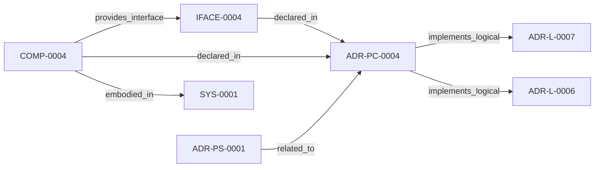

<!--
integrity_schema_version: 1
generated: deterministic_projection_v1
artifact_kind: rendered_adr_markdown
generator_id: adr-projection-markdown
generator_version: 2
hash_algorithm: sha256
source_hash: 3c93b94f7291b529fb24bf25818e484c51379c785ff2073f3a20fbe08ffba916
rendered_hash: cabf203bea5467332be98a05bdc57f9c91db643e36976462790e6213f1450e8b
-->

# ADR-PC-0004: Obligation Projection and Context Assembly

**Status:** proposed  
**Created:** 2026-03-15  
**Authors:** erik.gallmann  
**Domains:** obligations, context, rss  
**Alias name:** adr-pc-0004-obligation-projection-and-context-assembly  

**Implements Logical:** [ADR-L-0006](../logical/ADR-L-0006-conversational-query-interface-for-rss.md), [ADR-L-0007](../logical/ADR-L-0007-graph-freshness-and-obligation-projection-semantics.md)  
**Technologies:** typescript, node.js, zod  

**Implements System:** [ADR-PS-0001](../physical-system/ADR-PS-0001-runtime-orchestration-and-assistant-integration.md)  

## Context

This component projects invalidated validations and change-driven obligations,
assembles implementation context, and loads source-backed evidence for
assistant-facing reasoning.

## Technology Stack

### TypeScript (language)

**Version:** 5.3+

**Rationale:**
Existing implementation language.

## Relationship graph

## Related ADRs

### ADR-L-0006 — Conversational Query Interface for RSS

**Relationships:**
- this ADR -[:implements_logical]-> 019ff84e-4ece-71c8-af1f-eb35c77b551a

**Context:** E-ADR-004 established the RSS CLI and TypeScript API as the foundation for graph traversal and context assembly. However, a gap exists between:

[Open projection](../logical/ADR-L-0006-conversational-query-interface-for-rss.md)
### ADR-L-0007 — Graph Freshness and Obligation Projection Semantics

**Relationships:**
- this ADR -[:implements_logical]-> 019ff84e-4ece-70ba-bf2e-a0fecd4a986e

**Context:** ste-runtime now exposes graph freshness checks, invalidated validation
signals, change intent handling, and obligation projection behavior through
RSS and MCP tooling. These semantics are broader than implementation detail
and require an explicit logical authority.

[Open projection](../logical/ADR-L-0007-graph-freshness-and-obligation-projection-semantics.md)
### ADR-PS-0001 — Runtime Orchestration and Assistant Integration

**Relationships:**
- 019ff84e-4ecf-78a6-bb1c-676e50a3d97a -[:related_to]-> this ADR

**Context:** ste-runtime now contains a runtime orchestration boundary that keeps semantic
state fresh, exposes assistant-facing MCP tools, performs reconciliation
gating and freshness checks, and assembles implementation context and
obligation projections for agents and operators.

[Open projection](../physical-system/ADR-PS-0001-runtime-orchestration-and-assistant-integration.md)

## Component Specifications

### COMP-0004: Obligation Projection and Context Assembly (service)

**Responsibilities:**
- Project obligations from change intent and graph state
- Surface invalidated validations and advisories
- Load source-backed implementation context
- Format runtime context for assistant consumption

**Interfaces:**
- **IFACE-0004** (library_api): Public surfaces:
- projectObligations
- assembleContextTool
- getImplementationContext
- loadSourceG...

**Implementation Identifiers:**
- Module Path: `src/mcp/obligation-projector.ts`

---

*Generated from ADR-PC-0004 by ADR Architecture Kit*