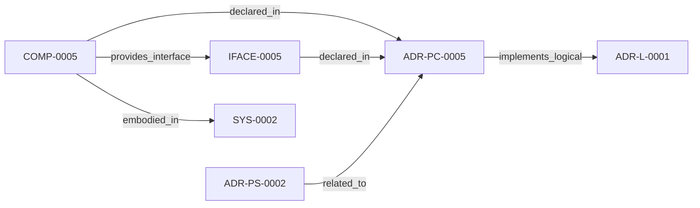

<!--
integrity_schema_version: 1
generated: deterministic_projection_v1
artifact_kind: rendered_adr_markdown
generator_id: adr-projection-markdown
generator_version: 2
hash_algorithm: sha256
source_hash: 22de0219defb7e9a30050e9780389ce61343c2a154ca5470ab20e1aff17d3480
rendered_hash: ec39d575bfef719cf22118524f3a8117afb7b141fb14508c69b6e3d914ed061d
-->

# ADR-PC-0005: JSON Semantic Extraction

**Status:** proposed  
**Created:** 2026-03-15  
**Authors:** erik.gallmann  
**Domains:** extraction, json, recon  
**Alias name:** json-semantic-extraction  

**Implements Logical:** [ADR-L-0001](../logical/ADR-L-0001-recon-provisional-execution-for-project-level-semantic-state.md)  
**Technologies:** typescript, json, node.js  

**Implements System:** [ADR-PS-0002](../physical-system/ADR-PS-0002-semantic-extraction-subsystem.md)  

## Context

JSON semantic extraction captures controls, schemas, and configuration
semantics from JSON sources and feeds them into RECON normalization.

## Technology Stack

### TypeScript (language)

**Version:** 5.3+

**Rationale:**
Existing implementation language.

## Relationship graph

## Related ADRs

### ADR-L-0001 — RECON Provisional Execution for Project-Level Semantic State

**Relationships:**
- this ADR -[:implements_logical]-> 019ff84e-4ece-791b-822f-21f537c95340

**Context:** The STE Architecture Specification defines RECON (Reconciliation Engine) as the mechanism for extracting semantic state from source code and populating AI-DOC. The question arose: How should RECON operate during the exploratory development phase when foundational components are still being built?

[Open projection](../logical/ADR-L-0001-recon-provisional-execution-for-project-level-semantic-state.md)
### ADR-PS-0002 — Semantic Extraction Subsystem

**Relationships:**
- 019ff84e-4ed0-73d5-aa3f-dfbfd18b339c -[:related_to]-> this ADR

**Context:** ste-runtime extraction is now a subsystem containing multiple first-class
extractors and normalization flows rather than a pair of isolated physical
slices. This ADR groups the implemented extractor estate under a concrete
system boundary.

[Open projection](../physical-system/ADR-PS-0002-semantic-extraction-subsystem.md)

## Component Specifications

### COMP-0005: JSON Semantic Extractor (library)

**Responsibilities:**
- Detect semantically relevant JSON files
- Extract controls, schemas, and configuration semantics
- Provide RECON-ready assertions for normalization

**Interfaces:**
- **IFACE-0005** (library_api): Public surfaces:
- src/extractors/json/index.ts
- src/extractors/json/json-extractor.ts
...

**Implementation Identifiers:**
- Module Path: `src/extractors/json/json-extractor.ts`

---

*Generated from ADR-PC-0005 by ADR Architecture Kit*