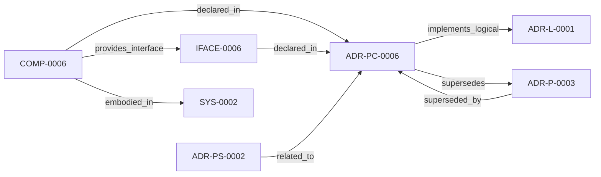

<!--
integrity_schema_version: 1
generated: deterministic_projection_v1
artifact_kind: rendered_adr_markdown
generator_id: adr-projection-markdown
generator_version: 2
hash_algorithm: sha256
source_hash: 517cf96d5c8a38bfe208f04395c94ae222dbbfa503190fcecdfd05e9b6e46843
rendered_hash: 4b9392e64016c4799a6cd27d8c625f5f99ec5d7877452614001c694dfb33fa21
-->

# ADR-PC-0006: Frontend Semantic Extraction

**Status:** proposed  
**Created:** 2026-03-15  
**Authors:** erik.gallmann  
**Domains:** extraction, frontend, recon  
**Alias name:** frontend-semantic-extraction  

**Implements Logical:** [ADR-L-0001](../logical/ADR-L-0001-recon-provisional-execution-for-project-level-semantic-state.md)  
**Technologies:** typescript, angular, css, scss  

**Implements System:** [ADR-PS-0002](../physical-system/ADR-PS-0002-semantic-extraction-subsystem.md)  

## Context

Frontend semantic extraction captures Angular and CSS/SCSS-specific semantics
beyond generic TypeScript structure and feeds them into RECON normalization.

## Technology Stack

### TypeScript (language)

**Version:** 5.3+

**Rationale:**
Existing implementation language.

## Relationship graph

## Related ADRs

### ADR-L-0001 — RECON Provisional Execution for Project-Level Semantic State

**Relationships:**
- this ADR -[:implements_logical]-> 019ff84e-4ece-791b-822f-21f537c95340

**Context:** The STE Architecture Specification defines RECON (Reconciliation Engine) as the mechanism for extracting semantic state from source code and populating AI-DOC. The question arose: How should RECON operate during the exploratory development phase when foundational components are still being built?

[Open projection](../logical/ADR-L-0001-recon-provisional-execution-for-project-level-semantic-state.md)
### ADR-P-0003 — Angular and CSS/SCSS Semantic Extraction

**Relationships:**
- 019ff84e-4ed0-7fa4-b739-80447b4e3085 -[:superseded_by]-> this ADR
- this ADR -[:supersedes]-> 019ff84e-4ed0-7fa4-b739-80447b4e3085

**Context:** The TypeScript extractor currently processes Angular files as standard TypeScript, capturing:
- Functions and their signatures
- Classes and their methods
- Import/export relationships
- Module structure

[Open projection](../physical/ADR-P-0003-angular-and-css-scss-semantic-extraction.md)
### ADR-PS-0002 — Semantic Extraction Subsystem

**Relationships:**
- 019ff84e-4ed0-73d5-aa3f-dfbfd18b339c -[:related_to]-> this ADR

**Context:** ste-runtime extraction is now a subsystem containing multiple first-class
extractors and normalization flows rather than a pair of isolated physical
slices. This ADR groups the implemented extractor estate under a concrete
system boundary.

[Open projection](../physical-system/ADR-PS-0002-semantic-extraction-subsystem.md)

## Component Specifications

### COMP-0006: Frontend Semantic Extractor (library)

**Responsibilities:**
- Extract Angular component, service, route, and template semantics
- Extract CSS/SCSS tokens, styles, and related frontend semantics
- Provide frontend assertions for RECON normalization

**Interfaces:**
- **IFACE-0006** (library_api): Public surfaces:
- src/extractors/angular/angular-extractor.ts
- src/extractors/css/css-extractor.ts...

**Implementation Identifiers:**
- Module Path: `src/extractors/angular/angular-extractor.ts`

---

*Generated from ADR-PC-0006 by ADR Architecture Kit*