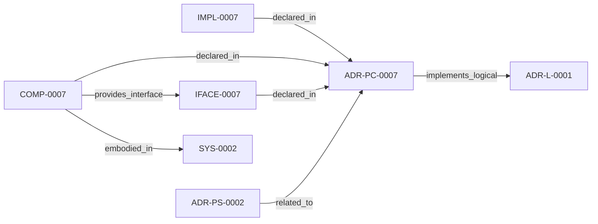

<!--
integrity_schema_version: 1
generated: deterministic_projection_v1
artifact_kind: rendered_adr_markdown
generator_id: adr-projection-markdown
generator_version: 2
hash_algorithm: sha256
source_hash: c7f3914b49371805e501ad8a7212f268bc877974b2592928b8f74d0a49ed69d8
rendered_hash: 986b30dae9d38a1ec35555b5532a8fa93461eea03aaa8339a8f38f8b1e8bab64
-->

# ADR-PC-0007: CloudFormation Semantic Extraction

**Status:** proposed  
**Created:** 2026-03-15  
**Authors:** erik.gallmann  
**Domains:** extraction, cloudformation, recon  
**Alias name:** cloudformation-semantic-extraction  

**Implements Logical:** [ADR-L-0001](../logical/ADR-L-0001-recon-provisional-execution-for-project-level-semantic-state.md)  
**Technologies:** typescript, cloudformation, yaml, json  

**Implements System:** [ADR-PS-0002](../physical-system/ADR-PS-0002-semantic-extraction-subsystem.md)  

## Context

CloudFormation semantic extraction captures templates, resources, outputs,
parameters, infrastructure relationships, and template-level implementation
intent from CloudFormation sources. This includes nested stack topology
detection: master templates that orchestrate child stacks via
AWS::Serverless::Application and AWS::CloudFormation::Stack resource types
are identified by resource type analysis, and cross-template resolution
structures (StackTopology, OutputIndex) are built for downstream service
wiring. All resolution is static analysis of template files on disk; no
runtime AWS API calls are made.

## Technology Stack

### TypeScript (language)

**Version:** 5.3+

**Rationale:**
Existing implementation language.

## Relationship graph

## Related ADRs

### ADR-L-0001 — RECON Provisional Execution for Project-Level Semantic State

**Relationships:**
- this ADR -[:implements_logical]-> 019ff84e-4ece-791b-822f-21f537c95340

**Context:** The STE Architecture Specification defines RECON (Reconciliation Engine) as the mechanism for extracting semantic state from source code and populating AI-DOC. The question arose: How should RECON operate during the exploratory development phase when foundational components are still being built?

[Open projection](../logical/ADR-L-0001-recon-provisional-execution-for-project-level-semantic-state.md)
### ADR-PS-0002 — Semantic Extraction Subsystem

**Relationships:**
- 019ff84e-4ed0-73d5-aa3f-dfbfd18b339c -[:related_to]-> this ADR

**Context:** ste-runtime extraction is now a subsystem containing multiple first-class
extractors and normalization flows rather than a pair of isolated physical
slices. This ADR groups the implemented extractor estate under a concrete
system boundary.

[Open projection](../physical-system/ADR-PS-0002-semantic-extraction-subsystem.md)

## Component Specifications

### COMP-0007: CloudFormation Semantic Extractor (library)

**Responsibilities:**
- Extract template, parameter, resource, and output semantics
- Derive infrastructure relationships and API/data model evidence
- Preserve template-level implementation intent metadata
- Detect nested stack topology via AWS::Serverless::Application and AWS::CloudFormation::Stack resource types
- Build cross-template resolution structures (StackTopology, OutputIndex) for downstream wiring
- Identify canonical stackId (<repo-relative-template-path>#<logicalId>) as primary identity model

**Interfaces:**
- **IFACE-0007** (library_api): Public surfaces:
- src/recon/phases/extraction-cloudformation.ts
- src/extractors/cfn/*
- src/worksp...

**Implementation Identifiers:**
- Module Path: `src/recon/phases/extraction-cloudformation.ts`

## Implementation Decisions

### IMPL-0007: CFN type completeness: all extracted AWS::* resources are emitted as workspace graph nodes. Explicitly mapped types receive specific graph type names (Lambda, Queue, Distribution, etc.). Unmapped types receive the InfraResource fallback type with cfn_type preserved in attributes.

**Rationale:**
The workspace graph is pattern-agnostic. Backend services, frontend SPAs, and MFE monorepos all produce infrastructure resources that must appear in the graph for Architecture IR fidelity.

## Gaps

### GAP-0001: AWS::Serverless::StateMachine is now handled via the shared CFN type mapping module (maps to StateMachine graph type). DefinitionBody/ DefinitionUri extraction uses the same logic as AWS::StepFunctions::StateMachine.

**Impact:**   
**Blocking:** No

---

*Generated from ADR-PC-0007 by ADR Architecture Kit*