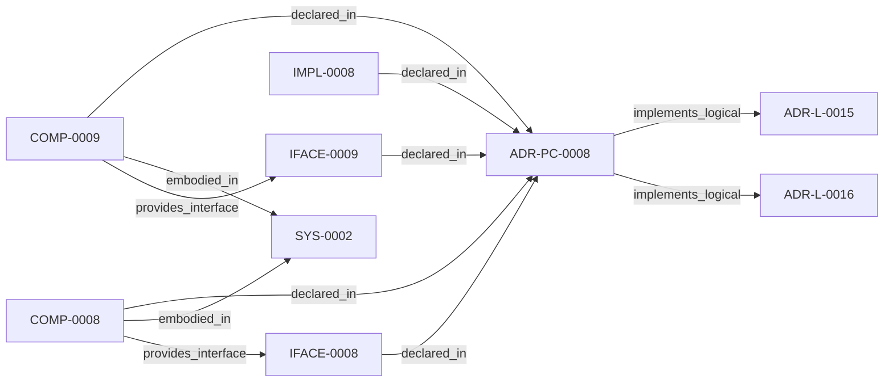

<!--
integrity_schema_version: 1
generated: deterministic_projection_v1
artifact_kind: rendered_adr_markdown
generator_id: adr-projection-markdown
generator_version: 2
hash_algorithm: sha256
source_hash: 8d218e54fb1cfa9c0bcc9d84512e9a3d9627972f1c88832ef80fc52c3d47de0c
rendered_hash: 4c4383a78b1cb2e74b93d70fac79c7363c73f559652cdaa4db597f6b4dc55804
-->

# ADR-PC-0008: Service Wiring Post-Processing

**Status:** proposed  
**Created:** 2026-04-24  
**Authors:** erik.gallmann  
**Domains:** workspace, graph, extraction  
**Alias name:** service-wiring-post-processing  

**Implements Logical:** [ADR-L-0015](../logical/ADR-L-0015-workspace-agnosticism-invariant.md), [ADR-L-0016](../logical/ADR-L-0016-workspace-graph-slice-schema-contract.md)  
**Technologies:** typescript, node.js, yaml  

**Implements System:** [ADR-PS-0002](../physical-system/ADR-PS-0002-semantic-extraction-subsystem.md)  

## Context

RECON produces rich per-repository state (call graphs, SDK usage, env
vars, CFN resources, triggers) but the workspace slice emitter collapsed
this to a skeleton with only has_contract edges. Cross-domain joins
(SDK usage to CFN resources via env var bridging) can produce reads,
writes, publishes, consumes, invokes, and deploys_to edges without any
new AST parsing. This wiring must be post-processing on existing RECON
state, never modifying extraction output.

## Technology Stack

### TypeScript (language)

**Version:** 5.3+

**Rationale:**
Existing implementation language.

## Relationship graph

## Related ADRs

### ADR-L-0015 — Workspace Agnosticism Invariant

**Relationships:**
- this ADR -[:implements_logical]-> 019ff84e-4ece-76a3-a93f-463d9474ce28

**Context:** ste-runtime is an OSS tool that operates on arbitrary workspaces. Each
workspace declares its own repository list, output directory, and domain
vocabulary in workspace.yaml. The runtime must never contain references
to any specific workspace, repository name, or domain vocabulary in its
source code. Prior ADRs established workspace scope (ADR-L-0009) and
path portability (ADR-L-0013). This ADR strengthens those commitments
into a codified invariant with automated enforcement.

[Open projection](../logical/ADR-L-0015-workspace-agnosticism-invariant.md)
### ADR-L-0016 — Workspace Graph Slice Schema Contract

**Relationships:**
- this ADR -[:implements_logical]-> 019ff84e-4ece-76ad-ae3e-f92bef05635a

**Context:** ste-runtime produces per-repository graph slices during workspace RECON.
These slices are consumed by the runtime-owned workspace merger to produce
a unified workspace graph and multi-resolution projections. Without a
defined schema contract, producer and consumer drift can break merge
pipelines or cause downstream tools to treat partial graph material as
authoritative.

[Open projection](../logical/ADR-L-0016-workspace-graph-slice-schema-contract.md)

## Component Specifications

### COMP-0008: Resource Resolver (library)

**Responsibilities:**
- Build env-var-to-CFN-resource join maps from per-repo RECON state
- Build SDK-service-to-graph-type maps (dynamodb->Database, s3->Bucket, etc.)
- Build Lambda-handler-to-function maps from CFN handler metadata
- Resolve cross-stack parameter chains through nested stack topology (ParamResolutionTable)
- Follow master-to-child GetAtt ChildStack.Outputs.X references through to originating resource logical IDs
- Map all extracted CFN resources to graph IDs using the shared cfn-type-mapping module (InfraResource fallback for unmapped types)
- All maps keyed by structural type, never by repository name

**Interfaces:**
- **IFACE-0008** (library_api): Public surfaces:
- src/workspace/resource-resolver.ts
Dependencies:
- src/workspace/cfn-stack-resolv...

**Implementation Identifiers:**
- Module Path: `src/workspace/resource-resolver.ts`

### COMP-0009: Slice Emitter Edge Wiring (library)

**Responsibilities:**
- Emit all extracted CFN resources as workspace graph nodes (no allowlist gate; InfraResource fallback for unmapped types)
- Emit Stack nodes from infrastructure/template slices with contains edges to child resources
- Produce reads/writes edges by joining SDK usage with infrastructure resources via env-var bridge
- Produce publishes edges for SQS/SNS SDK usage
- Improve consumes edge resolution via CFN logical ID lookup
- Produce deploys_to edges from StepFunctions DefinitionBody
- Produce invokes edges from Lambda-to-Lambda env var and SDK patterns
- Emit diagnostics (not edges) when join resolution is ambiguous
- Never modify RECON extraction output
- Use cross-stack parameter resolution (ParamResolutionTable) for trigger and StepFunctions resolution when available

**Interfaces:**
- **IFACE-0009** (library_api): Public surfaces:
- src/workspace/slice-emitter.ts
...

**Implementation Identifiers:**
- Module Path: `src/workspace/slice-emitter.ts`

## Implementation Decisions

### IMPL-0008: Resource-to-node emission policy: all RECON-extracted infrastructure resources become slice nodes. The previous silent omission of unmapped CFN types is replaced by diagnostic-aware emission via the shared cfn-type-mapping module. Unmapped types produce InfraResource nodes with cfn_type preserved in attributes.

**Rationale:**
Silent omission caused frontend and MFE monorepo infrastructure to disappear from the workspace graph. The graph must be pattern-agnostic.

---

*Generated from ADR-PC-0008 by ADR Architecture Kit*