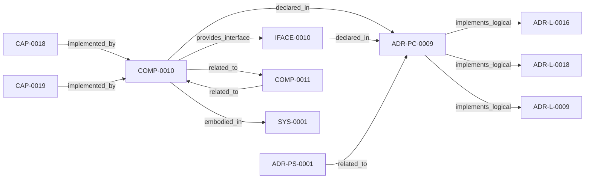

<!--
integrity_schema_version: 1
generated: deterministic_projection_v1
artifact_kind: rendered_adr_markdown
generator_id: adr-projection-markdown
generator_version: 2
hash_algorithm: sha256
source_hash: 89b07e76d447b869086f14da4178dc2f3a6bd8648149167cea8e43b1192b3794
rendered_hash: d0d4c845296792654e06ae4d4b24ce2666e6586ef1849fd27dc5e5c6385b640e
-->

# ADR-PC-0009: Workspace Graph Query Engine

**Status:** proposed  
**Created:** 2026-05-22  
**Authors:** erik.gallmann  
**Domains:** workspace, graph, rss  
**Tags:** workspace, graph-traversal, canned-queries, projections  
**Alias name:** adr-pc-0009-workspace-graph-query-engine  

**Implements Logical:** [ADR-L-0018](../logical/ADR-L-0018-deterministic-workspace-graph-queries.md), [ADR-L-0009](../logical/ADR-L-0009-unified-workspace-scope-model.md), [ADR-L-0016](../logical/ADR-L-0016-workspace-graph-slice-schema-contract.md)  
**Technologies:** typescript, node.js, yaml  

**Implements System:** [ADR-PS-0001](../physical-system/ADR-PS-0001-runtime-orchestration-and-assistant-integration.md)  

## Context

ADR-L-0018 established the capability for deterministic workspace graph
querying. This component implements the loader, three canned query functions,
and three projection renderers that realize that capability. It consumes
workspace slices (per ADR-L-0016 schema contract) and exposes results through
the MCP tool registry (ADR-PC-0001) and CLI (ADR-P-0001).

## Technology Stack

### TypeScript (language)

**Version:** 5.3+

**Rationale:**
Existing ste-runtime implementation language.

### js-yaml (library)

**Version:** 4.x

**Rationale:**
YAML parsing for workspace slice files, consistent with existing codebase.

## Relationship graph

## Related ADRs

### ADR-L-0009 — Unified Workspace Scope Model

**Relationships:**
- this ADR -[:implements_logical]-> 019ff84e-4ece-7ce3-aa17-67193bab337e

**Context:** Reconnaissance tools traditionally assume a single repository as the unit
of analysis. Multi-repo systems require scope to expand to the workspace
level so that cross-repo relationships, shared configuration, and
aggregate evidence can be captured correctly.

[Open projection](../logical/ADR-L-0009-unified-workspace-scope-model.md)
### ADR-L-0016 — Workspace Graph Slice Schema Contract

**Relationships:**
- this ADR -[:implements_logical]-> 019ff84e-4ece-76ad-ae3e-f92bef05635a

**Context:** ste-runtime produces per-repository graph slices during workspace RECON.
These slices are consumed by the runtime-owned workspace merger to produce
a unified workspace graph and multi-resolution projections. Without a
defined schema contract, producer and consumer drift can break merge
pipelines or cause downstream tools to treat partial graph material as
authoritative.

[Open projection](../logical/ADR-L-0016-workspace-graph-slice-schema-contract.md)
### ADR-L-0018 — Deterministic Workspace Graph Queries

**Relationships:**
- this ADR -[:implements_logical]-> 019ff84e-4ece-7c3b-833e-dbdb54ed76ec

**Context:** The workspace semantic graph (verb-typed edges in slices/*.yaml, produced per
ADR-L-0016) already contains the relationships needed to answer standard
system-level questions such as "show me the repo dependency map," "show me the
component integration," and "what is the blast radius of node X." Today, those
questions require either manual MCP tool invocation by an LLM or reading raw
YAML.

[Open projection](../logical/ADR-L-0018-deterministic-workspace-graph-queries.md)
### ADR-PS-0001 — Runtime Orchestration and Assistant Integration

**Relationships:**
- 019ff84e-4ecf-78a6-bb1c-676e50a3d97a -[:related_to]-> this ADR

**Context:** ste-runtime now contains a runtime orchestration boundary that keeps semantic
state fresh, exposes assistant-facing MCP tools, performs reconciliation
gating and freshness checks, and assembles implementation context and
obligation projections for agents and operators.

[Open projection](../physical-system/ADR-PS-0001-runtime-orchestration-and-assistant-integration.md)

## Component Specifications

### COMP-0010: Workspace Graph Query Engine (library)

**Responsibilities:**
- Load workspace graph slices into typed in-memory WorkspaceGraph
- Build outAdj/inAdj adjacency maps at load time for O(1) neighbor lookups
- Execute systemDependencies, componentIntegration, blastRadiusWorkspace queries
- Render results to Mermaid, table, and adjacency matrix projections
- Materialize deterministic projections to output_dir/projections/ on workspace recon (emitProjections)

**Interfaces:**
- **IFACE-0010** (library_api): Programmatic API:
  - loadWorkspaceGraph(outputDir: string): Promise<WorkspaceGraph>
  - systemDepen...
**Dependencies:** 019ff84e-4ecf-7ba6-ac1f-2a56af7d146c

**Implementation Identifiers:**
- Module Path: `src/workspace/workspace-graph-loader.ts`

---

*Generated from ADR-PC-0009 by ADR Architecture Kit*