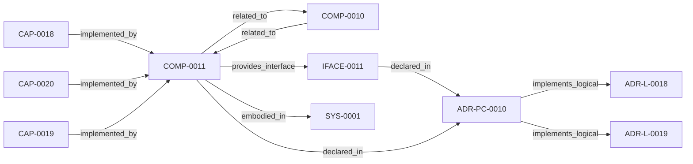

<!--
integrity_schema_version: 1
generated: deterministic_projection_v1
artifact_kind: rendered_adr_markdown
generator_id: adr-projection-markdown
generator_version: 2
hash_algorithm: sha256
source_hash: de23d7e8875ca831623bf9cc6a44a2f9adbfb315b26a1ad90be86aeca5d25e47
rendered_hash: 2e71c7944bfaa02f8acaf067a4f8f37104f21b5710d2e778f3794a9573c3ed18
-->

# ADR-PC-0010: Semantic Compression Engine

**Status:** proposed  
**Created:** 2026-05-22  
**Authors:** erik.gallmann  
**Domains:** workspace, graph, projection  
**Tags:** workspace, compression, multi-resolution, projection, deterministic  
**Alias name:** adr-pc-0010-semantic-compression-engine  

**Implements Logical:** [ADR-L-0019](../logical/ADR-L-0019-multi-resolution-architecture-projection.md), [ADR-L-0018](../logical/ADR-L-0018-deterministic-workspace-graph-queries.md)  
**Technologies:** typescript, node.js  

**Implements System:** [ADR-PS-0001](../physical-system/ADR-PS-0001-runtime-orchestration-and-assistant-integration.md)  

## Context

ADR-L-0019 established the capability for multi-resolution architecture
projection using deterministic semantic compression. This component implements
the compression engine, resolution-aware renderers, multi-resolution emission
pipeline, and projection family registry that realize that capability. It
consumes CannedQueryResult from the existing workspace graph query engine
(COMP-0010) and produces CompressedProjection at configurable resolution levels.

## Technology Stack

### TypeScript (language)

**Version:** 5.3+

**Rationale:**
Existing ste-runtime implementation language.

## Relationship graph

## Related ADRs

### ADR-L-0018 — Deterministic Workspace Graph Queries

**Relationships:**
- this ADR -[:implements_logical]-> 019ff84e-4ece-7c3b-833e-dbdb54ed76ec

**Context:** The workspace semantic graph (verb-typed edges in slices/*.yaml, produced per
ADR-L-0016) already contains the relationships needed to answer standard
system-level questions such as "show me the repo dependency map," "show me the
component integration," and "what is the blast radius of node X." Today, those
questions require either manual MCP tool invocation by an LLM or reading raw
YAML.

[Open projection](../logical/ADR-L-0018-deterministic-workspace-graph-queries.md)
### ADR-L-0019 — Multi-Resolution Architecture Projection

**Relationships:**
- this ADR -[:implements_logical]-> 019ff84e-4ecf-74ba-b201-3b02412f39c8

**Context:** ADR-L-0018 established deterministic workspace graph querying with L4 (full
fidelity) projection rendering. The resulting projections prove the pipeline
works but produce cognitively unusable output for human readers. Evidence:
a typical multi-repo workspace architecture-overview.md contains 413 lines with 61 identical
has_contract edges rendering every API endpoint as a sibling node.

[Open projection](../logical/ADR-L-0019-multi-resolution-architecture-projection.md)

## Component Specifications

### COMP-0011: Semantic Compression Engine (library)

**Responsibilities:**
- Compress CannedQueryResult into CompressedProjection at configurable resolution levels (L0-L4)
- Group endpoints by capability domain using path-prefix extraction
- Aggregate same-type nodes above threshold into count-annotated groups
- Filter edges by 5-tier verb taxonomy with per-level suppression rules
- Compress edge multiplicity (N edges of same verb collapsed to single edge with count)
- Suppress alarm/monitoring infrastructure at L0-L1
- Render compressed projections to Mermaid and table formats with navigation bars
- Emit multi-resolution projection files (L0-L3) alongside existing L4 files
- Manage projection family registry for extensible projection types

**Interfaces:**
- **IFACE-0011** (library_api): Programmatic API:
  - compress(result: CannedQueryResult, config: { level: ResolutionLevel } & Parti...
**Dependencies:** 019ff84e-4ecf-736e-9d3d-dc19c7223122

**Implementation Identifiers:**
- Module Path: `src/workspace/compression.ts`

---

*Generated from ADR-PC-0010 by ADR Architecture Kit*