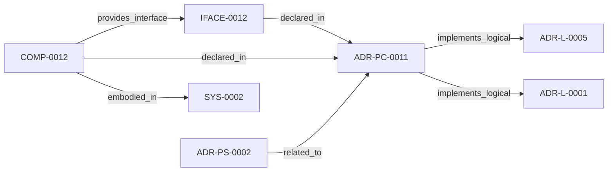

<!--
integrity_schema_version: 1
generated: deterministic_projection_v1
artifact_kind: rendered_adr_markdown
generator_id: adr-projection-markdown
generator_version: 2
hash_algorithm: sha256
source_hash: 16d604f0708ed1d80c840740580580c446973c2d0b07494a272f9c33067d1ba4
rendered_hash: eba70f43909ece45bbb6262d0d978889fe725ab4ceca1ae0fa55b2965154598a
-->

# ADR-PC-0011: ADR YAML Semantic Extraction

**Status:** proposed  
**Created:** 2026-05-26  
**Authors:** erik.gallmann  
**Domains:** extraction, architecture, recon  
**Alias name:** adr-yaml-semantic-extraction  

**Implements Logical:** [ADR-L-0001](../logical/ADR-L-0001-recon-provisional-execution-for-project-level-semantic-state.md), [ADR-L-0005](../logical/ADR-L-0005-self-configuring-domain-discovery.md)  
**Technologies:** typescript, node.js, js-yaml, adr-yaml  

**Implements System:** [ADR-PS-0002](../physical-system/ADR-PS-0002-semantic-extraction-subsystem.md)  

## Context

ADR YAML semantic extraction converts Architecture Decision Records authored
in the ADR-kit YAML schema into first-class RECON graph slices. This enables
the MCP query tools (find, impact, usages, similar) to operate over the
architecture domain alongside code-derived domains (graph, behavior, data,
api, infrastructure).

The extractor recognizes three ADR types (logical, physical-system,
physical-component) and emits six element types: adr_document, adr_invariant,
adr_decision, adr_capability, adr_component, and adr_system. A new AI-DOC
domain 'architecture' with subdirectories (adrs, invariants, decisions,
capabilities, components, systems) is introduced.

## Technology Stack

### TypeScript (language)

**Version:** 5.3+

**Rationale:**
Existing implementation language.

### js-yaml (library)

**Version:** 4.x

**Rationale:**
YAML parsing for ADR source files.

## Relationship graph

## Related ADRs

### ADR-L-0001 — RECON Provisional Execution for Project-Level Semantic State

**Relationships:**
- this ADR -[:implements_logical]-> 019ff84e-4ece-791b-822f-21f537c95340

**Context:** The STE Architecture Specification defines RECON (Reconciliation Engine) as the mechanism for extracting semantic state from source code and populating AI-DOC. The question arose: How should RECON operate during the exploratory development phase when foundational components are still being built?

[Open projection](../logical/ADR-L-0001-recon-provisional-execution-for-project-level-semantic-state.md)
### ADR-L-0005 — Self-Configuring Domain Discovery

**Relationships:**
- this ADR -[:implements_logical]-> 019ff84e-4ece-737a-a23f-3f243e6fafda

**Context:** (no context)

[Open projection](../logical/ADR-L-0005-self-configuring-domain-discovery.md)
### ADR-PS-0002 — Semantic Extraction Subsystem

**Relationships:**
- 019ff84e-4ed0-73d5-aa3f-dfbfd18b339c -[:related_to]-> this ADR

**Context:** ste-runtime extraction is now a subsystem containing multiple first-class
extractors and normalization flows rather than a pair of isolated physical
slices. This ADR groups the implemented extractor estate under a concrete
system boundary.

[Open projection](../physical-system/ADR-PS-0002-semantic-extraction-subsystem.md)

## Component Specifications

### COMP-0012: ADR YAML Semantic Extractor (library)

**Responsibilities:**
- Detect and classify ADR YAML files via path-prefix and content sniffing
- Parse ADR YAML using js-yaml
- Extract ADR documents, invariants, decisions, capabilities, component
  specifications, and system boundaries as RawAssertions
- Emit source provenance (serialized YAML snippets) for traceability
- Handle failure paths: malformed YAML, missing adr_type, unknown adr_type

**Interfaces:**
- **IFACE-0012** (library_api): Public surfaces:
- src/extractors/adr-yaml/index.ts (extractFromAdrYaml)
...

**Implementation Identifiers:**
- Module Path: `src/extractors/adr-yaml/index.ts`

---

*Generated from ADR-PC-0011 by ADR Architecture Kit*