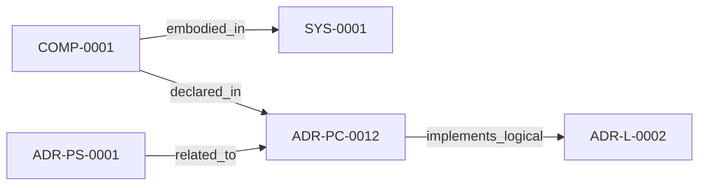

<!--
integrity_schema_version: 1
generated: deterministic_projection_v1
artifact_kind: rendered_adr_markdown
generator_id: adr-projection-markdown
generator_version: 2
hash_algorithm: sha256
source_hash: 44a85141d0a079283ff02c1edf1e4fc103e812bf0645b7929b29be92ed00f5ea
rendered_hash: eaefaf6281f5b03cb3c7ab6ab17335da4ab44693c192e06447bc116f9071d176
-->

# ADR-PC-0012: RSS CLI and Runtime Graph Traversal

**Status:** proposed  
**Created:** 2026-08-12  
**Modified:** 2026-08-12  
**Authors:** erik.gallmann  
**Domains:** runtime, rss, cli  
**Tags:** rss, graph-traversal, cli, context-assembly  
**Alias name:** rss-cli-and-runtime-graph-traversal  

**Implements Logical:** [ADR-L-0002](../logical/ADR-L-0002-recon-self-validation-strategy.md)  
**Technologies:** typescript, node.js, yaml  

**Implements System:** [ADR-PS-0001](../physical-system/ADR-PS-0001-runtime-orchestration-and-assistant-integration.md)  

## Context

The runtime requires a developer-facing interface for deterministic traversal and context assembly over the RECON semantic graph. This component provides the RSS CLI and the underlying graph operations used by runtime and assistant-facing workflows.

## Technology Stack

### TypeScript (language)

**Version:** 5.3+

**Rationale:**
Existing runtime implementation language.

### Node.js (framework)

**Version:** 18.x+

**Rationale:**
Existing runtime execution environment.

## Relationship graph

## Related ADRs

### ADR-L-0002 — RECON Self-Validation Strategy

**Relationships:**
- this ADR -[:implements_logical]-> 019ff84e-4ece-7378-b637-eaea5a1d3bc2

**Context:** RECON generates AI-DOC state from source code extraction. The question arose: How should RECON validate its own output to ensure consistency and quality?

[Open projection](../logical/ADR-L-0002-recon-self-validation-strategy.md)
### ADR-PS-0001 — Runtime Orchestration and Assistant Integration

**Relationships:**
- 019ff84e-4ecf-78a6-bb1c-676e50a3d97a -[:related_to]-> this ADR

**Context:** ste-runtime now contains a runtime orchestration boundary that keeps semantic
state fresh, exposes assistant-facing MCP tools, performs reconciliation
gating and freshness checks, and assembles implementation context and
obligation projections for agents and operators.

[Open projection](../physical-system/ADR-PS-0001-runtime-orchestration-and-assistant-integration.md)

## Component Specifications

### COMP-0001: RSS CLI and Runtime Graph Traversal (library)

**Responsibilities:**
- Expose lookup, search, dependency, dependent, blast-radius, tag, and context commands through the RSS CLI
- Load and traverse AI-DOC graph state deterministically
- Assemble source-backed context from graph entry points

**Implementation Identifiers:**
- Module Path: `src/cli/rss-cli.ts`

---

*Generated from ADR-PC-0012 by ADR Architecture Kit*