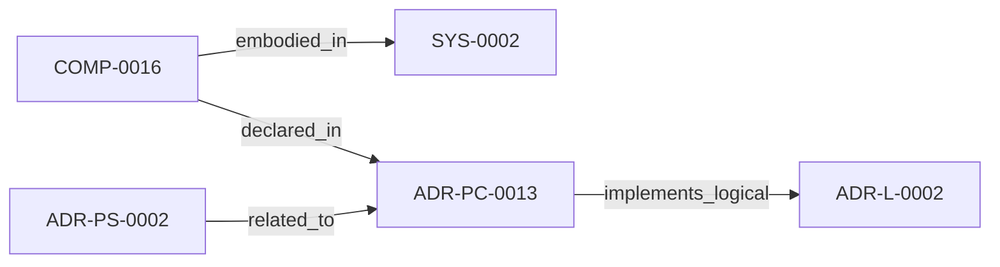

<!--
integrity_schema_version: 1
generated: deterministic_projection_v1
artifact_kind: rendered_adr_markdown
generator_id: adr-projection-markdown
generator_version: 2
hash_algorithm: sha256
source_hash: cae1c78dad209f122b3451d6d43749f1ace5d1bd205a7797e4cfa4e7e97cac96
rendered_hash: ad1e192f0f668f48d2612948cabce3fdb76a087657c2114459e126fad48569bb
-->

# ADR-PC-0013: Extractor Validation Framework

**Status:** proposed  
**Created:** 2026-08-12  
**Modified:** 2026-08-12  
**Authors:** erik.gallmann  
**Domains:** extraction, validation, recon  
**Tags:** validation, extractors, quality-assurance  
**Alias name:** extractor-validation-framework  

**Implements Logical:** [ADR-L-0002](../logical/ADR-L-0002-recon-self-validation-strategy.md)  
**Technologies:** typescript, node.js, schema-validation, testing  

**Implements System:** [ADR-PS-0002](../physical-system/ADR-PS-0002-semantic-extraction-subsystem.md)  

## Context

The semantic extraction subsystem needs a concrete validation component that checks extractor output quality, graph consistency, coverage, identity, schema conformance, and repeatability before derived state is accepted.

## Technology Stack

### TypeScript (language)

**Version:** 5.3+

**Rationale:**
Existing runtime implementation language.

### Node.js (framework)

**Version:** 18.x+

**Rationale:**
Existing runtime execution environment.

## Relationship graph

## Related ADRs

### ADR-L-0002 — RECON Self-Validation Strategy

**Relationships:**
- this ADR -[:implements_logical]-> 019ff84e-4ece-7378-b637-eaea5a1d3bc2

**Context:** RECON generates AI-DOC state from source code extraction. The question arose: How should RECON validate its own output to ensure consistency and quality?

[Open projection](../logical/ADR-L-0002-recon-self-validation-strategy.md)
### ADR-PS-0002 — Semantic Extraction Subsystem

**Relationships:**
- 019ff84e-4ed0-73d5-aa3f-dfbfd18b339c -[:related_to]-> this ADR

**Context:** ste-runtime extraction is now a subsystem containing multiple first-class
extractors and normalization flows rather than a pair of isolated physical
slices. This ADR groups the implemented extractor estate under a concrete
system boundary.

[Open projection](../physical-system/ADR-PS-0002-semantic-extraction-subsystem.md)

## Component Specifications

### COMP-0016: Extractor Validation Framework (library)

**Responsibilities:**
- Validate extractor output quality and correctness
- Check graph, coverage, identity, schema, and repeatability invariants
- Produce deterministic validation reports for RECON self-validation

**Implementation Identifiers:**
- Module Path: `src/recon/validation/`

---

*Generated from ADR-PC-0013 by ADR Architecture Kit*