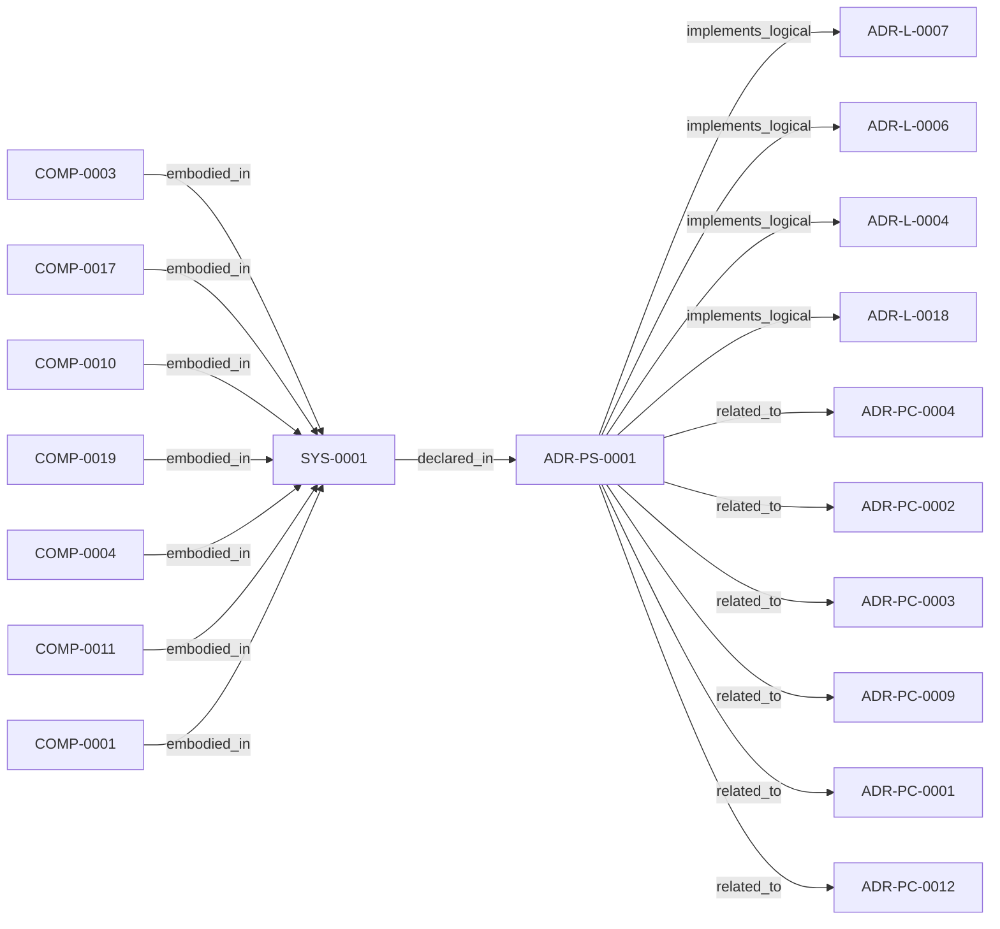

<!--
integrity_schema_version: 1
generated: deterministic_projection_v1
artifact_kind: rendered_adr_markdown
generator_id: adr-projection-markdown
generator_version: 2
hash_algorithm: sha256
source_hash: 74a9562fcc0f033626a5fa54a5e6c9ffc5795c1dfc6143c6a1edfd1be94b13d7
rendered_hash: a768c53bfa7629d9f66444553e17e6b54fb3a38863880e553f16ee442b8a5e32
-->

# ADR-PS-0001: Runtime Orchestration and Assistant Integration

**Status:** proposed  
**Created:** 2026-03-15  
**Modified:** 2026-05-22  
**Authors:** erik.gallmann  
**Domains:** runtime, mcp, rss, watch  
**Tags:** runtime, mcp, watchdog, obligations  
**Alias name:** runtime-orchestration-and-assistant-integration  

**Implements Logical:** [ADR-L-0004](../logical/ADR-L-0004-watchdog-authoritative-mode-for-workspace-boundary.md), [ADR-L-0006](../logical/ADR-L-0006-conversational-query-interface-for-rss.md), [ADR-L-0007](../logical/ADR-L-0007-graph-freshness-and-obligation-projection-semantics.md), [ADR-L-0018](../logical/ADR-L-0018-deterministic-workspace-graph-queries.md)  
**Technologies:** typescript, node.js, mcp, chokidar, zod  

## Context

ste-runtime now contains a runtime orchestration boundary that keeps semantic
state fresh, exposes assistant-facing MCP tools, performs reconciliation
gating and freshness checks, and assembles implementation context and
obligation projections for agents and operators.

## Technology Stack

### TypeScript (language)

**Version:** 5.3+

**Rationale:**
Existing runtime implementation language.

### Node.js (framework)

**Version:** 18.x+

**Rationale:**
Existing runtime execution environment.

### @modelcontextprotocol/sdk (library)

**Version:** 1.x

**Rationale:**
MCP protocol implementation.

### chokidar (library)

**Version:** 3.x

**Rationale:**
Cross-platform file watching.

## Relationship graph

## Related ADRs

### ADR-L-0004 — Watchdog Authoritative Mode for Workspace Boundary

**Relationships:**
- this ADR -[:implements_logical]-> 019ff84e-4ece-75dd-9f0b-ccb51cedc4f5

**Context:** Per STE Architecture (Section 3.1), STE operates across two distinct governance boundaries:
1. **Workspace Development Boundary** - Provisional state, soft + hard enforcement, post-reasoning validation
2. **Runtime Execution Boundary** - Canonical state, cryptographic enforcement, pre-reasoning admission control

[Open projection](../logical/ADR-L-0004-watchdog-authoritative-mode-for-workspace-boundary.md)
### ADR-L-0006 — Conversational Query Interface for RSS

**Relationships:**
- this ADR -[:implements_logical]-> 019ff84e-4ece-71c8-af1f-eb35c77b551a

**Context:** E-ADR-004 established the RSS CLI and TypeScript API as the foundation for graph traversal and context assembly. However, a gap exists between:

[Open projection](../logical/ADR-L-0006-conversational-query-interface-for-rss.md)
### ADR-L-0007 — Graph Freshness and Obligation Projection Semantics

**Relationships:**
- this ADR -[:implements_logical]-> 019ff84e-4ece-70ba-bf2e-a0fecd4a986e

**Context:** ste-runtime now exposes graph freshness checks, invalidated validation
signals, change intent handling, and obligation projection behavior through
RSS and MCP tooling. These semantics are broader than implementation detail
and require an explicit logical authority.

[Open projection](../logical/ADR-L-0007-graph-freshness-and-obligation-projection-semantics.md)
### ADR-L-0018 — Deterministic Workspace Graph Queries

**Relationships:**
- this ADR -[:implements_logical]-> 019ff84e-4ece-7c3b-833e-dbdb54ed76ec

**Context:** The workspace semantic graph (verb-typed edges in slices/*.yaml, produced per
ADR-L-0016) already contains the relationships needed to answer standard
system-level questions such as "show me the repo dependency map," "show me the
component integration," and "what is the blast radius of node X." Today, those
questions require either manual MCP tool invocation by an LLM or reading raw
YAML.

[Open projection](../logical/ADR-L-0018-deterministic-workspace-graph-queries.md)
### ADR-PC-0001 — MCP Server and Tool Registry

**Relationships:**
- this ADR -[:related_to]-> 019ff84e-4ecf-7d5e-a53c-bae8c74aca48

**Context:** This component exposes assistant-facing runtime tools over MCP and binds
structural, operational, context, optimized, obligation-oriented, and
workspace graph query tool surfaces into one discoverable server boundary.

[Open projection](../physical-component/ADR-PC-0001-mcp-server-and-tool-registry.md)
### ADR-PC-0002 — Watchdog and Update Coordination

**Relationships:**
- this ADR -[:related_to]-> 019ff84e-4ecf-734c-9f3f-04d15f1079f5

**Context:** This component monitors changes, detects transactions, coordinates update
batches, and safeguards write-triggered reconciliation behavior for the
runtime boundary.

[Open projection](../physical-component/ADR-PC-0002-watchdog-and-update-coordination.md)
### ADR-PC-0003 — Preflight Freshness and Reconciliation Gating

**Relationships:**
- this ADR -[:related_to]-> 019ff84e-4ecf-7776-bf27-ffc57bc598dd

**Context:** This component evaluates file freshness, intent scope, and reconciliation
requirements before runtime actions rely on semantic graph state.

[Open projection](../physical-component/ADR-PC-0003-preflight-freshness-and-reconciliation-gating.md)
### ADR-PC-0004 — Obligation Projection and Context Assembly

**Relationships:**
- this ADR -[:related_to]-> 019ff84e-4ecf-7156-a33b-bc8bba3fac60

**Context:** This component projects invalidated validations and change-driven obligations,
assembles implementation context, and loads source-backed evidence for
assistant-facing reasoning.

[Open projection](../physical-component/ADR-PC-0004-obligation-projection-and-context-assembly.md)
### ADR-PC-0009 — Workspace Graph Query Engine

**Relationships:**
- this ADR -[:related_to]-> 019ff84e-4ecf-7a24-801d-7d1e708577ac

**Context:** ADR-L-0018 established the capability for deterministic workspace graph
querying. This component implements the loader, three canned query functions,
and three projection renderers that realize that capability. It consumes
workspace slices (per ADR-L-0016 schema contract) and exposes results through
the MCP tool registry (ADR-PC-0001) and RSS CLI (ADR-PC-0012).

[Open projection](../physical-component/ADR-PC-0009-workspace-graph-query-engine.md)
### ADR-PC-0012 — RSS CLI and Runtime Graph Traversal

**Relationships:**
- this ADR -[:related_to]-> 019ff876-6dad-7d95-ad68-e13d96ed23a9

**Context:** The runtime requires a developer-facing interface for deterministic traversal and context assembly over the RECON semantic graph. This component provides the RSS CLI and the underlying graph operations used by runtime and assistant-facing workflows.

[Open projection](../physical-component/ADR-PC-0012-rss-cli-and-runtime-graph-traversal.md)

## Operational Requirements

### Monitoring
Track freshness status, invalidated validations, and runtime health metrics.

### Logging
Structured runtime logs for reconciliation and tool invocation flows.

---

*Generated from ADR-PS-0001 by ADR Architecture Kit*