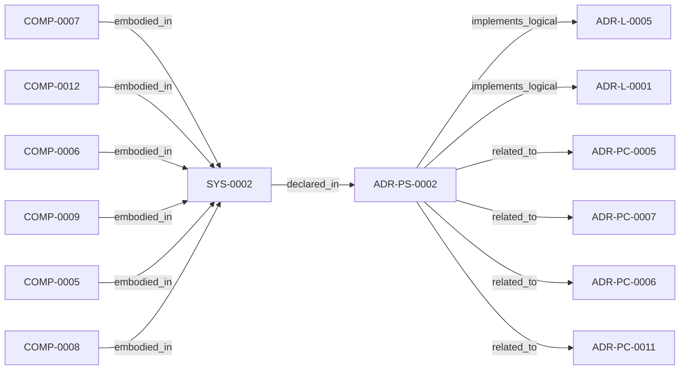

<!--
integrity_schema_version: 1
generated: deterministic_projection_v1
artifact_kind: rendered_adr_markdown
generator_id: adr-projection-markdown
generator_version: 2
hash_algorithm: sha256
source_hash: aed710029fc591dfdad65c0ed246e1eb6c2d91090e45419363a9d12379b4791e
rendered_hash: 02bd6908a8ea05329bc1c6cd37b57322b1180fd8a218fe9290ba609937b2c02d
-->

# ADR-PS-0002: Semantic Extraction Subsystem

**Status:** proposed  
**Created:** 2026-03-15  
**Authors:** erik.gallmann  
**Domains:** extraction, recon, normalization  
**Tags:** extraction, recon, semantic-state  
**Alias name:** semantic-extraction-subsystem  

**Implements Logical:** [ADR-L-0001](../logical/ADR-L-0001-recon-provisional-execution-for-project-level-semantic-state.md), [ADR-L-0005](../logical/ADR-L-0005-self-configuring-domain-discovery.md)  
**Technologies:** typescript, node.js, json, angular, css, cloudformation, adr-yaml  

## Context

ste-runtime extraction is now a subsystem containing multiple first-class
extractors and normalization flows rather than a pair of isolated physical
slices. This ADR groups the implemented extractor estate under a concrete
system boundary.

## Technology Stack

### TypeScript (language)

**Version:** 5.3+

**Rationale:**
Existing implementation language.

### Node.js (framework)

**Version:** 18.x+

**Rationale:**
Existing execution environment.

## Relationship graph

## Related ADRs

### ADR-L-0001 — RECON Provisional Execution for Project-Level Semantic State

**Relationships:**
- this ADR -[:implements_logical]-> 019ff84e-4ece-791b-822f-21f537c95340

**Context:** The STE Architecture Specification defines RECON (Reconciliation Engine) as the mechanism for extracting semantic state from source code and populating AI-DOC. The question arose: How should RECON operate during the exploratory development phase when foundational components are still being built?

[Open projection](../logical/ADR-L-0001-recon-provisional-execution-for-project-level-semantic-state.md)
### ADR-L-0005 — Self-Configuring Domain Discovery

**Relationships:**
- this ADR -[:implements_logical]-> 019ff84e-4ece-737a-a23f-3f243e6fafda

**Context:** (no context)

[Open projection](../logical/ADR-L-0005-self-configuring-domain-discovery.md)
### ADR-PC-0005 — JSON Semantic Extraction

**Relationships:**
- this ADR -[:related_to]-> 019ff84e-4ecf-7117-853b-c869ac6d7ba6

**Context:** JSON semantic extraction captures controls, schemas, and configuration
semantics from JSON sources and feeds them into RECON normalization.

[Open projection](../physical-component/ADR-PC-0005-json-semantic-extraction.md)
### ADR-PC-0006 — Frontend Semantic Extraction

**Relationships:**
- this ADR -[:related_to]-> 019ff84e-4ecf-73e1-8c0f-19a06db3004b

**Context:** Frontend semantic extraction captures Angular and CSS/SCSS-specific semantics
beyond generic TypeScript structure and feeds them into RECON normalization.

[Open projection](../physical-component/ADR-PC-0006-frontend-semantic-extraction.md)
### ADR-PC-0007 — CloudFormation Semantic Extraction

**Relationships:**
- this ADR -[:related_to]-> 019ff84e-4ecf-721a-b936-e1b98d068ec7

**Context:** CloudFormation semantic extraction captures templates, resources, outputs,
parameters, infrastructure relationships, and template-level implementation
intent from CloudFormation sources. This includes nested stack topology
detection: master templates that orchestrate child stacks via
AWS::Serverless::Application and AWS::CloudFormation::Stack resource types
are identified by resource type analysis, and cross-template resolution
structures (StackTopology, OutputIndex) are built for downstream…

[Open projection](../physical-component/ADR-PC-0007-cloudformation-semantic-extraction.md)
### ADR-PC-0011 — ADR YAML Semantic Extraction

**Relationships:**
- this ADR -[:related_to]-> 019ff84e-4ecf-7a82-ae3a-121886af1b51

**Context:** ADR YAML semantic extraction converts Architecture Decision Records authored
in the ADR-kit YAML schema into first-class RECON graph slices. This enables
the MCP query tools (find, impact, usages, similar) to operate over the
architecture domain alongside code-derived domains (graph, behavior, data,
api, infrastructure).

[Open projection](../physical-component/ADR-PC-0011-adr-yaml-semantic-extraction.md)

---

*Generated from ADR-PS-0002 by ADR Architecture Kit*