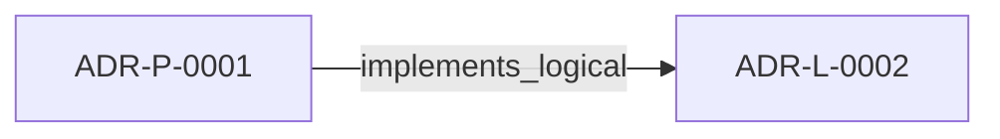

<!--
integrity_schema_version: 1
generated: deterministic_projection_v1
artifact_kind: rendered_adr_markdown
generator_id: adr-projection-markdown
generator_version: 2
hash_algorithm: sha256
source_hash: 000748b9de9a7e3c3db9bfd3fe572a4eb2f9cf114aa21aaec84a1a499937214f
rendered_hash: 40d537c204f593fb73ce0400afd15afa919577247ff82f269348d37589544e0f
-->

# ADR-P-0001: RSS CLI Implementation for Developer-Invoked Graph Traversal

**Status:** accepted  
**Created:** 2026-01-07  
**Modified:** 2026-01-07  
**Authors:** erik.gallmann  
**Domains:** rss, cli, implementation  
**Tags:** rss, cli, graph-traversal, developer-tools  
**Alias name:** rss-cli-implementation-for-developer-invoked-graph-traversal  

**Implements Logical:** [ADR-L-0002](../logical/ADR-L-0002-recon-self-validation-strategy.md)  
**Technologies:** cli, file-discovery, file-watching, graph-traversal, mcp, node.js, schema-validation, testing, typescript, yaml  

## Context

The STE Architecture Specification Section 4.6 defines RSS (Runtime State-Slicing) as the component responsible for graph traversal and context assembly from AI-DOC state. RSS provides six core operations:

| Operation | Description |
|-----------|-------------|
| `lookup(domain, id)` | Direct item retrieval |
| `dependencies(item, depth)` | Forward traversal (what does this depend on?) |
| `dependents(item, depth)` | Backward traversal (what depends on this?) |
| `blast_radius(item, depth)` | Bidirectional traversal (full impact surface) |
| `by_tag(tag)` | Cross-domain query |
| `assemble_context(task)` | Main context assembly function |

The question arose: How should RSS be exposed for developer use during the exploratory phase?

---

## Technology Stack

### TypeScript (language)

**Version:** 5.3+

**Rationale:**
Type safety, excellent Node.js ecosystem, maintainability

### Node.js (framework)

**Version:** 18.0+

**Rationale:**
JavaScript runtime for CLI and server applications

## Relationship graph

## Related ADRs

### ADR-L-0002 — RECON Self-Validation Strategy

**Relationships:**
- this ADR -[:implements_logical]-> 019ff84e-4ece-7378-b637-eaea5a1d3bc2

**Context:** RECON generates AI-DOC state from source code extraction. The question arose: How should RECON validate its own output to ensure consistency and quality?

[Open projection](../logical/ADR-L-0002-recon-self-validation-strategy.md)

## Component Specifications

### COMP-0001: RSS CLI (library)

**Responsibilities:**
Command-line interface for RSS graph traversal operations

**Implementation Identifiers:**
- Module Path: `src/cli/rss-cli.ts`

---

*Generated from ADR-P-0001 by ADR Architecture Kit*