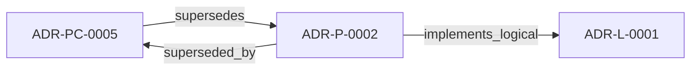

<!--
integrity_schema_version: 1
generated: deterministic_projection_v1
artifact_kind: rendered_adr_markdown
generator_id: adr-projection-markdown
generator_version: 2
hash_algorithm: sha256
source_hash: 58c4e41a4a7b6e7f3cb0bc34227887579720cd69ed82f71d4275b3f52963bdca
rendered_hash: f0facd06afbaeb4722ff0ac1a09f6b7d1842dc4f2367eac75aa934da261e4be1
-->

# ADR-P-0002: JSON Data Extraction for Compliance Controls and Schemas

**Status:** superseded  
**Created:** 2026-01-07  
**Modified:** 2026-01-07  
**Authors:** erik.gallmann  
**Domains:** extraction, data, implementation  
**Tags:** json, extractor, compliance, schemas  
**Alias name:** json-data-extraction-for-compliance-controls-and-schemas  

**Implements Logical:** [ADR-L-0001](../logical/ADR-L-0001-recon-provisional-execution-for-project-level-semantic-state.md)  
**Technologies:** cli, data-extraction, file-discovery, file-watching, json, mcp, node.js, schema-validation, testing, typescript, yaml  

## Context

Many enterprise codebases contain JSON files with semantic value beyond simple configuration:

| Category | Examples | Semantic Value |
|----------|----------|----------------|
| Controls/Rules Catalog | Security controls, compliance rules, policy definitions | High - governance metadata |
| Data Schemas | Entity definitions, API contracts, validation schemas | High - data contracts |
| Deployment Parameters | CFN parameters, environment configs, feature flags | High - deployment configuration |
| Reference Data | Seed data, lookup tables, static catalogs | Medium - reference data |
| Test Fixtures | Mock data, test inputs | Low - test data |
| Package Manifests | `package.json`, `tsconfig.json` | Low - tooling configuration |

Currently, RECON extracts:
- Python code (functions, classes, imports, SDK usage, API endpoints)
- TypeScript code (functions, classes, imports)
- CloudFormation templates (resources, outputs, parameters, GSIs)

**JSON files are not extracted**, leaving semantic gaps:
- Infrastructure resources may reference control/rule IDs, but definitions are not in the graph
- Data schemas define entity structure, but schemas are not linked to code that uses them
- Deployment parameters configure resources, but parameter values are not visible

The question arose: Should RECON extract JSON data models and configuration files?

---

## Technology Stack

### TypeScript (language)

**Version:** 5.3+

**Rationale:**
Type safety, excellent Node.js ecosystem, maintainability

### Node.js (framework)

**Version:** 18.0+

**Rationale:**
JavaScript runtime for CLI and server applications

## Relationship graph

## Related ADRs

### ADR-L-0001 — RECON Provisional Execution for Project-Level Semantic State

**Relationships:**
- this ADR -[:implements_logical]-> 019ff84e-4ece-791b-822f-21f537c95340

**Context:** The STE Architecture Specification defines RECON (Reconciliation Engine) as the mechanism for extracting semantic state from source code and populating AI-DOC. The question arose: How should RECON operate during the exploratory development phase when foundational components are still being built?

[Open projection](../logical/ADR-L-0001-recon-provisional-execution-for-project-level-semantic-state.md)
### ADR-PC-0005 — JSON Semantic Extraction

**Relationships:**
- this ADR -[:superseded_by]-> 019ff84e-4ecf-7117-853b-c869ac6d7ba6
- 019ff84e-4ecf-7117-853b-c869ac6d7ba6 -[:supersedes]-> this ADR

**Context:** JSON semantic extraction captures controls, schemas, and configuration
semantics from JSON sources and feeds them into RECON normalization.

[Open projection](../physical-component/ADR-PC-0005-json-semantic-extraction.md)

## Component Specifications

### COMP-0013: JSON Data Extractor (library)

**Responsibilities:**
Extract semantic entities from JSON files (compliance controls, schemas, configs)

**Implementation Identifiers:**
- Module Path: `src/extractors/json/`

---

*Generated from ADR-P-0002 by ADR Architecture Kit*