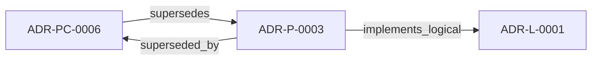

<!--
integrity_schema_version: 1
generated: deterministic_projection_v1
artifact_kind: rendered_adr_markdown
generator_id: adr-projection-markdown
generator_version: 2
hash_algorithm: sha256
source_hash: 1dd759caa819538460a75d95a7b63620599a19ec54e9b9f46c958065ede4e6d6
rendered_hash: 686a50a89dbacacfe5a139e4aacd50317bbe86cc9a04508e2ffa6cabae2ebd3f
-->

# ADR-P-0003: Angular and CSS/SCSS Semantic Extraction

**Status:** superseded  
**Created:** 2026-01-07  
**Modified:** 2026-01-07  
**Authors:** erik.gallmann  
**Domains:** extraction, frontend, implementation  
**Tags:** angular, css, scss, extractor, frontend  
**Alias name:** angular-and-css-scss-semantic-extraction  

**Implements Logical:** [ADR-L-0001](../logical/ADR-L-0001-recon-provisional-execution-for-project-level-semantic-state.md)  
**Technologies:** angular, ast-parsing, cli, css, file-discovery, file-watching, mcp, node.js, schema-validation, scss, testing, typescript, yaml  

## Context

The TypeScript extractor currently processes Angular files as standard TypeScript, capturing:
- Functions and their signatures
- Classes and their methods
- Import/export relationships
- Module structure

However, Angular-specific semantics are not captured:

| Pattern | Current Extraction | Semantic Gap |
|---------|-------------------|--------------|
| `@Component({ selector: 'app-dashboard' })` | Class with decorator | Selector, templateUrl, styleUrls missing |
| `@Injectable({ providedIn: 'root' })` | Class with decorator | Dependency injection scope missing |
| Route definitions | Array of objects | Navigation structure, guards, lazy loading missing |
| HTML templates | Not extracted | Template bindings, component usage, directives missing |

Additionally, CSS/SCSS files contain semantic information valuable for **any** frontend project:
- Design tokens (CSS variables, SCSS variables)
- Responsive breakpoints
- Animation definitions
- Component styling patterns

**Impact**: Frontend components cannot be linked to:
- Their templates (component ↔ template relationship)
- Their styles (component ↔ styles relationship)
- Backend services they consume (HTTP calls → API endpoints)
- Other components they render (parent → child relationships)
- Routes that load them (route → component mapping)

The question arose: Should RECON extract Angular-specific semantics and CSS/SCSS beyond basic TypeScript?

---

## Technology Stack

### TypeScript (language)

**Version:** 5.3+

**Rationale:**
Type safety, excellent Node.js ecosystem, maintainability

### Node.js (framework)

**Version:** 18.0+

**Rationale:**
JavaScript runtime for CLI and server applications

## Relationship graph

## Related ADRs

### ADR-L-0001 — RECON Provisional Execution for Project-Level Semantic State

**Relationships:**
- this ADR -[:implements_logical]-> 019ff84e-4ece-791b-822f-21f537c95340

**Context:** The STE Architecture Specification defines RECON (Reconciliation Engine) as the mechanism for extracting semantic state from source code and populating AI-DOC. The question arose: How should RECON operate during the exploratory development phase when foundational components are still being built?

[Open projection](../logical/ADR-L-0001-recon-provisional-execution-for-project-level-semantic-state.md)
### ADR-PC-0006 — Frontend Semantic Extraction

**Relationships:**
- this ADR -[:superseded_by]-> 019ff84e-4ecf-73e1-8c0f-19a06db3004b
- 019ff84e-4ecf-73e1-8c0f-19a06db3004b -[:supersedes]-> this ADR

**Context:** Frontend semantic extraction captures Angular and CSS/SCSS-specific semantics
beyond generic TypeScript structure and feeds them into RECON normalization.

[Open projection](../physical-component/ADR-PC-0006-frontend-semantic-extraction.md)

## Component Specifications

### COMP-0014: Angular Semantic Extractor (library)

**Responsibilities:**
Extract components, services, routes, templates from Angular applications

**Implementation Identifiers:**
- Module Path: `src/extractors/angular/`

### COMP-0002: CSS/SCSS Extractor (library)

**Responsibilities:**
Extract styles, design tokens, and CSS entities

**Implementation Identifiers:**
- Module Path: `src/extractors/css/`

---

*Generated from ADR-P-0003 by ADR Architecture Kit*