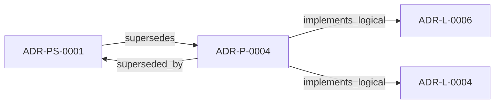

<!--
integrity_schema_version: 1
generated: deterministic_projection_v1
artifact_kind: rendered_adr_markdown
generator_id: adr-projection-markdown
generator_version: 2
hash_algorithm: sha256
source_hash: 786d0999ceb9d2579d34d68d6c6759120e7f695fcc619d528241f47626e0277a
rendered_hash: 87966c6e61840303291bf93731210d26a46ed35dd6073168b1f76aedce7a7cf5
-->

# ADR-P-0004: ste-runtime MCP Server Implementation

**Status:** superseded  
**Created:** 2026-01-11  
**Modified:** 2026-01-11  
**Authors:** erik.gallmann  
**Domains:** mcp, integration, implementation  
**Tags:** mcp, server, cursor-integration, file-watching  
**Alias name:** ste-runtime-mcp-server-implementation  

**Implements Logical:** [ADR-L-0004](../logical/ADR-L-0004-watchdog-authoritative-mode-for-workspace-boundary.md), [ADR-L-0006](../logical/ADR-L-0006-conversational-query-interface-for-rss.md)  
**Technologies:** cli, file-discovery, file-watching, incremental-recon, mcp, node.js, schema-validation, stdio, testing, typescript, yaml  

## Context

Per STE Architecture Section 3.1, the Workspace Development Boundary requires:
- **Provisional state** maintenance (pre-merge, feature branches)
- **Soft + hard enforcement** (LLM instruction-following + validation tools)
- **Post-reasoning validation** (catch violations after generation)
- **Context assembly via RSS** (CEM Stage 2: State Loading)

Currently, ste-runtime provides:
- ✅ Incremental RECON (maintains fresh AI-DOC)
- ✅ RSS operations (semantic graph traversal)
- ✅ CLI interface (human-friendly commands)
- ❌ No long-running process (graph reloaded on every query)
- ❌ No MCP interface (Cursor can't discover tools automatically)
- ❌ No automatic file watching (manual RECON invocation required)

**Gap:** Cursor (and other AI assistants) need:
1. **Always-fresh semantic state** (automatic updates on file changes)
2. **Fast queries** (in-memory graph, <100ms response)
3. **Tool auto-discovery** (MCP protocol for semantic operations)
4. **Deterministic context** (RSS graph traversal, not probabilistic search)

---

## Technology Stack

### TypeScript (language)

**Version:** 5.3+

**Rationale:**
Type safety, excellent Node.js ecosystem, maintainability

### Node.js (framework)

**Version:** 18.0+

**Rationale:**
JavaScript runtime for CLI and server applications

### @modelcontextprotocol/sdk (library)

**Version:** 1.25.3

**Rationale:**
Standard MCP protocol implementation for AI assistant integration

### chokidar (library)

**Version:** ^3.5.3

**Rationale:**
Cross-platform file watching with robust event handling

## Relationship graph

## Related ADRs

### ADR-L-0004 — Watchdog Authoritative Mode for Workspace Boundary

**Relationships:**
- this ADR -[:implements_logical]-> 019ff84e-4ece-75dd-9f0b-ccb51cedc4f5

**Context:** Per STE Architecture (Section 3.1), STE operates across two distinct governance boundaries:
1. **Workspace Development Boundary** - Provisional state, soft + hard enforcement, post-reasoning validation
2. **Runtime Execution Boundary** - Canonical state, cryptographic enforcement, pre-reasoning admission control

[Open projection](../logical/ADR-L-0004-watchdog-authoritative-mode-for-workspace-boundary.md)
### ADR-L-0006 — Conversational Query Interface for RSS

**Relationships:**
- this ADR -[:implements_logical]-> 019ff84e-4ece-71c8-af1f-eb35c77b551a

**Context:** E-ADR-004 established the RSS CLI and TypeScript API as the foundation for graph traversal and context assembly. However, a gap exists between:

[Open projection](../logical/ADR-L-0006-conversational-query-interface-for-rss.md)
### ADR-PS-0001 — Runtime Orchestration and Assistant Integration

**Relationships:**
- this ADR -[:superseded_by]-> 019ff84e-4ecf-78a6-bb1c-676e50a3d97a
- 019ff84e-4ecf-78a6-bb1c-676e50a3d97a -[:supersedes]-> this ADR

**Context:** ste-runtime now contains a runtime orchestration boundary that keeps semantic
state fresh, exposes assistant-facing MCP tools, performs reconciliation
gating and freshness checks, and assembles implementation context and
obligation projections for agents and operators.

[Open projection](../physical-system/ADR-PS-0001-runtime-orchestration-and-assistant-integration.md)

## Component Specifications

### COMP-0015: MCP Server (service)

**Responsibilities:**
Model Context Protocol server exposing 8 RSS tools for AI assistants

**Implementation Identifiers:**
- Module Path: `src/mcp/mcp-server.ts`

### COMP-0018: File Watcher (service)

**Responsibilities:**
Monitor project files and trigger incremental RECON on changes

**Implementation Identifiers:**
- Module Path: `src/watch/watchdog.ts`

## Gaps

### GAP-0001: ** Cursor (and other AI assistants) need:

**Impact:**   
**Blocking:** No

### GAP-0002: Cursor (and other AI assistants) need:

**Impact:**   
**Blocking:** No

---

*Generated from ADR-P-0004 by ADR Architecture Kit*