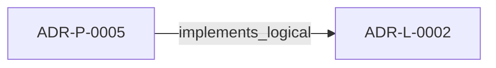

<!--
integrity_schema_version: 1
generated: deterministic_projection_v1
artifact_kind: rendered_adr_markdown
generator_id: adr-projection-markdown
generator_version: 2
hash_algorithm: sha256
source_hash: 167522c089599f09bc6575743ef9abb4a6f453dad10a9261978560db41df364a
rendered_hash: 4938e51c3073e5c006e794900112dcf9fcf332b53b78f87d50d4011520f91ad6
-->

# ADR-P-0005: Extractor Validation Requirements

**Status:** accepted  
**Created:** 2026-01-11  
**Modified:** 2026-01-11  
**Authors:** erik.gallmann  
**Domains:** validation, extraction, implementation  
**Tags:** validation, extractors, quality-assurance  
**Alias name:** extractor-validation-requirements  

**Implements Logical:** [ADR-L-0002](../logical/ADR-L-0002-recon-self-validation-strategy.md)  
**Technologies:** cli, file-discovery, file-watching, mcp, node.js, schema-validation, testing, typescript, validation, yaml  

## Context

## Technology Stack

### TypeScript (language)

**Version:** 5.3+

**Rationale:**
Type safety, excellent Node.js ecosystem, maintainability

### Node.js (framework)

**Version:** 18.0+

**Rationale:**
JavaScript runtime for CLI and server applications

## Relationship graph

## Related ADRs

### ADR-L-0002 — RECON Self-Validation Strategy

**Relationships:**
- this ADR -[:implements_logical]-> 019ff84e-4ece-7378-b637-eaea5a1d3bc2

**Context:** RECON generates AI-DOC state from source code extraction. The question arose: How should RECON validate its own output to ensure consistency and quality?

[Open projection](../logical/ADR-L-0002-recon-self-validation-strategy.md)

## Component Specifications

### COMP-0016: Extractor Validation Framework (library)

**Responsibilities:**
Validate extractor output quality and correctness

**Implementation Identifiers:**
- Module Path: `src/recon/validation/`

---

*Generated from ADR-P-0005 by ADR Architecture Kit*