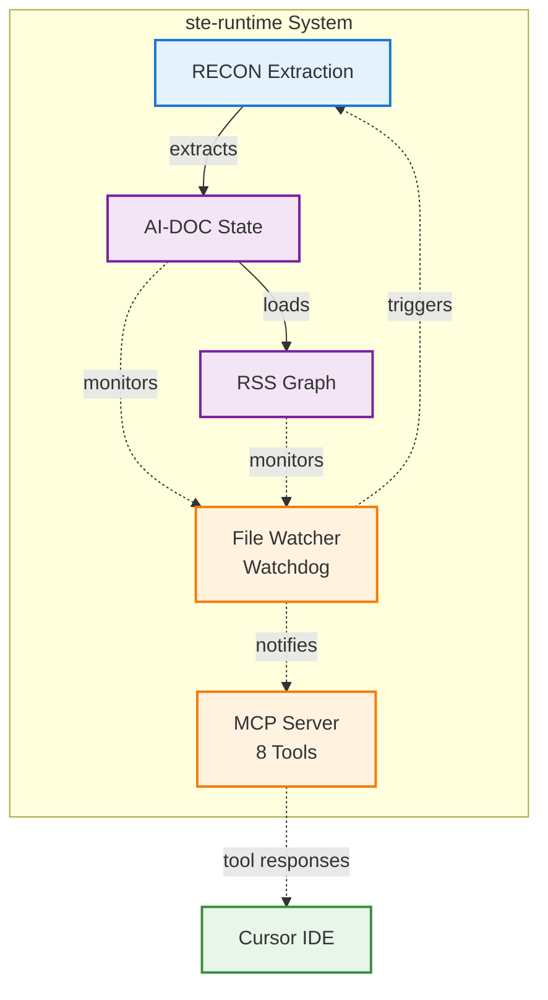

# ste-runtime Architecture

**System Architecture Document** — Complete technical architecture of the ste-runtime component implementation.

**See:** [STE Specification Architecture](https://github.com/egallmann/ste-spec/tree/main/ste-spec/architecture) for the complete STE Runtime system architecture.

---

## Purpose

This document describes the **actual architecture of ste-runtime** — what has been built, how components connect, and the design decisions that shaped the implementation.

**Scope:**
- ste-runtime component architecture (not the complete STE Runtime system)
- Implementation details and design decisions
- Data flows and component interactions
- Reference for contributors and users

**Related Documents:**
- [STE Architecture Specification](../../spec/ste-spec/architecture/STE-Architecture.md) — Complete STE Runtime architecture
- [E-ADRs](../e-adr/) — Component-level architectural decisions
- [Architecture Diagrams](../diagrams/README.md) — Visual architecture diagrams

---

## System Overview

ste-runtime is a **single-process semantic extraction and graph traversal toolkit** that transforms codebases into queryable semantic graphs for AI-assisted development.

### Core Value Proposition

**Problem:** AI assistants need structured semantic understanding of codebases, not raw text search.

**Solution:** ste-runtime provides:
1. **Deterministic extraction** (RECON) — Transforms source code into structured semantic state
2. **Graph traversal** (RSS) — Queryable semantic relationships
3. **Always-fresh state** — Automatic updates via file watching
4. **AI integration** — MCP protocol for seamless Cursor IDE integration

### High-Level Architecture



**Data Flow:**
- **Solid arrows (→):** Primary data flow
  - RECON → AI-DOC State (extraction output)
  - AI-DOC State → RSS Graph (graph loading)
- **Dashed arrows (-.->):** Control/notification flow
  - File Watcher triggers RECON (incremental updates)
  - AI-DOC State and RSS Graph inform File Watcher (monitoring)
  - File Watcher notifies MCP Server (state updates)
  - MCP Server responds to Cursor IDE (tool responses)

---

## Component Architecture

### 1. RECON (Reconciliation Protocol)

**Purpose:** Extract semantic state from source code into AI-DOC format.

**Implementation:** `src/recon/`

**Phases:**
1. **Discovery** — Enumerate source files
2. **Extraction** — Parse and extract semantic assertions
3. **Inference** — Infer relationships between elements
4. **Normalization** — Convert to AI-DOC schema
5. **Population** — Write slices to `.ste/state/`
6. **Validation** — Self-validation and currency checks

**Key Design Decisions:**
- **Multi-language support** — TypeScript, Python, CloudFormation, JSON, Angular, CSS
- **Incremental updates** — O(changed files) performance
- **Content-addressable** — Deterministic, reproducible state
- **Self-validating** — 6-phase pipeline with validation

**See:** [E-ADR-001: RECON Provisional Execution](../e-adr/E-ADR-001-RECON-Provisional-Execution.md)

---

### 2. RSS (Runtime State Slicing)

**Purpose:** Graph traversal protocol for deterministic context assembly.

**Implementation:** `src/rss/`

**Operations:**
- `lookup(domain, id)` — Direct item retrieval
- `dependencies(item, depth)` — Forward traversal
- `dependents(item, depth)` — Backward traversal
- `blast_radius(item, depth)` — Bidirectional traversal
- `by_tag(tag)` — Cross-domain query
- `assemble_context(task)` — Main context assembly (MVC)

**Two-Layer Design:**
- **Layer 1 (Structural):** Fast metadata queries (<100ms)
- **Layer 2 (Context Assembly):** Graph + source code (100-500ms)

**Key Design Decisions:**
- **In-memory graph** — Fast queries, reloaded after RECON
- **Two-layer architecture** — Token efficiency + precision
- **Deterministic traversal** — Same entry points → same context

**See:** 
- [E-ADR-004: RSS CLI Implementation](../e-adr/E-ADR-004-RSS-CLI-Implementation.md)
- [Two-Layer Context Assembly](../innovations/Two-Layer-Context-Assembly.md)

---

### 3. MCP Server

**Purpose:** Expose ste-runtime functionality via Model Context Protocol for Cursor IDE integration.

**Implementation:** `src/mcp/`

**Tools Exposed (8 total):**
- `find` — Semantic search by meaning/name
- `show` — Full implementation with dependencies
- `usages` — Usage sites with snippets
- `impact` — Change impact analysis
- `similar` — Find similar code patterns
- `overview` — Codebase structure overview
- `diagnose` — Graph health/coverage checks
- `refresh` — Trigger graph refresh

**Key Design Decisions:**
- **MCP over stdio** — Native Cursor integration
- **Auto-discovery** — Cursor automatically finds tools
- **Context reload** — Automatic RSS graph reload after RECON

**See:** [E-ADR-011: ste-runtime MCP Server](../e-adr/E-ADR-011-ste-runtime-MCP-Server.md)

---

### 4. File Watching (Watchdog)

**Purpose:** Monitor project files and trigger incremental RECON automatically.

**Implementation:** `src/watch/`

**Components:**

**Watchdog Orchestrator**
- Coordinates file watching and RECON pipeline
- Manages component lifecycle
- Tracks statistics and health

**File Watcher** (chokidar)
- Monitors configured file patterns
- Cross-platform file watching
- Stability checks and polling fallback

**Edit Queue Manager**
- Debounces rapid file changes
- AI edit detection (streaming saves)
- Adaptive debouncing (500ms manual / 2s AI)

**Transaction Detector**
- Detects multi-file edits
- Batches refactor operations
- 3-second transaction window

**Incremental RECON**
- O(changed files) performance
- Updates AI-DOC state efficiently
- Falls back to full RECON if needed

**Key Design Decisions:**
- **Single process** — Unified file watching and MCP server
- **Smart debouncing** — Handles Cursor's streaming edits
- **Transaction awareness** — Batches multi-file refactors

**See:** [E-ADR-007: Watchdog Authoritative Mode](../e-adr/E-ADR-007-Watchdog-Authoritative-Mode.md)

---

## Data Flow Architecture

### Bootstrap Flow (Initial RECON)

```
Source Code
    │
    ▼
[RECON Discovery] ──▶ Enumerate files
    │
    ▼
[RECON Extraction] ──▶ Extract semantic assertions
    │
    ▼
[RECON Inference] ──▶ Infer relationships
    │
    ▼
[RECON Normalization] ──▶ Convert to AI-DOC schema
    │
    ▼
[RECON Population] ──▶ Write to .ste/state/
    │
    ▼
[RECON Validation] ──▶ Self-validation
    │
    ▼
AI-DOC State (.ste/state/)
    │
    ▼
[RSS Graph Loader] ──▶ Load into memory
    │
    ▼
In-Memory RSS Graph (ready for queries)
```

### Query Flow (MCP Request)

```
Cursor IDE
    │
    ▼ MCP Protocol (stdio)
MCP Server
    │
    ├─▶ Layer 1 Query ──▶ RSS Graph (in-memory) ──▶ Fast response (<100ms)
    │
    └─▶ Layer 2 Query ──▶ RSS Graph ──▶ File System ──▶ Rich response (100-500ms)
```

### File Change Flow (Incremental Update)

```
File Change Detected
    │
    ▼
File Watcher (chokidar)
    │
    ▼
Edit Queue Manager (debounce)
    │
    ▼
Transaction Detector (batch multi-file)
    │
    ▼
Incremental RECON
    │
    ├─▶ Update AI-DOC State (.ste/state/)
    │
    └─▶ Notify MCP Server
        │
        ▼
    Reload RSS Graph (in-memory)
        │
        ▼
    Next query sees updated state
```

---

## Storage Architecture

### AI-DOC State (`.ste/state/`)

**Format:** YAML files organized by domain

**Structure:**
```
.ste/state/
├── graph/
│   ├── modules/      # Source file metadata
│   ├── functions/    # Function signatures
│   └── classes/      # Class definitions
├── api/
│   └── endpoints/    # REST/GraphQL endpoints
├── data/
│   └── entities/      # Database schemas
├── infrastructure/
│   ├── templates/    # CloudFormation templates
│   └── resources/    # Infrastructure resources
├── behavior/
│   ├── sdk_usage/    # AWS SDK usage
│   ├── env_vars/     # Environment variables
│   └── call_graph/   # Function call graphs
└── validation/       # Self-validation reports
```

**Properties:**
- **Content-addressable** — Filenames are SHA-256 hashes
- **Deterministic** — Same source → same state
- **Incremental** — Only changed slices updated

**See:** [Content-Addressable Naming](../reference/content-addressable-naming.md)

### In-Memory RSS Graph

**Purpose:** Fast query interface (avoids filesystem I/O)

**Source:** Loaded from AI-DOC state on startup

**Updates:** Reloaded after each RECON completes

**Performance:** <100ms for structural queries

**Implementation:** `src/rss/graph-loader.ts`

---

## Design Principles

### 1. Determinism Over Probabilism

**Principle:** Same source code always produces identical semantic state.

**Implementation:**
- Content-addressable naming
- Deterministic extraction (no randomness)
- Reproducible graph structure

### 2. Incremental Over Full

**Principle:** Only process what changed, not everything.

**Implementation:**
- Incremental RECON (O(changed files))
- File watching triggers updates
- Efficient state updates

### 3. Two-Layer Query Design

**Principle:** Separate fast metadata queries from rich context assembly.

**Implementation:**
- Layer 1: In-memory graph (fast)
- Layer 2: Graph + source files (rich)
- Token efficiency (98.5% reduction)

### 4. Single Process Architecture

**Principle:** Unified process for file watching, RECON, and MCP server.

**Implementation:**
- Long-running process
- Shared in-memory state
- Automatic context reload

---

## Component Relationships

### RECON → AI-DOC → RSS

```
RECON extracts semantic state
    │
    ▼
AI-DOC state persisted to disk
    │
    ▼
RSS loads state into memory
    │
    ▼
MCP Server queries RSS graph
```

### File Watching → RECON → RSS

```
File change detected
    │
    ▼
Incremental RECON triggered
    │
    ▼
AI-DOC state updated
    │
    ▼
RSS graph reloaded
    │
    ▼
MCP Server has fresh context
```

### MCP Server → RSS → File System

```
MCP query received
    │
    ├─▶ Layer 1: RSS graph only (fast)
    │
    └─▶ Layer 2: RSS graph + source files (rich)
```

---

## Known Limitations

### 1. Behavior Domain Not Fully Integrated

**Status:** Call graph data extracted but not connected to graph edges.

**Impact:** `behavior/call_graph` files have empty `references` arrays.

**Reason:** Inference phase doesn't process `function_calls` type assertions yet.

**Future Work:** Add inference logic to create references from call graph data.

### 2. CEM Not Implemented

**Status:** Deferred per [E-ADR-003](../e-adr/E-ADR-003-CEM-Deferral.md).

**Impact:** No formal 9-stage execution lifecycle.

**Current State:** Human-in-loop provides implicit CEM governance.

### 3. Task Analysis Protocol Partial

**Status:** Basic entry point discovery exists, full protocol not implemented.

**Impact:** Natural language queries work but not full spec-compliant Task Analysis.

**Current State:** `findEntryPoints` provides basic functionality.

---

## Performance Characteristics

| Operation | Typical Time | Notes |
|-----------|--------------|-------|
| Layer 1 Query | <100ms | In-memory graph lookup |
| Layer 2 Context Assembly | 100-500ms | Depends on files loaded |
| File Change Detection | <10ms | chokidar event |
| Edit Queue Debounce | 500ms-2s | Manual vs AI edits |
| Incremental RECON | 200ms-2s | Depends on files changed |
| Context Reload | 50-200ms | Reload RSS graph from disk |
| Full RECON | 1-10s | Depends on project size |

---

## Configuration Architecture

**File:** `ste.config.json` (auto-generated on initialization)

**Sections:**
- `languages` — Languages to extract
- `sourceDirs` — Directories to scan
- `ignorePatterns` — Patterns to ignore
- `jsonPatterns` — JSON extraction patterns
- `angularPatterns` — Angular extraction patterns
- `cssPatterns` — CSS extraction patterns
- `watchdog` — File watching configuration
- `mcp` — MCP server configuration
- `rss` — RSS query defaults

**See:** [Configuration Reference](../guides/configuration-reference.md)

---

## Security Architecture

### Boundary Enforcement

**Purpose:** Prevent RECON from scanning outside project scope.

**Implementation:** `src/config/boundary-validation.ts`

**Enforcement:**
- Validates all file paths against project root
- Blocks parent directory traversal
- Prevents home directory access
- Validates against `.gitignore` patterns

**See:** [Boundary Enforcement](../security/boundary-enforcement.md)

---

## Extensibility Points

### Adding New Extractors

**Process:**
1. Implement `BaseExtractor` interface
2. Add to `src/extractors/`
3. Register in language detection
4. Add to normalization phase

**See:** [E-ADR-008: Extractor Development Guide](../e-adr/E-ADR-008-Extractor-Development-Guide.md)

### Adding New RSS Operations

**Process:**
1. Implement operation in `src/rss/rss-operations.ts`
2. Add to MCP server tools
3. Update CLI commands
4. Add tests

---

## References

### E-ADRs (Exploratory Architectural Decision Records)

- [E-ADR-001: RECON Provisional Execution](../e-adr/E-ADR-001-RECON-Provisional-Execution.md)
- [E-ADR-002: RECON Self-Validation](../e-adr/E-ADR-002-RECON-Self-Validation.md)
- [E-ADR-003: CEM Deferral](../e-adr/E-ADR-003-CEM-Deferral.md)
- [E-ADR-004: RSS CLI Implementation](../e-adr/E-ADR-004-RSS-CLI-Implementation.md)
- [E-ADR-007: Watchdog Authoritative Mode](../e-adr/E-ADR-007-Watchdog-Authoritative-Mode.md)
- [E-ADR-011: ste-runtime MCP Server](../e-adr/E-ADR-011-ste-runtime-MCP-Server.md)

### Related Documentation

- [Architecture Diagrams](../diagrams/README.md) — Visual architecture
- [Getting Started Guide](../guides/getting-started.md) — User onboarding
- [Configuration Reference](../guides/configuration-reference.md) — Configuration options
- [STE Specification Architecture](../../spec/ste-spec/architecture/STE-Architecture.md) — Complete STE Runtime architecture

---

## Version History

- **2026-01-11** — Initial architecture document
  - Documented RECON, RSS, MCP Server, File Watching components
  - Documented data flows and design principles
  - Documented known limitations

---

**Last Updated:** 2026-01-11  
**Maintainer:** ste-runtime contributors


