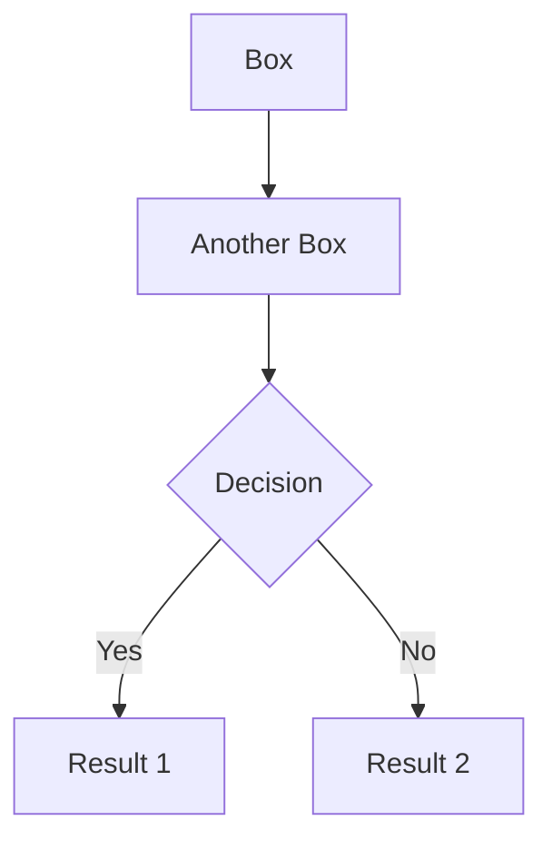
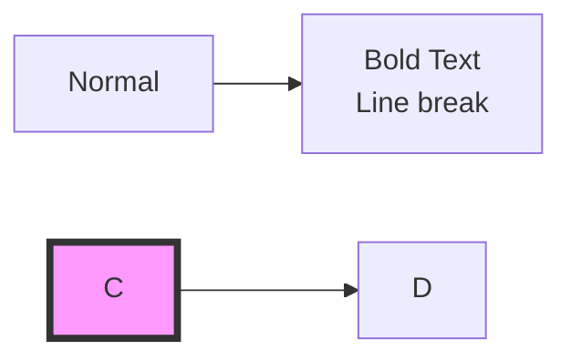

# STE Runtime Architecture Diagrams

## ste-runtime Architecture



This diagram shows the complete architecture of ste-runtime as a unified MCP server for Cursor IDE integration.

---

## Architecture Overview

ste-runtime is a **single long-running process** that combines file watching, semantic graph maintenance, and MCP protocol exposure. It keeps your codebase's semantic state always fresh and provides fast queries to AI assistants.

---

## Component Details

### External Interface

#### **Cursor IDE**
- The AI-powered code editor that uses ste-runtime
- Communicates via **MCP (Model Context Protocol)** over stdio
- Automatically discovers and uses ste-runtime's 8 tools
- No manual configuration needed once MCP is set up

#### **MCP Server**
- Exposes ste-runtime functionality as MCP tools
- **8 tools total** (AI-optimized):
  - `find`, `show`, `usages`, `impact`
  - `similar`, `overview`, `diagnose`, `refresh`
- Reloads RSS context automatically after RECON completes

---

### Query Layers

#### **Layer 1: Structural Queries** (Fast - <100ms)
- **Purpose:** Entry point discovery and graph traversal
- **Operations:** Search, dependencies, dependents, blast radius, lookup
- **Data:** Metadata only (component keys, relationships, tags)
- **Storage:** In-memory RSS Graph (loaded from AI-DOC state)
- **Use Case:** "Find all authentication handlers" → Returns 12 component keys

#### **Layer 2: Context Assembly** (Rich - 100-500ms)
- **Purpose:** Load full source code for LLM reasoning
- **Operations:** Assemble context, get implementation, find similar patterns
- **Data:** Graph metadata + actual source code from filesystem
- **Process:** 
  1. Uses Layer 1 to find relevant components
  2. Loads source files from filesystem
  3. Combines metadata + source code
  4. Returns optimized context (typically 3-5 files, not entire modules)
- **Use Case:** "Assemble context for fixing login bug" → Returns 3 files with source code

**Why Two Layers?**
- **Token Efficiency:** Layer 1 finds entry points without loading source (saves tokens)
- **Precision:** Layer 2 loads only relevant files (not entire modules)
- **Performance:** Layer 1 is fast (<100ms), Layer 2 is targeted (only loads what's needed)

---

### File Watching & State Maintenance

#### **Watchdog Orchestrator**
- **Purpose:** Coordinates the entire file watching and RECON pipeline
- **Responsibilities:**
  - Manages file watcher lifecycle
  - Coordinates edit queue and transaction detection
  - Triggers incremental RECON when files change
  - Handles periodic full reconciliation (optional)
  - Tracks statistics and health metrics
- **Implementation:** `src/watch/watchdog.ts`

#### **File Watcher** (chokidar FSWatcher)
- **Purpose:** Monitors project files for changes
- **Technology:** Uses `chokidar` library (cross-platform file watching)
- **Features:**
  - Watches configured patterns (e.g., `**/*.ts`, `**/*.py`)
  - Ignores configured directories (e.g., `node_modules`, `.git`)
  - Stability checks (waits for file writes to complete)
  - Polling fallback for network drives (optional)
- **Events:** `add`, `change`, `unlink` (file creation, modification, deletion)

#### **Edit Queue Manager**
- **Purpose:** Debounces and coalesces rapid file changes
- **Key Features:**
  - **AI Edit Detection:** Detects Cursor's streaming edit patterns
  - **Adaptive Debouncing:** 
    - 500ms for manual edits (fast feedback)
    - 2000ms for AI edits (handles Cursor's streaming saves)
  - **Version Tracking:** Coalesces multiple rapid changes to same file
  - **Stability Checks:** Waits for file to stop changing before processing
  - **Syntax Validation:** Skips RECON if file has syntax errors (prevents broken state)
- **Output:** Emits `stable` events with change sets
- **Implementation:** `src/watch/edit-queue-manager.ts`

#### **Transaction Detector**
- **Purpose:** Detects and batches multi-file edits
- **Problem Solved:** Cursor often edits multiple files in a refactor (e.g., rename class across 5 files)
- **Solution:** 
  - Detects when multiple files change within a 3-second window
  - Waits for transaction to complete
  - Triggers single RECON for all files (not 5 separate RECONs)
- **Configuration:** 
  - `transactionWindowMs`: 3000ms (default)
  - `minFilesForTransaction`: 2 files
- **Implementation:** `src/watch/transaction-detector.ts`

#### **Incremental RECON**
- **Purpose:** Updates AI-DOC state efficiently (only processes changed files)
- **Performance:** O(changed files) - not O(all files)
- **Process:**
  1. Discovers which files changed
  2. Extracts semantic assertions from changed files only
  3. Normalizes and infers relationships
  4. Updates AI-DOC state (creates/updates/deletes slices)
  5. Notifies MCP server to reload RSS context
- **Fallback:** Falls back to full RECON if incremental fails
- **Implementation:** `src/recon/incremental-recon.ts`

---

### Data Storage

#### **AI-DOC State** (`.ste/state/`)
- **Purpose:** Persistent semantic graph storage
- **Format:** YAML files organized by domain
- **Structure:**
  - `graph/modules/` - Source file metadata
  - `graph/functions/` - Function signatures and relationships
  - `graph/classes/` - Class definitions
  - `api/endpoints/` - REST/GraphQL endpoints
  - `data/entities/` - Database schemas
  - `graph-metrics.json` - Graph topology analysis
- **Properties:**
  - **Content-addressable:** Same source code → same state
  - **Deterministic:** No randomness, always reproducible
  - **Incremental:** Only changed slices are updated

#### **In-Memory RSS Graph**
- **Purpose:** Fast query interface (avoids filesystem I/O)
- **Source:** Loaded from AI-DOC state on startup
- **Updates:** Reloaded after each RECON completes
- **Performance:** <100ms for structural queries
- **Implementation:** `src/rss/graph-loader.ts`

#### **File System**
- **Purpose:** Source code storage (for Layer 2 context assembly)
- **Usage:** Layer 2 loads actual source files when assembling context
- **Why Not in Graph?** Source code is too large - graph stores metadata only

---

## Data Flow Examples

### Example 1: User Queries "Find authentication handlers"

```
1. Cursor → MCP Server: find("authentication handlers")
2. MCP Server → Layer 1: Query in-memory RSS Graph
3. Layer 1 → RSS Graph: Search metadata (no file I/O)
4. RSS Graph → Layer 1: Returns 12 component keys
5. Layer 1 → MCP Server: Returns keys to Cursor
6. Total time: ~45ms
```

### Example 2: User Queries "Assemble context for fixing login bug"

```
1. Cursor → MCP Server: show("src/api/auth.ts")
2. MCP Server → Layer 2: Assemble context
3. Layer 2 → Layer 1: Find relevant components (12 keys)
4. Layer 2 → File System: Load source for 3 most relevant files
5. Layer 2 → MCP Server: Returns metadata + source code
6. Total time: ~180ms
```

### Example 3: Developer Edits a File

```
1. Developer saves file: src/api/auth.ts
2. File Watcher → Edit Queue: File change detected
3. Edit Queue → Wait 500ms (manual edit debounce)
4. Edit Queue → Transaction Detector: Check for multi-file edits
5. Transaction Detector → Incremental RECON: Single file, proceed
6. Incremental RECON → AI-DOC State: Update slices for auth.ts
7. Incremental RECON → MCP Server: Notify context reload needed
8. MCP Server → RSS Graph: Reload from updated AI-DOC state
9. Next query sees updated state
```

### Example 4: Cursor AI Edits Multiple Files (Refactor)

```
1. Cursor saves: src/api/auth.ts (file 1)
2. File Watcher → Edit Queue: Change detected
3. Cursor saves: src/api/user.ts (file 2) - within 3s window
4. Transaction Detector: Multi-file transaction detected, wait...
5. Cursor saves: src/api/session.ts (file 3) - still in window
6. 3 seconds pass: Transaction complete
7. Transaction Detector → Incremental RECON: Process all 3 files
8. Incremental RECON → AI-DOC State: Update all 3 files in single RECON
9. Result: 1 RECON run (not 3 separate runs)
```

---

## Key Design Decisions

### Why MCP Instead of HTTP REST?
- **Native Cursor Integration:** stdio transport, no network setup
- **Auto-Discovery:** Cursor automatically finds available tools
- **Schema Validation:** MCP enforces input/output schemas
- **Standard Protocol:** Works with any MCP-compatible AI assistant

### Why Two-Layer Query Design?
- **Token Efficiency:** Layer 1 finds entry points without loading source (98.5% token reduction)
- **Performance:** Layer 1 is fast (<100ms), Layer 2 is targeted (only loads needed files)
- **Precision:** Returns 3-5 relevant files instead of entire modules

### Why Watchdog Orchestrator?
- **Unified Process:** Single long-running process (not per-query)
- **Always Fresh:** State updates automatically when files change
- **Smart Debouncing:** Handles Cursor's streaming edit patterns
- **Transaction Awareness:** Batches multi-file refactors

### Why Incremental RECON?
- **Performance:** O(changed files) instead of O(all files)
- **Efficiency:** Only processes what changed
- **Freshness:** State always reflects current source code

---

## Performance Characteristics

| Operation | Typical Time | Notes |
|-----------|--------------|-------|
| Layer 1 Query | <100ms | In-memory graph lookup |
| Layer 2 Context Assembly | 100-500ms | Depends on files loaded |
| File Change Detection | <10ms | chokidar event |
| Edit Queue Debounce | 500ms-2s | Manual vs AI edits |
| Incremental RECON | 200ms-2s | Depends on files changed |
| Context Reload | 50-200ms | Reload RSS graph from disk |
| Full RECON | 1-10s | Depends on project size |

---

## Configuration

All components are configured via `ste.config.json`:

```json
{
  "watchdog": {
    "enabled": true,
    "debounceMs": 500,
    "aiEditDebounceMs": 2000,
    "patterns": ["**/*.ts", "**/*.py"]
  },
  "rss": {
    "stateRoot": ".ste/state",
    "defaultDepth": 2,
    "maxResults": 50
  }
}
```

See `documentation/guides/mcp-setup.md` for complete configuration options.

---

## Rendering Diagrams

### View in Markdown Preview
Open this file in Cursor/VS Code and use the markdown preview (Ctrl+Shift+V).

### Render to Images

**SVG (vector, recommended):**
```bash
npm run diagram:render
```

**PNG (raster):**
```bash
npm run diagram:png
```

### Edit Diagrams

Edit `ste-runtime-architecture.mmd` and re-render:

```bash
npm run diagram:render
```

---

## Mermaid Syntax Reference

### Flowchart Basics


### Styling


See: https://mermaid.js.org/syntax/flowchart.html

---

## Adding New Diagrams

1. Create `.mmd` file in this directory:
   ```bash
   touch documentation/diagrams/new-diagram.mmd
   ```

2. Add render script to `package.json`:
   ```json
   "diagram:new": "mmdc -i documentation/diagrams/new-diagram.mmd -o documentation/diagrams/new-diagram.svg"
   ```

3. Render:
   ```bash
   npm run diagram:new
   ```

4. Include in markdown:
   ```markdown
   
   ```


