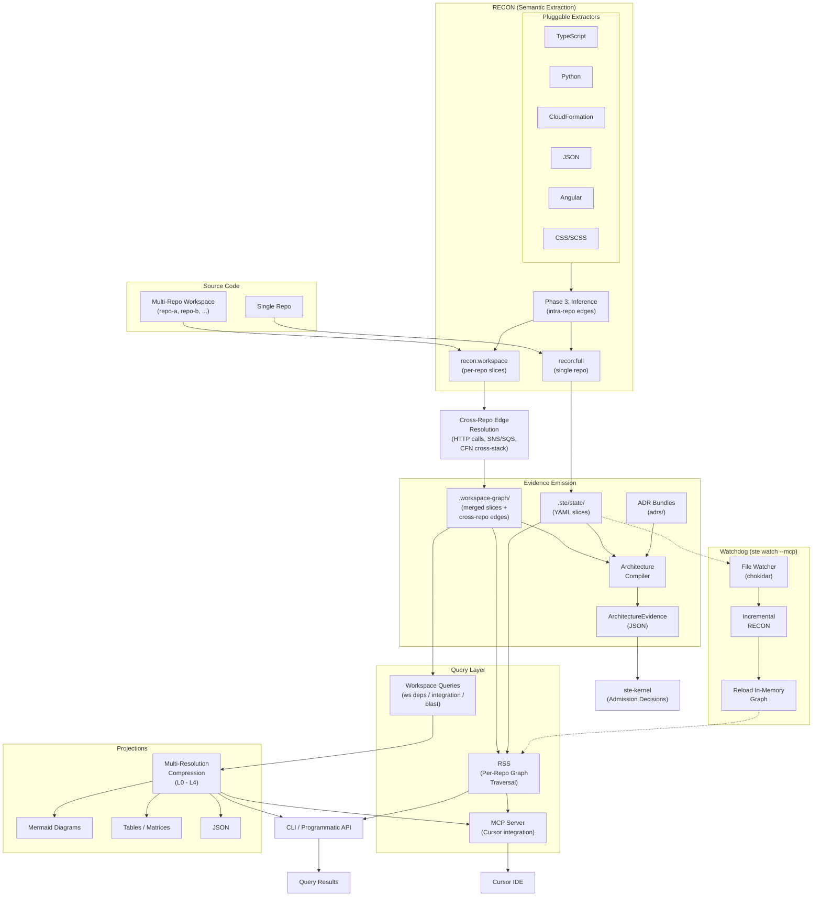

# STE Runtime Instructions

**Semantic Truth Engine** - A portable semantic extraction and graph traversal toolkit for AI-assisted development.

---

## Instructions Index

| Document | Purpose | Audience |
|----------|---------|----------|
| [RECON-README.md](./RECON-README.md) | Install, configure, and run RECON | Developers, AI agents |
| [RSS-USAGE-GUIDE.md](./RSS-USAGE-GUIDE.md) | Query the semantic graph (CLI) | Human developers |
| [RSS-PROGRAMMATIC-API.md](./RSS-PROGRAMMATIC-API.md) | Query the semantic graph (TypeScript API) | AI assistants, machines |
| [recon-incremental.md](./recon-incremental.md) | Incremental mode internals | Contributors |

---

## For AI Coding Assistants (Cursor, Copilot, etc.)

**Use the programmatic API, not the CLI.**

The CLI (`rss-cli.js`) is designed for human developers at the terminal. AI assistants should import the TypeScript API directly:

```typescript
import { initRssContext, search, blastRadius } from 'ste-runtime';

const ctx = await initRssContext('.ste/state');
const results = search(ctx, 'user authentication');
const impact = blastRadius(ctx, results.nodes[0].key);
```

**See [RSS-PROGRAMMATIC-API.md](./RSS-PROGRAMMATIC-API.md) for full documentation.**

---

## Common Human Prompts → Actions

**For AI Assistants: When a human says these phrases, execute these commands.**

| Human Says | Execute | Working Directory |
|------------|---------|-------------------|
| "run full recon" | `npm run recon:full` | `ste-runtime/` |
| "run recon" | `npm run recon` | `ste-runtime/` |
| "regenerate the semantic graph" | `npm run recon:full` | `ste-runtime/` |
| "update the graph" | `npm run recon` | `ste-runtime/` |
| "graph stats" | `npm run rss:stats` | `ste-runtime/` |
| "search the graph for X" | Use programmatic API (see below) | N/A |

**Execution:** Locate `ste-runtime/` in the project, navigate there, then run the command.

---

## Quick Start

See **[documentation/guides/setup.md](../documentation/guides/setup.md)** for
the full setup guide, including automated setup via `ste setup`.

---

## What is STE Runtime?

STE Runtime provides two core capabilities:

### RECON - Semantic Extraction

Analyzes source code and generates a **semantic graph** containing:

- **Modules** - Source files with exports, imports, relationships
- **Functions** - Signatures, parameters, return types
- **Classes** - Definitions, methods, inheritance
- **API Endpoints** - REST/GraphQL routes and handlers
- **Data Entities** - Database schemas, models
- **Infrastructure** - CloudFormation/Terraform resources
- **Frontend Components** - Angular/React components, services
- **Design Tokens** - CSS variables, breakpoints, animations

### RSS - Graph Traversal

Queries the semantic graph with:

- **Search** -- natural language discovery with fuzzy fallback (Levenshtein)
- **Lookup** -- O(1) direct node retrieval by key (`Map.get()`)
- **By Tag** -- cross-domain queries (e.g., all Lambda handlers, all DynamoDB tables)

### Traversal Model

All graph traversals are bounded by `maxDepth` and `maxNodes` to prevent
runaway expansion on large graphs. Every edge is bidirectional by construction
(inference emits both `references` and `referenced_by`), enabling four
traversal modes:

| Operation | Direction | Use Case |
|-----------|-----------|----------|
| `dependencies(key, depth)` | Forward only (`references`) | What does this depend on? |
| `dependents(key, depth)` | Backward only (`referenced_by`) | What depends on this? |
| `blastRadius(key, depth)` | Bidirectional (both edges simultaneously) | Full impact surface of a change |
| `assembleContext(entryPoints)` | Convergent sub-tree | Starts from multiple entry points, expands via bidirectional blast radius from each, deduplicates via visited set -- produces the minimal viable context for a task |

Context assembly is the primary operation for AI-assisted workflows: given a
natural language task, `findEntryPoints` scores nodes by relevance, then
`assembleContext` expands from those entry points to produce a bounded,
deduplicated sub-graph that an agent can consume.

### Adaptive Depth Tuning

The graph topology analyzer (`graph-topology-analyzer.ts`) runs at MCP server
startup and after graph reloads. It inspects the actual graph structure --
average/P95/max dependency depths, fan-out per component, and architectural
shape -- to detect the architecture pattern and recommend an optimal traversal
depth:

| Detected Pattern | Base Depth | Characteristics |
|------------------|-----------|-----------------|
| `component-tree` | 4 | Deep component hierarchies (React, Vue) |
| `microservices` | 3 | Wide peer services with shared dependencies |
| `layered` | 2 | Clean layer boundaries |
| `flat` | 2 | Minimal dependencies (utility libraries) |
| `mixed` | 3 | No clear pattern (conservative default) |

The final recommended depth is the maximum of the pattern-based and
data-driven (P95-based) values, capped at 5. The MCP server logs the
recommendation at startup and monitors for significant changes during live
operation.

---

## Supported Languages

| Language | Elements Extracted |
|----------|-------------------|
| TypeScript | Functions, classes, imports, exports |
| Python | Functions, classes, Flask/FastAPI endpoints, Pydantic models |
| CloudFormation | Templates, resources, parameters, outputs |
| JSON | Schemas, configurations, reference data |
| Angular | Components, services, routes, templates |
| CSS/SCSS | Design tokens, variables, animations |
| ADR YAML | ADR documents, invariants, decisions, capabilities, component specs, system boundaries |

### ADR Integration with adr-architecture-kit

When paired with STE's
[adr-architecture-kit](https://github.com/egallmann/adr-architecture-kit),
RECON extracts ADR YAML files into the same high-fidelity graph shape as
source code. ADR documents, invariants, decisions, capabilities, component
specifications, and system boundaries become first-class graph nodes with
typed relationships (implements, supersedes, enforces, governs, contradicts).

This means all standard RSS operations work against defined design intent:

- **Search** ADRs by decision content or invariant statements
- **Dependencies** from a code component to the ADRs that govern it
- **Dependents** from an invariant to every component that must comply
- **Blast radius** of an ADR change across both architecture decisions and
  implementation code
- **Context assembly** that includes both the relevant code and the design
  rationale for a task

The result is a unified graph where implementation and intent are
traversable together, not siloed in separate documentation systems.

---

## For AI Coding Assistants

STE Runtime is designed for AI-assisted development. Key workflow:

```bash
# 1. Understand the codebase
node dist/cli/rss-cli.js stats

# 2. Find relevant components
node dist/cli/rss-cli.js search "feature you need"

# 3. Get full context for implementation
node dist/cli/rss-cli.js context "your task description"

# 4. Check impact before changes
node dist/cli/rss-cli.js blast-radius component/key
```

**Advantage over grep:** RSS returns typed semantic entities with pre-computed
relationships, not raw text matches. Key-based lookups are O(1) via
`Map.get()`. Traversal operations (dependencies, dependents, blast radius)
follow pre-computed edges in constant time per hop -- something grep cannot
do at all. Search is O(n) over graph nodes but scores against structured
metadata (IDs, paths, domains) rather than raw file contents.

---

## Architecture



**State** is stored as content-addressable YAML slices in `.ste/state/`
(single repo) or `.workspace-graph/` (multi-repo workspace).

**Extractors** are pluggable, language-specific parsers that RECON invokes
during extraction. New languages can be added by implementing an extractor.

**Edge generators** produce the graph relationships that make traversal
possible. Phase 3 inference runs within each repo to resolve intra-repo edges
(import/export references, function calls, class inheritance). Cross-repo edge
resolution is a separate post-processing step in workspace mode that matches
outbound HTTP calls against API endpoint contracts, detects shared SNS/SQS
event channels, and resolves CloudFormation cross-stack references. Edges carry
a confidence level (HIGH for bilateral match, MEDIUM for unilateral claim).

**Watchdog** powers the live MCP experience. `ste watch --mcp` monitors the
filesystem, triggers incremental RECON on changes, reloads the in-memory
graph, and serves MCP tools -- keeping the Cursor integration current without
manual re-runs.

**Query surfaces** are split by scope: RSS operates on the per-repo semantic
graph (functions, classes, endpoints), while workspace queries (`ws deps`,
`ws integration`, `ws blast`) operate on the cross-repo system graph
(repo-to-repo dependencies, integration maps, system-level blast radius).

**Projections** render workspace query results at configurable resolution
levels: L0 (system), L1 (domain), L2 (service), L3 (component), L4 (full
detail). Output formats include Mermaid diagrams, tables, adjacency matrices,
and JSON. This allows the same graph to be viewed at architecture-level
summaries or granular component detail.

**Evidence emission** combines ADR bundles with semantic graph state to
produce factual `ArchitectureEvidence` JSON consumed by `ste-kernel` for
admission decisions. ste-runtime never makes admission judgments itself.

---

## Further Reading

- [ste-handbook](../../ste-handbook/) -- deeper explanatory background on STE,
  subsystem roles, RECON/RSS theory, and end-to-end solution structure
- [ste-spec](https://github.com/egallmann/ste-spec) -- normative contracts,
  architecture doctrine, and shared schemas
- [documentation/guides/setup.md](../documentation/guides/setup.md) -- setup
  and onboarding guide
- [documentation/guides/configuration-reference.md](../documentation/guides/configuration-reference.md) --
  all config options for `ste.config.json` and `workspace.yaml`
- [documentation/guides/troubleshooting.md](../documentation/guides/troubleshooting.md) --
  common issues and solutions
- [RSS-PROGRAMMATIC-API.md](RSS-PROGRAMMATIC-API.md) -- TypeScript API for AI
  assistants and programmatic consumers
- [adrs/](../adrs/) -- Architecture Decision Records for this repository

---

## License

See repository root for license information.

